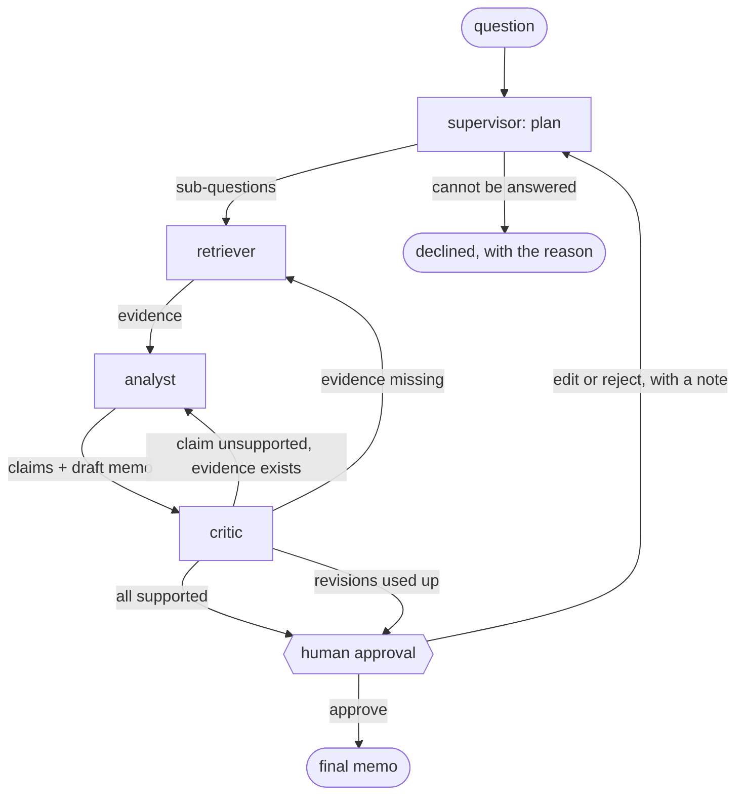

# The filings analyst: capstone architecture

*Milestone `v1.0-capstone`, Fri 2026-10-30. Written 2026-10-08, before any capstone code, as the
roadmap asks: agents, tools, state, handoffs, failure modes and the eval plan. Week 6 builds it,
Week 7 evaluates and serves it, Week 8 ships it.*

## The problem

An analyst asks a question about ITC, Reliance or Tata Motors: *"Did ITC's FMCG margin improve in
FY25, and how does its dividend payout compare with Reliance's?"* The system answers with a short
memo in which **every claim cites the page it came from**, every figure it computed shows its
inputs, and a critic has checked each claim against its source before a human approves it.

`v0.2-agent` already answers questions like this with one agent and five tools. What the capstone
adds is the part an analyst would actually trust: claims that are checked, not just cited; two
years of filings, so it can talk about change; a human in the loop before anything is final; and
a 50-task eval that measures faithfulness, not only correctness.

## Decisions taken

| Decision | Choice | Why it matters here |
|---|---|---|
| Corpus | The **FY25 and FY24** annual reports of the same three companies: six documents | Year-over-year questions become possible, and so does the failure they invite: an FY24 figure answering an FY25 question |
| Market data | A **frozen fundamentals table** in the repo, with a dated price snapshot | Ground truth never drifts, evals stay reproducible and free; the tool's interface is the one a live source would plug into later |
| Framework | **LangGraph**, on `llm.core` as today | It already holds the Project 2 agent and orchestrator-workers; it has the interrupt and checkpointing the human gate needs |
| Models | **Sonnet 5 while building, Opus 5 for the reported numbers**, as in Project 2 | Same split, same cost discipline; every paid run asked for separately |
| Local model | **One role, optional:** the figure extractor runs on the Week 6 fine-tune through `Llm(client)` | The fine-tune gets a measured job inside the system, not only a table of its own |
| Judge | **Sarvam 105B, if it earns it**, on the existing `sarvam` client with its schema enforced; Sonnet 5 if it does not | A judge from outside the Claude family has no self-preference toward the agents it grades, and critic agreement stops being Claude agreeing with Claude. At $0.31 / $0.77 per million against Sonnet's $2 / $10, verdicts cost cents. It must first match a hand-labelled sample as well as Sonnet does: on Project 1 it answered like the local 4B, not like Opus |
| Web search | **Off** | Every answer must be reproducible from the repo; a web figure has no frozen ground truth |

## Architecture



Four agents, one gate. The supervisor is the only node that decides *what* to do; the others each
do one job and hand back a typed result.

| Agent | Does | Model | Tools |
|---|---|---|---|
| **supervisor** | Turns the question into a plan of sub-questions, each naming its company, year and what is needed; declines a question the filings cannot answer; re-plans after a human note | Claude | none: it routes |
| **retriever** | Runs each sub-question's searches and keeps the passages that answer it, as evidence with chunk ids and pages | Claude | `search_filings` |
| **analyst** | Extracts the figures it needs from the evidence, computes what the question asks, and writes claims and a draft memo, every claim citing its evidence | Claude; its figure extraction optionally the local model | `fundamentals`, `calculate`, `extract_figures` |
| **critic** | Checks each claim against exactly the chunks it cites: supported, unsupported, or wrong (the figure, the year, the company). Never sees the analyst's reasoning, only claim and source | Claude, a different model from the analyst in the reported runs | none: it reads |

The retriever is the RAG: `retrieval`'s hybrid search with reranking, unchanged, over a six-report
inventory. The critic is what makes the system more than an agent with citations. `v0.2`'s
guardrail checks that a cited id *was retrieved*; the critic checks that it *says what the claim
says*.

## Tools

| Tool | Signature | Source | New or reused |
|---|---|---|---|
| `search_filings` | `(query, company="all", year="all") -> passages` | `report_tools.ReportSearch` over the six-report inventory | Reused; gains a `year` scope beside `report` |
| `fundamentals` | `(ticker, metric, year) -> value, unit, source` | `evals/reference/fundamentals.json`: revenue, profit, EPS, dividend per share, segment margins, and a closing price on one dated day, each with the page it came from | New |
| `calculate` | `(expression) -> number` | `tools.calculate` | Reused as is |
| `extract_figures` | `(chunk_ids, wanted) -> [Figure]` | A structured call over the cited chunks, returning `{metric, value, unit, year, chunk_id}` | New; the local model's role |

The fundamentals table is reference data, so it follows the repo's rule: sorted by ticker, then
year, one stable shape per entry, and a test in `test_reference_data.py` that fails if it drifts.
Every value carries its page, so a `fundamentals` answer can be cited like a passage.

## State

<!-- fmt:off -->
```python
class State(TypedDict):
    question: str
    plan: Plan                                        # sub-questions, or a reason to decline
    evidence: Annotated[dict[str, Passage], merge]    # by chunk id, so a re-search adds, never repeats
    claims: list[Claim]                               # each with its citations and figures
    verdicts: dict[str, Verdict]                      # claim id -> supported | unsupported | wrong
    memo: Memo | None
    revisions: int                                    # critic loops used, capped
    review: Review | None                             # the human's decision and note
    spent: Usage                                      # every call's tokens, for the per-task ceiling
```
<!-- fmt:on -->

`evidence` is the one field with a reducer: a retriever sent back for more adds passages beside
the old ones, keyed by chunk id, so the analyst never sees a passage twice and a claim's citation
never points at something dropped. Everything else is replaced by the node that owns it. The graph
runs with a checkpointer, which is what lets it stop at the human gate and resume hours later.

The final output is one Pydantic model, validated before it is shown:

<!-- fmt:off -->
```python
class Claim(BaseModel):
    id: str
    text: str
    citations: list[str]          # chunk ids or fundamentals keys; at least one
    figures: list[Figure]         # what was computed from what

class Memo(BaseModel):
    question: str
    summary: str                  # the answer in two sentences
    claims: list[Claim]
    caveats: list[str]            # what the filings do not say
```
<!-- fmt:on -->

## Handoffs

| From → to | When | Carries |
|---|---|---|
| supervisor → retriever | a plan with at least one sub-question | the plan |
| supervisor → declined | the question needs data the filings do not hold, or rests on a false premise | the reason |
| retriever → analyst | every sub-question has evidence, or has been searched three ways without any | the evidence, and which sub-questions came up empty |
| analyst → critic | always | claims and the draft memo |
| critic → analyst | a claim is unsupported or wrong and its evidence exists | the verdicts; revisions + 1 |
| critic → retriever | a claim needs evidence nobody found | the missing sub-question; revisions + 1 |
| critic → human | every claim supported, or **two** revisions used | the memo, with any unsupported claim marked, never silently dropped |
| human → final | approve | the memo |
| human → supervisor | edit or reject | the note, as a new constraint on the plan |

In evals, the human is a policy that approves, so a run is unattended; the reject path has its own
tests and a handful of scripted tasks.

## Failure modes, and what catches each

| Failure | Where it shows | Guard |
|---|---|---|
| A claim with no citation | analyst | `Claim.citations` has a minimum of one; validation fails the memo |
| A citation that does not say what the claim says | analyst | the critic, per claim; the judge measures how often it misses |
| **The right figure from the wrong year** | retriever, analyst | `search_filings` scoped by year; every `Figure` carries its year; the critic's `wrong` verdict names year mismatches. New with two years of filings, and the most likely failure |
| Arithmetic done in the head | analyst | figures carry their inputs; computed values must come from `calculate` |
| A loop between critic and analyst | graph | `revisions` capped at two, then the human sees what is still unsupported |
| A question the filings cannot answer | supervisor | an explicit decline path, and decline tasks in the eval |
| Instructions planted in a filing | retriever | passages fenced as untrusted, as `read_file` is today (invariant 28); the injection set grows by filing-shaped cases |
| A run that costs too much | every node | `llm.core`'s free count and the per-task ceiling, as now; a refused turn ends in a last answer, not an error |
| A tool that fails | any | errors return as data (`is_error`), never as exceptions, as now |
| The local model returns malformed JSON | analyst | `extract_figures` validates; on failure it falls back to Claude for that call and the fallback is counted |
| The human rejects | gate | the note becomes a plan constraint; a second rejection ends the run as declined |

## Eval plan

**50 tasks with ground truth**, written by hand, each naming the facts the answer must hold, the
pages they are on, and anything it must not claim:

| Family | Tasks | Example |
|---|---|---|
| Single figure, one report | 8 | ITC's FY25 dividend per share |
| Year over year | 12 | How Reliance's net debt moved from FY24 to FY25 |
| Across companies | 8 | Which of the three spent the most on R&D in FY25 |
| Computed from filing and fundamentals | 10 | ITC's FY25 payout ratio, from its dividend and EPS |
| Multi-hop | 6 | Tata Motors' JLR share of revenue, and the reason the report gives for its change |
| Must decline | 6 | A false premise, or a figure no report states |

**Metrics, per run:**

| Metric | How | Cost |
|---|---|---|
| Task success | every grader passes, as in Project 2 | free graders plus the judge |
| Faithfulness | share of claims a judge finds supported by the chunks they cite, read from the trajectory | judge |
| Critic agreement | how often the critic's verdict matches the judge's | free, from saved rows |
| Year accuracy | share of figures from the year the question asked | free |
| Cost per task, p50 and p95 latency | from `llm.core`'s billing and the trace | free |

**Run-to-run noise is the first thing to measure, not the last.** In Project 2 the same build
scored 15 and then 23. So the baseline runs three times on Sonnet before anything is changed, and
an iteration only counts as having moved the number if it clears that spread.

**The iteration that moves a number:** the critic loop. Run the system with the critic switched
off, then on: faithfulness and success with and without it are the capstone's headline. If the
Week 6 retrieval sweep (chunk size, dedup, a second embedder) changes the inventory, that is a
second, separate iteration, measured the same way.

**Cost, to be replaced by dry-run counts before any run.** These are estimates from Project 2,
where a task cost $0.038 on Sonnet and $0.116 on Opus over about three turns: with four agents and
up to two revisions, roughly three to four times that, so about $0.15 a task on Sonnet and $0.45
on Opus, or $7.50 and $22.50 for 50 tasks. A Sarvam judge costs cents either way; a Sonnet one goes through the batch path at half price. Every run still
goes through `--yes` and its own go-ahead.

**The CI gate (Week 7).** CI spends nothing, so the gate cannot run the agent. It re-grades a
frozen set of saved trajectories with the free graders and fails if any free metric drops; the
paid eval stays a deliberate, by-hand run.

## Reused, extended, new

| Piece | Status |
|---|---|
| `llm.core` (budget, caching, tracing, retries, batch) | reused unchanged |
| `retrieval` hybrid search and rerank | reused; the inventory grows to six reports |
| `report_tools.ReportSearch` | extended with a year scope |
| `tools.calculate`, `tools.fence`, guardrails | reused; `check_answer` reads the memo's citations |
| `evals` harness, graders, LLM judge, batch judge | reused; new graders for faithfulness and year accuracy |
| `agent_graph` | the starting point for the graph, not edited in place |
| Langfuse tracing | reused; one trace per task, a span per node |
| supervisor, critic, the human gate, the memo schema | new |
| `fundamentals` table and tool, `extract_figures` | new |
| FY24 reports in the corpus manifest | new |

## Build order

**Week 6, end to end, ugly is fine:**

1. FY24 reports into the manifest and the inventory; `search_filings` with a year scope; the
   fundamentals table and its sort test.
2. The graph with the four agents as stubs that pass typed state, and the human gate with a
   checkpointer, tested before any prompt is written.
3. The real prompts, one agent at a time, each on a handful of tasks.
4. The 50 tasks, then the first Sonnet baseline, three times.
5. The Track B fine-tune wired in as `extract_figures`' local backend.

**Week 7:** the critic iteration, faithfulness and the judge bake-off: Sarvam and Sonnet each judge
a hand-labelled sample of about 40 claims, and Sarvam becomes the judge if its Cohen's kappa is
within noise of Sonnet's, the Opus run, HTTP and a container, the CI gate.

**Week 8:** README, diagram, the walkthrough, the write-up and the tag.

## Open questions

- **Tata Motors' segments across the two years.** Its demerger took effect after FY25, so both
  reports should describe the combined company, but segment definitions can still change between
  years; check they match before writing a year-over-year task on a segment.
- **The critic's model.** A different model from the analyst is the point of a critic; whether that
  is Opus checking Sonnet or the reverse is a Week 7 measurement, not a guess now.
- **How strict the memo is.** Whether an unsupported claim that survives two revisions is shown
  marked, or removed, is a product choice; this doc says marked, so nothing is hidden from the
  human.
