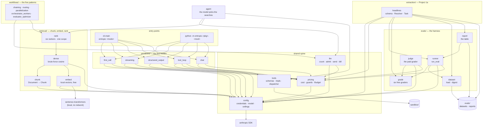

# Entropic knowledge graph

A map of what exists in this repo, what it does, and how the pieces point at each other. Written for
a future session that needs orientation before touching code.

**Verified against commit `cb6abb9` plus the neutral request and reply, and the clients that
speak for it, landing in this commit (2026-09-23). 823 tests pass (819 plus 4 that need the
`compare` group), 1 live test deselected. The suite is fully green.**

> **The package is organised by capability, not by week.** `week01/` split into `primitives/`
> (the five CLI modes) and `extraction/` (Project 1a, which is a
> capability rather than a demo); `week02/` became `retrieval/`. The test tree mirrors it.
> Roadmap weeks still appear in §5, where they are dates rather than module names.

> **Week 3 opened with the five workflow patterns** from "Building effective agents", in
> `workflows/`: chaining, routing, parallelization, orchestrator-workers, evaluator-optimizer,
> each under 100 lines, each over the Project 1 corpus, every call through `llm`. Written and
> tested for free against the fake client, then run live for about $0.55 (2026-09-22). Three of
> five answers were honest declines on retrieval misses: search, not the models, is the bottleneck.

> **The first agent runs on the SDK's tool runner** (`agent`, through `llm.run_tools`). The runner
> keeps the echo, one-message and error-result rules, but by default it has no turn cap, no
> pre-flight and no budget, and running out of turns looks like finishing. `run_tools` counts and
> admits every turn before it is sent, and raises at the cap. Read against the source in
> `docs/tool-runner.md`.

> **Retrieval runs end to end**: chunk → embed → rank → grade → report. Written by hand against
> tests that were written first, the same arrangement as the `underhood` repo (Track B).
>
> **The corpus is real and ingested.** Three Indian annual reports — 1,148 pages, 4.2M characters
> raw — load through `retrieval.corpus` into three `Document`s of 4,040,587 characters. The 3.8%
> that ingestion removes is running headers and page numbers. The question set is 54 questions
> labelled with verified quotes, 19/16/19 across the three reports.
>
> **The result that outranks every number below it (2026-09-20).** The same six retrieval arms were
> run over two question sets that differ *only* in wording — same corpus, same chunks, same 54
> quotes, same labels — and they recommend **opposite systems**. On questions authored from the
> passages, `bm25+rerank` wins at hit@5 0.907 and fusion is worse than BM25 alone. On paraphrased
> questions, BM25 falls from best to worst (0.889 → 0.315, below dense), and fusion becomes the best
> base. **An eval whose questions were written while looking at the passages will recommend the
> wrong retriever.** Treat any single retrieval table here as conditional on its question style.
>
> **Both halves are measured.** Generation, 2026-09-19, all 54 cases for $1.342: closed-book
> `correct` 5/54 against RAG's 42/54, and closed-book **answered 10 and was right 5** where RAG was
> right 42 of 43 answered. Retrieval, `retrieval.evaluate`, 2026-09-18, three strategies, $0.00: hit@5 **0.635 / 0.630 / 0.685**, recall@5 0.619 / 0.583 / 0.608, MRR 0.471 / 0.511 / 0.452
> for `fixed` / `fixed+overlap` / `by_sentence`. **Three metrics, three different winners**, and
> the spread is inside what 54 questions can resolve — a four-case gap on 54 paired rows cannot
> reach p<0.05 by a sign test even if every discordant row falls the same way. The honest reading
> is that these three strategies are not distinguishable on this dataset, which is a finding about
> the dataset's size as much as about the chunkers. Quote the number with the metric and the
> strategy, or do not quote it.

If the code has moved since, trust the code and update this file (see [Maintenance](#maintenance)).

- Package root: `src/entropic/` (uv build backend, `src` layout, Python 3.12+)
- Entry point: `entropic = "entropic.cli:main"` — `pyproject.toml:20`
- Everything paid goes through two modules: `config.py` builds the client, `pricing.py` prices the
  call and guards the spend. Nothing else does either.

---

## 1. Shape of the system



Reading order for a newcomer: `config.py` → `pricing.py` → `tools.py` → `primitives/tool_loop.py`. The rest are
variations on the first call. For the harness, read `evals/grade.py` first — the vocabulary explains
the runner, not the other way round.

Note which way the arrows do *not* run: nothing in `primitives/` imports `evals`, and `evals` imports no
capability module. The harness measures whatever it is handed.

---

## 2. Nodes

Stable IDs are `module.Symbol`. Cite them in future notes; they survive line drift.

### 2.1 Modules

| ID | Path | Role |
|----|------|------|
| `config` | `src/entropic/config.py` | **Every tunable constant except the tool pair's and each client's**: credentials, model selection, spending ceilings, output caps, loop caps. The only module that constructs a client. Holds no arithmetic. |
| `pricing` | `src/entropic/pricing.py` | Token prices, cost arithmetic, and the two budget guards that enforce `config`'s ceilings. The only module that knows a price — **including a local model's** (2026-09-23), priced at what an hour of this machine costs over the tokens an hour buys, so a local run reads as cheap rather than as free and every guard keeps working. Since 2026-09-23 it prices a `messages.Usage` and imports no provider SDK. |
| `messages` | `src/entropic/messages.py` | **The neutral types** (2026-09-23): `Msg`, `Block`, `Tool`, `Cache`, `Thinking`, `OutputConfig`, `Usage`, `Reply`, `Parsed`. What a request carries and a reply returns, in this repo's own types, so no caller names a provider's. The shapes mirror Anthropic's, the richer of the two wires; the OpenAI adapter flattens what it can and refuses what it cannot. Imports only pydantic, so anything may import it. |
| `adapters` | `src/entropic/adapters/` | **The clients we can talk to, and the wire each speaks** (2026-09-23) — the only place an SDK is imported. A *client* is a named endpoint (`anthropic` today, a local `mlx_lm.server` next); an *adapter* is the class that speaks its wire. `CLIENTS` maps a client name to its settings (from its own `cfg_<name>.py`), `WIRES` maps a wire name to the class that speaks it, and `build(client, sdk)` makes an adapter over a vendor client if handed one, raising on an unknown name rather than defaulting — guessing would send a request somewhere nobody asked for. **Many clients may share one adapter** (anything OpenAI-compatible speaks one wire) but a client maps to exactly one, so the name is enough to pick it. `Adapter` is the protocol `llm` calls — `count`, `send`, `parse`, `streamed`, `tools` — with `Streamed` and `ToolSession` for the two that return something to drive. `adapters.anthropic.Anthropic` holds one SDK client, built on first use so an import needs no credentials, and converts both ways (`usage_of`, `reply_of`). Its `ToolSession` is the wire half of a tool-using conversation — iterate turns, run the tools, send a last answer with the same tools so the cache still holds — while `llm` admits and bills each turn. `Streaming` exposes neutral text and a final `Reply`, plus `raw` for the one demo that is about Anthropic's own events. Two wires so far: `anthropic`, and `openai` (2026-09-23) for anything serving `/v1/chat/completions` — the local `mlx_lm.server`, vLLM later, OpenAI itself. Two clients: `anthropic` and `local`. A new client is a `cfg_<name>.py` and a row in `CLIENTS`; a new *wire* is a class and a row in `WIRES`. `adapters.client.Client` is the shape of those settings: name, wire, three models, an optional `base_url`, and `max_tokens` overrides by call-site key. **Credentials moved here too** (2026-09-23): `adapters.anthropic.get_client` / `has_credentials` were `config`'s, and building a client is the wire's business — which is also what lets `config` read the active client's settings without a cycle. |
| `llm` | `src/entropic/llm.py` | **The one door to a model** (2026-09-21): every request is counted, admitted against a budget, sent, billed and traced. Every call shape the repo uses — plain, structured, streamed, tool-using, concurrent — has a method here, and every call in the package goes through it. **It imports no SDK** (2026-09-23): the wire lives in `adapters`, including the tool runner and streaming, so what remains here is policy — counting, ceilings, holds, billing, the trace, concurrency. A caller never names an adapter: `Llm(client)` takes a **client name**, defaulting to `config.CLIENT`, and builds the adapter behind `_adapter`. `Llm.client` gives that name back and `Llm.sdk` hands the vendor client on, so an eval and its graders share one connection — the eval seams (`answer_task`, `extraction_task`, `graders`, `LlmJudge`) thread both. A test fails on any module but an adapter calling `client.messages` itself (invariant 8). **It also refuses what a wire cannot do** (2026-09-23): `_asks_for` reads the capabilities a request needs — cache, thinking, effort, tools, web_search — against the adapter's `supports`, and raises `Unsupported` before counting or sending. A wire that silently dropped a cache marker or a schema would answer anyway, differently and for a different price, which is the one failure a budget guard cannot catch. |
| `errors` | `src/entropic/errors.py` | **Every error the package defines** (2026-09-22): `BudgetExceeded`, `DatasetError`, `StepFailed`, `TurnsExhausted`. Imports nothing, so any module can raise one without an import cycle. Reuse one before adding another (invariant 23). |
| `tools` | `src/entropic/tools.py` | Framework-free tool implementations + their JSON schemas + a name→function dispatcher. Imports nothing from this package except `tools_config`. |
| `report_tools` | `src/entropic/report_tools.py` | **Tools over the annual reports** (2026-09-22): `search_reports`'s schema, what runs it, and the record of each search. The home for any tool that needs the rest of the package, which is exactly what `tools` must not import. Moved out of `agent` so the agent holds only its choice of tools and its loop. |
| `tools_config` | `src/entropic/tools_config.py` | The constants `tools` needs, in a config module that travels with it. Imports nothing internal at all. |
| `cli` | `src/entropic/cli.py` | The `entropic` command: a mode table, a lookup, an interactive menu. |
| `primitives.first_call` | `src/entropic/primitives/first_call.py` | One non-streaming call; token count and cost. |
| `primitives.streaming` | `src/entropic/primitives/streaming.py` | Streamed call; thinking vs. text blocks. |
| `primitives.structured_output` | `src/entropic/primitives/structured_output.py` | `messages.parse` into a Pydantic model. |
| `primitives.tool_loop` | `src/entropic/primitives/tool_loop.py` | The agent loop, hand-written. The seed of the real agent. |
| `primitives.chat` | `src/entropic/primitives/chat.py` | Multi-turn REPL with a running cost meter. |
| `extraction.headlines` | `src/entropic/extraction/headlines.py` | **Project 1a**: the extraction schema, two system-prompt variants, the `Task` that wraps `messages.parse`, the `Resolver` that turns a company mention into a ticker, and the `main` that runs the eval. The harness's first paying customer. |
| `evals.dataset` | `src/entropic/evals/dataset.py` | `Case`, the strict JSONL loader, the dataset digest. |
| `evals.grade` | `src/entropic/evals/grade.py` | `Outcome`, `Score`, `Grader`, and the ten graders that cost nothing — five over text, four over a labelled quote and a ranked list of chunk ids, and one over a boolean the task reported about itself. |
| `evals.judge` | `src/entropic/evals/judge.py` | `LlmJudge`: the fifth grader, the only one that spends. |
| `evals.runner` | `src/entropic/evals/runner.py` | `run_eval`: iterate, bill, grade, survive. |
| `evals.report` | `src/entropic/evals/report.py` | Four Markdown tables and the file they are written to. |
| `retrieval.chunk` | `src/entropic/retrieval/chunk.py` | `Document`, `Chunk`, `Inventory`, and the four splitters — fixed, fixed-with-overlap, by sentence, by heading. Also `Inventory.containing`, which resolves a labelled quote to the ids that hold it. Imports `config` and nothing else internal. |
| `retrieval.embed` | `src/entropic/retrieval/embed.py` | The `Embedder` protocol and `LocalEmbedder`, `sentence-transformers` on MPS. The one part of Entropic that thinks with someone else's weights, and the only capability module that spends nothing at all. |
| `retrieval.dense` | `src/entropic/retrieval/dense.py` | `DenseIndex`: ids, a normalised matrix, and brute-force cosine search. No approximate index, no database, exact answers. |
| `retrieval.corpus` | `src/entropic/retrieval/corpus.py` | Annual report PDFs into `Document`s: `pypdf` per page, normalise, strip furniture, join while recording page offsets. Plus the opt-in disk cache. The only module that touches `pypdf`. |
| `retrieval.questions` | `src/entropic/retrieval/questions.py` | The question set's generator and, more importantly, its gate: `verify` is what a label must survive whether a model wrote it or a person did. |
| `retrieval.evaluate` | `src/entropic/retrieval/evaluate.py` | **Project 1's eval**: one question set, three chunking strategies, four numbers each. The capability module that imports the harness — the retrieval twin of `extraction.headlines`, and free where that one spends. |
| `retrieval.langchain_rag` | `src/entropic/retrieval/langchain_rag.py` | **The framework comparison**: the same pipeline in LangChain, scored by the same harness. Its packages are in the non-default `compare` dependency group and imported inside functions, so the core package never depends on the framework it is measured against. |
| `retrieval.sparse` | `src/entropic/retrieval/sparse.py` | `SparseIndex`: BM25 as an inverted index over the same `Inventory` the dense index holds. The lexical half of hybrid retrieval, written out rather than imported. |
| `retrieval.fuse` | `src/entropic/retrieval/fuse.py` | Reciprocal rank fusion: several rankings of the same ids into one, using ranks because the scores are not commensurable. |
| `retrieval.rerank` | `src/entropic/retrieval/rerank.py` | A `Reranker` protocol and a local cross-encoder. The expensive second stage: reads query and passage *together*, so it cannot be precomputed and never runs over the corpus. |
| `retrieval.hits` | `src/entropic/retrieval/hits.py` | `Hit` and `rank_ids`: what every index, ranker, fusion and reranker returns. Its own module so none of them imports another to get the type. |
| `retrieval.rank` | `src/entropic/retrieval/rank.py` | **The rankers.** `build_ranker(method, indexes)` turns any of the six method names into a `Ranker`, whose one method is `rank(query, k, doc_id=)`. `DenseRanker` and `SparseRanker` each wrap one index; `HybridRanker` holds the two and fuses them; `Reranked` wraps any of the three. The indexes are built once in `Indexes` and shared. The eval ranks through these and so does anything else (invariant 21). |
| `workflows.reports` | `src/entropic/workflows/reports.py` | `DocId`, `REPORTS`, `CATALOGUE`, and the `Search` protocol the patterns take — so a pattern test hands in a fake search and never builds an index. |
| `workflows.demo` | `src/entropic/workflows/demo.py` | The command line the five and `agent` share: build the search once (~65s), dry run by default, `--yes` to spend, `--limit` for the ceiling. |
| `workflows.{chaining, routing, parallelization, orchestrator_workers, evaluator_optimizer}` | `src/entropic/workflows/*.py` | The five patterns, one module each, each under 100 lines — a test holds them to it. See §2.9. |
| `workflows.orchestrator_workers_graph` | `src/entropic/workflows/orchestrator_workers_graph.py` | **Orchestrator-workers rebuilt as a LangGraph graph** (2026-09-22), for Week 3's comparison. It uses the same prompts, schema and calls as `orchestrator_workers`, only the control flow differs, and it passes the same tests. It needs the `graph` group. See §2.9 and `docs/langgraph.md`. |
| `agent` | `src/entropic/agent.py` | **The first agent** (2026-09-22): `report_tools.SEARCH_TOOL` beside `tools.ALL_TOOLS`, looped on the SDK's tool runner through `llm.run_tools`. Shares `workflows.demo`'s command line and `Search`. See §2.10. |
| `retrieval.answer` | `src/entropic/retrieval/answer.py` | **Project 1's generation half**: answer the question set from retrieved passages, closed-book against RAG. The first part of Week 2 that spends, and the reason the rest of `retrieval` staying free matters — the two numbers stay separable. |

### 2.2 Settings (`config`)

Values, plus the one function that turns them into a client. No arithmetic lives here.

| ID | Kind | Anchor | Contract |
|----|------|--------|----------|
| `config.MODEL` | constant | `config.py:23` | What Entropic thinks with. `ENTROPIC_MODEL` env override, else `DEFAULT_MODEL` = `claude-opus-5`. Every module imports this; none hardcodes a model. |
| `config.JUDGE_MODEL` | constant | `config.py:24` | What grades an eval. `ENTROPIC_JUDGE_MODEL` env override, else `DEFAULT_JUDGE_MODEL` = `claude-sonnet-5`. **Deliberately not `MODEL`**: a model grading its own output favours it, and applying a rubric is easier than the task being graded. Raise it when the rubric is hard — a judge weaker than the task cannot see the failures that matter. |
| `config.SMALL_MODEL` | constant | `config.py:25` | Where `workflows.routing` sends a lookup, and what its router runs on. `ENTROPIC_SMALL_MODEL`, else `DEFAULT_SMALL_MODEL` = `claude-haiku-4-5`. The one place a cheaper model does the work on purpose rather than grading it — sending easy questions to a small model is the routing pattern's canonical use, kept to see the difference (decided 2026-09-22). Must appear in `pricing.PRICES`; `test_pricing` pins it with the other two defaults. |
| `config.MAX_USD_PER_REQUEST` | constant | `config.py:32` | Default `0.25`, env `ENTROPIC_MAX_USD_PER_REQUEST`. Enforced in `pricing`, not here. |
| `config.MAX_USD_PER_TURN` | constant | `config.py:33` | Default `0.60` (was `0.40` until web search), env `ENTROPIC_MAX_USD_PER_TURN` (2026-09-22). The per-request ceiling for a turn of `llm.run_tools`, in place of `MAX_USD_PER_REQUEST`: a turn resends the whole conversation, so a working agent outgrows a single call's ceiling long before its run budget. With web search offered, a turn reserves the 4,096-token output cap and three searches' allowance, which leaves about 44,800 input tokens at the cache-write price. At $0.40 a cap of 3 would have left about 12,800. |
| `config.MAX_USD_PER_RUN` | constant | `config.py:34` | Default `1.00`, env `ENTROPIC_MAX_USD_PER_RUN`. |
| `config.MAX_USD_PER_WORKFLOW` | constant | `config.py:35` | Default `0.25`, env `ENTROPIC_MAX_USD_PER_WORKFLOW`. One workflow demo's ceiling, admitted before every call and every batch through `llm`, so a demo cannot cross it at all. A single demo question has no business costing a dollar, so it sits under the run ceiling. `--limit` overrides it per run. |
| `config.WEB_SEARCH_RESULT_TOKENS` | constant | `config.py:38` | `10_000` per web search (2026-09-22). The API adds a search's results as input during the call, where the free count cannot see them, so the worst case prices this allowance instead. **Measured for direct search**: two searches wrote about 20,000 new tokens, and the next turn's context had grown by about 9,000 a search. The rereads the server-side loop makes within a turn are cached, so they cost little and are not in it. |
| `config.MAX_USD_PER_EVAL` | constant | `config.py:36` | Default `2.00`, env `ENTROPIC_MAX_USD_PER_EVAL`. One eval over a whole dataset. |
| `config.DEFAULT_MAX_TOKENS` / `MAX_TOKENS_*` | table + constants | `config.py` | **One table of output caps, and the names derived from it** (2026-09-23): `max_tokens(site)` returns the active client's override or the shared default, and each `MAX_TOKENS_*` constant is resolved from it at import, so call sites import a number as they always did. `tests/test_config.py` holds the table and the names in step, and checks an override wins while the rest are inherited. One output cap per call site: `FIRST_CALL` 1024, `STREAMING` 4096, `EXTRACT` 2048, **`HEADLINE` 128**, `TOOL_LOOP` 4096, `CHAT` 4096, `JUDGE` 256, `QUESTION` 512, **`ANSWER` 256**, and eleven for the workflows, grouped by pattern — `FACTS` 1024 and `NOTE` 384 (chaining), `ROUTE` 128 and `ROUTED` 768, `SECTION` 384 and `VOTE` 256, `PLAN` 512, `WORKER` 384 and `SYNTHESIS` 768, `DRAFT` 384 and `CRITIQUE` 256. Three were raised after the first live run (2026-09-22): the fact extractor used 740 of 768, an analysis answer hit 384, and a reviewer's one-sentence verdict was cut off at 128 — which is also what found the unbilled-reply bug in `llm`. Each module imports its own under the local alias `MAX_TOKENS`. Side by side they show which calls are the expensive ones — invisible when each number sits alone in its module. `HEADLINE` is the worked example of why the cap is sized per call site rather than set generously: `estimate_eval_usd` prices the full cap, so Project 1a's worst case is $3.19 at `EXTRACT`'s 2048 and $0.64 at 384. Same run, same real spend; only the guard's verdict changes. It started at 256, clipped one row in 60 on the first live run (2026-09-11), went to 384, and still clipped two rows in 50 — the other edge of the same knife. The cause was not the record: it was **extended thinking**, billed as output and charged against the cap, spending 200-280 tokens before the answer began. With `THINKING_EVAL` off the record is ~45 tokens and 128 is three times what it needs. The old comment claimed 384 sized "a five-field record"; it never did. Tuned against actual runs rather than guessed — three of them. |
| `config.MAX_AGENT_TURNS` | constant | `config.py:78` | `25` (was `8` until 2026-09-22). Both tool loops' iteration cap; imported by `tool_loop` as `MAX_TURNS`. **A backstop, not the policy**: every turn is admitted against the budget before it is sent, so the budget decides how long a run lasts. At the ~4–5k tokens a search adds, `MAX_USD_PER_TURN` ends a search near turn 11; the cap binds only on a loop of turns too cheap for the budget to stop soon. At 8 it was the cap that ended the third live run, with the ceiling far off. |
| `config.MIN_TOKENS_FINAL_ANSWER` | constant | `config.py:79` | `1024`. The least output `llm.run_tools` will send a last answer with; below it, the refusal that ended the searching stands. |
| `config.MAX_PARALLEL_CALLS` | constant | `config.py:82` | `4`. How many calls one `Llm.gather_*` batch keeps in flight. Admission covers the whole batch regardless, so this bounds concurrency and rate-limit pressure, not spend. |
| `config.THINKING_WORKFLOW_PARAM` | constant | `config.py:85` | `{"type": "disabled"}`, stated on every workflow `Request`. A workflow splits the work into small, fully specified calls, which is where thinking adds least, and off keeps output inside caps a few hundred tokens wide. On Opus 5 thinking-off is accepted at effort `high` or below, the default, and can leak thinking tags into text — watch for that in the live runs. **Not for a tool-using agent**: with thinking off, Opus 5 can write a tool call into its visible text, where it never runs. |
| `config.MAX_PLAN_TASKS` / `MAX_REFINE_ROUNDS` | constants | `config.py:88-89` | `4` and `3`. The two loops a model controls in the workflows — how many workers an orchestrator spawns, how many drafts an evaluator sends back — capped in code for the reason `MAX_AGENT_TURNS` is. `MAX_PLAN_TASKS` is stated in the planner's prompt and **enforced by slicing, not by the schema**: a `maxItems` the structured-output grammar may not honour is a promise, a slice is a guarantee. |
| `config.MAX_GRAPH_STEPS` | constant | `config.py:90` | `10`, the `recursion_limit` the LangGraph rebuild runs at, in place of LangGraph's default of 10,007 supersteps. The graph takes four. |
| `config.MAX_FAILURES_SHOWN` | constant | `config.py:92` | `10`. Default truncation for an eval report's failure list. |
| `config.EMBED_MODEL` | constant | `config.py:99` | `BAAI/bge-small-en-v1.5` — 384 dimensions, 512 tokens, ~130MB, runs on MPS. Free to run, which is what makes a retrieval eval free to repeat. |
| `config.EMBED_QUERY_PREFIX` | constant | `config.py:104` | The instruction BGE v1.5 is trained to see **on the query side only**. Embedding a passage with it, or a query without it, still returns plausible rankings — just measurably worse ones, with nothing in the output to say so. |
| `config.CHUNK_*` | constants | `config.py:108-112` | `CHARS` 1200, `OVERLAP_CHARS` 200, `OVERLAP_SENTENCES` 1, `MAX_CHARS` 2000, `MIN_CHARS` 80. **In characters, not tokens**: the tokenizer belongs to the embedding model, and a chunker that imports one cannot be pointed at another. `MIN_CHARS` is the floor below which a fragment is dropped rather than embedded. |
| `config.HEADING_*` | constants | `config.py:115-117` | What `by_heading` accepts as a heading in text whose markup extraction destroyed: `MAX_CHARS` 80, `MAX_WORDS` 12, `MIN_CAPITAL_RATIO` 0.6. |
| `config.TOP_K` | constant | `config.py:120` | `5`. How many chunks a retriever returns, and therefore how many an answer can cite. |
| `config.BM25_K1` / `BM25_B` | constants | `config.py:124-125` | `1.5` and `0.75`, where the literature settled. `K1` is where term frequency saturates, `B` how hard a long chunk is penalised. Not tuned here — tuning them on the eval set is how you overfit a retriever to 54 questions. |
| `config.FUSE_DEPTH` | constant | `config.py:129` | `100`. How deep each ranker's list goes into fusion. Fusing the whole corpus adds runtime and tail noise; cutting at `TOP_K` would throw away the rank-20-lexically, rank-4-densely chunk that fusion exists to promote. |
| `config.RRF_K` | constant | `config.py:134` | `60`. **The constant that decides what fusion means.** At 0, rank 1 scores 1.0 against rank 2's 0.5, so whichever ranker shouted first wins. At 60 the two are 1/61 and 1/62, so agreement across rankers outweighs a single first place. Measured consequence: on the original question set that property *cost* four rows, because BM25 had them at rank 1 and dense had them nowhere. |
| `config.RERANK_*` | constants | `config.py:138-140` | `MODEL` `cross-encoder/ms-marco-MiniLM-L-6-v2`, `CANDIDATES` 30, `BATCH` 32. **`CANDIDATES` is a real optimum, not a free knob.** Widening 30 → 100 on the paraphrased set helped `bm25+rerank` (+0.037 hit@5) and *hurt* `dense+rerank` (−0.019): seventy more candidates are seventy more chances for a small cross-encoder to promote a plausible wrong chunk. Widen it where the base has good reach and bad ordering; not otherwise. |
| `config.SEARCH_METHOD` | constant | `config.py:143` | `hybrid+rerank`, the method to rank with outside the eval. **Chosen on the paraphrased set, not the original**: a caller's queries are written by a user or a model, never from the passages, and on questions not written from the passages `hybrid+rerank` was the best of six (hit@5 0.481 against `bm25+rerank`'s 0.426), where on the original set it came second. The banner's finding, applied. `workflows.demo` searches by it; a test holds it to `METHODS`. |
| `config.FURNITURE_*` | constants | `config.py:148-150` | What `strip_furniture` calls a running header: `MIN_PAGES` 4, `EDGE_LINES` 2, `RATIO` 0.2. Tuned against the real corpus rather than guessed — at 0.2 over edge lines it removes 1.1% of ITC's lines and 1.7% of Reliance's, and exactly the right ones. The two knobs that matter are not the ratio: **digits must be masked** before counting (a header carries the page number, so it never repeats verbatim — ITC's is on 163 of 412 pages and on none of them twice), and only lines at the **edge** of a page are candidates (`(Rs. in crore)` repeats on 86 ITC pages mid-table and is content). |
| `config.THINKING_EVAL_PARAM` | constant | `config.py:73` | `THINKING_EVAL` in the shape the wire wants it. Built **once** so two call sites cannot disagree about whether thinking is on; `extraction.headlines`, `retrieval.questions` and `retrieval.answer` all read it. Turning it on means raising the output cap at every site that sends it. |
| `config.PAGE_SEPARATOR` | constant | `config.py:153` | `\n\n`. What joins two pages into one document text, so a page break reads as a paragraph break to every splitter. |
| `config.has_credentials` | function | `config.py:156` | `ANTHROPIC_API_KEY` or `ANTHROPIC_AUTH_TOKEN` env, or `~/.config/anthropic` (the `ant` CLI profile). Used to skip tests, not only to fail fast. |
| `config.get_client` | function | `config.py:163` | Raises `SystemExit` with both setup paths when unauthenticated. Adds `anthropic-workspace-id` header only when `ANTHROPIC_WORKSPACE_ID` is set — needed for org-level keys, harmless to omit for workspace-scoped ones. |

### 2.3 Cost and budget (`pricing`)

The only module that knows a price. Two guards at two scales: `assert_request_within_budget` refuses
one call whose worst case is over the per-request ceiling (`llm` applies it to every call before
sending), `Budget` reacts after the call that crosses a ceiling — the only honest moment, since
what a call cost is not knowable until it is done. **`Budget.admit` closes the gap between them**
(2026-09-21): what a call *could* cost is knowable before sending, so a budget refuses any call whose
worst case would carry it past its ceiling, and the run never crosses it at all.

| ID | Kind | Anchor | Contract |
|----|------|--------|----------|
| `pricing.Price` | frozen dataclass | `pricing.py:25` | USD per million tokens. `cache_write` = input × 1.25, `cache_read` = input × 0.10, as properties — not stored fields. |
| `pricing.PRICES` | dict | `pricing.py:40` | `claude-opus-5` 5/25, `claude-sonnet-5` 2/10, `claude-haiku-4-5` 1/5, `claude-fable-5-1` 10/50. Both of `config`'s default models must appear here. |
| `pricing.PRICE_PER_WEB_SEARCH` | constant | `pricing.py:48` | `$0.01`: $10 per 1,000 searches, on top of the tokens their results add. A search that errors is not billed. |
| `pricing.cost_usd` | function | `pricing.py:51` | Prices one request across four token classes, plus its web searches. **An unknown model costs `0.0`, it does not raise** — a typo in `ENTROPIC_MODEL` silently reports free. That stays true for display, but **no call on an unpriced model is admitted**: `assert_request_within_budget` refuses it. |
| `pricing.LlmUsage` | type alias | `pricing.py:21` | `Usage \| BetaUsage`. The tool runner answers on the beta endpoint, and both types carry the same four token counts, so every function that reads usage takes either and `llm` converts nothing. |
| `pricing.web_searches` | function | `pricing.py:72` | The searches a response ran, from `usage.server_tool_use`; 0 when it has none. |
| `pricing.usage_cost` | function | `pricing.py:76` | `cost_usd` applied to an `LlmUsage`, searches included; `None` cache fields coerce to 0. |
| `pricing.describe_usage` | function | `pricing.py:87` | One paste-into-`LOG.md` line. The house format for reporting a call; `web_searches=` appears only when a call searched. |
| `errors.BudgetExceeded` | exception | `errors.py:4` | `RuntimeError`. Message always names the amount and the env var to turn. |
| `pricing.worst_case_usd` | function | `pricing.py:98` | Input at input price + **the full `max_tokens`** at output price. Thinking counts against `max_tokens`, so this really is a ceiling. With `cached=True` the input is priced at the **cache-write** rate instead (1.25×): a request that may write the cache can miss, and a miss writes its whole prefix. With `web_searches=n`, each adds its fee and `WEB_SEARCH_RESULT_TOKENS` of results as input — **the one part of any worst case that is an estimate rather than a bound**, since results arrive mid-call. `Budget` still bills the real figure after. |
| `pricing.affordable_output_tokens` | function | `pricing.py:112` | The largest `max_tokens` whose worst case, with a given input, stays within a limit — one token short of exact, so float rounding cannot carry it over. `0` when the input alone is over, or the model has no price. What sizes `llm.run_tools`' last answer. |
| `pricing.estimate_eval_usd` | function | `pricing.py:126` | Worst case for a whole run: cases × calls-per-case × `worst_case_usd`. The per-request check cannot see this coming — no single row of an eval is expensive. Takes `cached_tokens`: a prefix behind a breakpoint is written once at a 25% premium and read thereafter at a tenth of input price, so a cached run is priced as one write plus n-1 reads. Without that the estimator would refuse a cached run for costing what the uncached one costs — blocking the experiment on the arithmetic it exists to check. Note the sign flips at n=1: caching a single row costs *more* than not caching it, because you pay the write premium and never read it back, which makes `--sample 1` the one place the wiring cannot be smoke-tested. |
| `pricing.assert_request_within_budget` | function | `pricing.py:148` | Pure, no network. Returns worst case or raises; `cached` passes through to `worst_case_usd`, and `scope` (`request` or `turn`) names the ceiling and the env var in the message, as `Budget.scope` does. `llm` calls it on every request after the free count. **Refuses a model with no price** (2026-09-21): a real model missing from `PRICES` counts without error, costs $0.00 by the arithmetic, and so would be admitted by every ceiling and billed as free — `claude-opus-4-8` did exactly that when probed. |
| `pricing.Budget` | mutable dataclass | `pricing.py:183` | Per-run accumulator, billed two ways. `charge()` returns the increment and **records** the overrun in `tripped`; `add()` is `charge()` plus a raise, which is what an interactive run wants. Both bill before they trip, so `spent_usd` always includes the crossing call. `scope` (`"run"` \| `"eval"`) only shapes the message, but it is what makes it name the right env var. |
| `pricing.Budget.admit` | method | `pricing.py:215` | Refuses, **before anything is sent**, spending whose worst case — input plus the full `max_tokens` — would carry the budget past its ceiling, **counting every call still in flight** (`held_usd`, 2026-09-22). With `hold=True` it keeps the worst case held until `release`; `llm` holds every call it admits, while a run-level pre-check (`run_eval`, the question generator) only checks, since the calls inside the run are each admitted again. Bills nothing and records nothing; `charge` still bills the actual cost when a call returns. Deliberately does not set `tripped`: a refused chat turn can be retried after `/reset` shrinks the history, and a sticky flag would end that session on its next successful turn. **The cost of the guarantee is stopping early**: the worst case assumes the whole output cap, so a $1.00 tool-loop run refuses its next call at about $0.90 spent, since a 4,096-token cap is ~$0.10 of Opus output, even when the call would cost a cent. |
| `pricing.Budget.held_usd` / `release` | field, method | `pricing.py:194,232` | The worst cases of calls admitted and not yet billed, and the way to let one go. **Why it exists**: a framework that runs nodes in parallel admits each call alone, and without it two calls could each fit the ceiling and together cross it — LangGraph runs a step's tasks all at once (`docs/langgraph.md`). `release` never takes the hold below zero. |
| `pricing.Budget.tripped` | field | `pricing.py:193` | The overrun message, or `None`. An **attribute** rather than a flag in a caller's closure: a type checker cannot see a nested function reassign a captured name, so it narrows such a flag to `None` and marks the stop branch unreachable — and unreachable code is never type-checked, which is the real cost. |

### 2.4 The model door (`llm`)

The one door to a model, and since 2026-09-23 it holds no wire of its own: `adapters` own the wire
formats, `config` builds the client and `pricing` knows the prices; this is where they meet a
request. Every public method runs the same steps in the same order:
count (free, schema included) → check the per-request ceiling → admit against the budget → send
→ bill and trace. A method that returns a judgement (`text`, `record`) bills *before* it judges,
so a refused or truncated call still shows in the trace and the total.

| ID | Kind | Anchor | Contract |
|----|------|--------|----------|
| `llm.Request` | frozen dataclass | `llm.py:66` | One call exactly as it will be sent: `messages`, `max_tokens`, and optionally `system` (a string or cacheable blocks), `model`, `tools` (ours or server tools), `thinking`, `output_config`, `cache_control`. `cache_control` is **automatic caching** (2026-09-22): a top-level marker the API places on the last cacheable block and moves forward as a conversation grows. Every send path forwards it — `parse` through `extra_body`, since the SDK's `messages.parse` has no parameter for it though the API takes it. Unset fields are `omit` and never reach the wire, so the model's own default applies. `step` names the call in the trace and is never sent. `Request.ask` builds the common single-turn shape. |
| `llm.Llm` | class | `llm.py:129` | One client (built on first use), one `Budget`, one trace. The budget defaults to one run's ceiling; pass one to scope it (`scope="eval"`) or to share it. |
| `llm.Llm.for_eval` | classmethod | `llm.py:150` | An `Llm` for an eval's task or grader: every call counted and checked against the per-request ceiling, but no run ceiling of its own, because the runner admits and bills the whole run (invariant 12). Without it each task's `Llm` would carry its own $1.00 run ceiling and start refusing partway through a run the runner had already admitted. |
| `llm.Llm.count` | method | `llm.py:165` | The free count of what a request would send, schema included. Bills nothing and traces nothing, which is what dry runs use. |
| `llm.Llm.create` / `text` | methods | `llm.py:179,184` | `create` returns the whole `Message` and judges nothing — a tool loop reads `stop_reason` and the `tool_use` blocks itself, and a turn that stops to use a tool is not a failure. `text` returns the text and raises `StepFailed` on a refusal or a truncation. |
| `llm.Llm.parse` / `record` | methods | `llm.py:189,197` | `parse` returns the whole `ParsedMessage`, whose `parsed_output` is `None` when the output did not validate — an eval task wants that, to record the miss as a row. **That includes a reply the SDK could not read**: it validates structured output as it reads, so a record cut off at `max_tokens` raises before its usage is returned, and the first live workflow run lost a paid call that way. `_parse` now catches it and bills the call at its worst case, which is exact for a cut-off reply — all of `max_tokens` out, the counted input in. `record` returns the record or raises `StepFailed` — a workflow step cannot go on without it. |
| `llm.Llm.stream` | context manager | `llm.py:203` | Admitted before the stream opens, billed from the final message after it closes; nothing is billed while text is still arriving. |
| `llm.Llm.gather_text` / `gather_records` | methods | `llm.py:222,227` | The only concurrency: every request of a batch at once, results in request order. **The whole batch is admitted before any of it is sent** — calls in flight cannot be recalled, so admitting call by call lets a batch that cannot finish start anyway. Two methods rather than one with an optional schema, so a batch of records cannot be priced without the schema it sends. Local models never run inside one. |
| `llm.Llm._admit` | method | `llm.py:363` | The shared front half: count each request, check it against the per-request ceiling (or the one `limit_usd` and `scope` name), sum the worst cases, `Budget.admit` the sum **and hold it**, returning what it held. Every send path holds through `_held`, a context manager that lets go when the block ends, billed or failed; `run_tools` holds each turn from its admission until that turn is billed, with a `finally` for the rest. A request that `_writes_cache` is priced at the cache-write rate, and **a request asking for the 1-hour cache is refused before it is counted** (`BudgetExceeded`): its writes cost 2× input where `Price.cache_write` models the 5-minute 1.25×, so no ceiling could hold it. Nothing uses the 1-hour cache. **Web search is priced at its cap** through `_web_searches`, which also refuses, before the count, a web search with no `max_uses` and any server tool pricing does not model. On a rehearsal, raises `Rehearsed` at the first request instead. |
| `llm.Rehearsed` | exception | `llm.py:119` | A dry run: raised in place of the first call with its real token count and worst case, so a caller gets a dry run without code of its own. Counts only the first call, since later inputs depend on earlier outputs — which is why a dry run quotes the ceiling beside it. |
| `errors.StepFailed` | exception | `errors.py:12` | A call that came back refused, truncated or unparseable. Always about a call that happened and was billed. |
| `llm.describe` | function | `llm.py:571` | The trace as a table: step, model, tokens and dollars per call, then the total. **`in` is every input token, cached or not, and `cached` is how many were read from the cache** — the API's `input_tokens` alone is only the uncached remainder, which would make a cached turn look nearly free of input. `web` is the searches a call ran. |
| `llm._is_client` / `_web_searches` | functions | `llm.py:525,530` | Which tools we run (no `type`, or `custom`), and the most web searches a request can run: the sum of its search tools' `max_uses`. Refuses a search with no `max_uses` and any other server tool, since either would leave the worst case unbounded. |
| `llm._writes_cache` / `_cache_markers` | functions | `llm.py:512,502` | Whether a request can write the cache, and the markers that say so: `cache_control` set, or a system block carrying a marker (as `extraction.headlines`' cached variants do). Decides the worst-case price in `_admit` and the bill for an unreadable reply. |
| `llm.Llm.run_tools` | method | `llm.py:234` | **An agent loop on the SDK's `beta.messages.tool_runner`, with every turn admitted before it is sent** (2026-09-22). The first request is counted and admitted before the runner exists. Each yielded turn is billed as `step:N`. Inside the yield, `generate_tool_call_response()` runs that turn's tools — the runner caches the result and does not run them again — and the next request, history plus results, is counted and admitted, so a turn the budget cannot afford is never sent. Returns the first turn that does not stop for a tool. `max_turns` is always passed (default `MAX_AGENT_TURNS`); running out raises `errors.TurnsExhausted`, where the runner alone would end silently. Refuses a request with no tools. **A turn's tools run before the next turn is admitted**, since their results are what it sends; every tool here is free, so nothing is spent early. **Every turn is held to `MAX_USD_PER_TURN`**, not the per-request ceiling. **With `finish`** (2026-09-22), a conversation about to run out — the next turn refused by either ceiling, or the next turn the last under the cap — gets one last turn instead of a stop: see `_last_answer`. Returns a `ToolRun`. **Server tools go to the runner unwrapped** (2026-09-22): the runner puts its own tools on the wire first and raw ones after, and `_last_answer` sends that same list so its request still matches. `pause_turn` is already followed. `docs/tool-runner.md` is the source read behind it. |
| `llm.ToolRun` | frozen dataclass | `llm.py:106` | `message`, the last turn; `cut_short`, why it was told to answer before it was done, or `None`; and `turns`, every message the run received, the last answer included. A web search's citations land in the turn that searched, often turns before the answer, so anything reading sources has to read them all. |
| `llm.Llm._last_answer` | method | `llm.py:316` | The next request as a last answer: `finish` appended as a text block after the tool results, and `max_tokens` cut to what the per-turn ceiling and the run's remaining budget still afford. Below `MIN_TOKENS_FINAL_ANSWER` it raises the refusal instead. **Sent directly, not through the runner**, with the runner's own tool dicts, so the request differs from the turns before it only in its messages and cap, and the cache holds: taking the runner's history over with `append_messages` clears its cached tool results, and it then runs the turn's tools a second time. Not `tool_choice: none` either, which would invalidate the messages cache and re-write the whole conversation at 1.25×. A last turn that asks for tools anyway raises the refusal. |
| `llm.Llm._admit_turn` | method | `llm.py:309` | Admits the next tool turn against the per-turn ceiling and returns what it holds, or the `BudgetExceeded` that refused it. |
| `llm.Llm._held` / `_release` | methods | `llm.py:400,415` | Hold a batch's worst case for the length of a block that sends and bills it, and let it go however the block ends. A hold that outlived its call would shrink every later ceiling. |
| `errors.TurnsExhausted` | exception | `errors.py:16` | `RuntimeError`: still asking for tools at the cap. The runner's own `until_done()` returns the last message instead, which can be a `tool_use` turn whose tools never ran — an agent that stopped mid-task looking finished. |
| `llm.Dispatch` | type alias | `llm.py:116` | `(name, arguments) -> (content, is_error)`, the shape `tools.execute_tool` already has, so it passes straight in. A caller with a tool of its own wraps it, as `agent.run` does for `search_reports`. |
| `adapters.anthropic._runnable` | function | `adapters/anthropic.py` | One `ToolParam` plus the dispatcher as the runner's `BetaFunctionTool`, keeping the hand-written schema, description and `strict` rather than deriving them from a docstring. An `is_error` result is raised as `ToolError`, which the runner returns as `is_error: true` with the content intact (invariant 5). It takes `**arguments: object`, so the runner's argument validation — which drops the reason — accepts anything, and `execute_tool` names a bad argument itself. |

### 2.5 Tools (`tools`, `report_tools`)

Two modules on one seam. `tools` imports nothing from this package, so it lifts into another
framework by copying two files. `report_tools` holds the tools that cannot: they need a ranker and
the reports. A new tool goes in `tools` if it can stand alone, and in `report_tools` if not — never
the other way round, which would cost `tools` its independence.

| ID | Kind | Anchor | Contract |
|----|------|--------|----------|
| `tools.calculate` | function | `tools.py:29` | AST-walked arithmetic. No names, calls, attributes, or tuples. Raises `ValueError` on anything else. |
| `tools._eval_node` | function | `tools.py:38` | The whitelist: `+ - * / ** %`, unary ±, non-bool numeric constants. Guards `**` at `MAX_EXPONENT` = 1000 and `/`, `%` at zero. |
| `tools.current_time` | function | `tools.py:62` | ISO-8601 UTC, second precision. |
| `tools.read_file` | function | `tools.py:67` | Sandboxed read. `sandbox` is a parameter (default `tools_config.SANDBOX`) purely so tests can pass a `tmp_path`. |
| `tools_config.SANDBOX` | constant | `tools_config.py:13` | `<repo root>/sandbox` via `parents[2]`. **Depends on the file staying two levels under the repo root** — moving the module to another depth breaks the path silently. |
| `tools_config.MAX_FILE_READ_CHARS` | constant | `tools_config.py:17` | 20 000 characters. `read_file` reads one extra char to detect truncation; the cut marker is appended text, not an exception. The number is interpolated into the tool description, so the model is told the cap. |
| `tools_config.MAX_WEB_SEARCHES` | constant | `tools_config.py:24` | `3` (the probes ran at 2, then 5; a direct run at 5 used 2), the `max_uses` on `tools.WEB_SEARCH_TOOL`: web searches per request. The cap is what lets a search be priced at all; `llm` refuses a search without one. |
| `tools_config.MAX_EXPONENT` | constant | `tools_config.py:21` | 1000. Stops `2 ** 10_000_000` hanging the process from a tool argument. |
| `tools.CALCULATOR_TOOL` / `TIME_TOOL` / `READ_FILE_TOOL` | `ToolParam` | `tools.py:86,106,118` | All three are `strict: True` with `additionalProperties: False`. Descriptions are written as prompts ("use this instead of computing in your head"). |
| `tools.ALL_TOOLS` | list | `tools.py:140` | The tools we run ourselves, handed to the API. Adding one = impl + schema + `ALL_TOOLS` entry + `execute_tool` branch. Four edits, no registry. **`WEB_SEARCH_TOOL` is deliberately not in it**: a loop opts in where its budget can hold a search. In `primitives.tool_loop`, held to the $0.25 per-request ceiling, two capped searches would leave about 5,000 input tokens a turn, so its first search would end the run; and it takes any stop but `tool_use` as the answer, so a `pause_turn` would come back half done. |
| `tools.WEB_SEARCH_TOOL` | server tool | `tools.py:171` | `web_search_20260318`, `max_uses` `MAX_WEB_SEARCHES`, **`allowed_callers: ["direct"]`**. The API runs it, so it has a schema and no implementation or `execute_tool` branch, and `tools` still imports nothing internal. **Direct, not dynamic filtering, chosen by four live runs on one question (2026-09-22, LOG)**: dynamic filtering adds about 3,300 tokens to every request's tool definitions; with `response_inclusion: excluded` it returned no page link at all; with `full` it returned 51 pages, cited none, cost half as much again, and ran 7 searches against a cap of 5. Direct cost $0.250, cited 6 pages beside the claims they support, and kept to its cap. |
| `tools.execute_tool` | function | `tools.py:143` | Dispatch by name → `(content, is_error)`. Type-checks each argument, catches every `Exception`, and returns unknown names as errors. **Never raises.** |
| `report_tools.SEARCH_TOOL` | `ToolParam` | `report_tools.py:16` | `search_reports(query, report)`, strict, both required, `report` an enum of the three doc ids plus `all`. The description says different words find different passages, since retrieval misses were what the workflows' live run found. |
| `report_tools.ReportSearch` | dataclass | `report_tools.py:49` | `search_reports` over one `Search`: called with a tool call's arguments, it searches one report or all, records a `Searched`, and returns `chunk.context_block` — every passage tagged with the id to cite — or a one-line no-match message. Its `searches` is the run's record of what was asked and found. |
| `report_tools.Searched` | frozen dataclass | `report_tools.py:40` | One call: `query`, `report`, and the passage ids `found`. |

### 2.6 CLI (`cli`)

| ID | Kind | Anchor | Contract |
|----|------|--------|----------|
| `cli.Mode` | frozen dataclass | `cli.py:15` | `key`, `title`, `blurb`, `run: Callable[[list[str]], None]`. |
| `cli.MODES` | tuple | `cli.py:29` | Order is the menu numbering and is asserted by a test: `call, stream, extract, loop, chat`. |
| `cli._run_loop` | function | `cli.py:23` | The only mode taking arguments; prompts `task>` when a TTY and no args. |
| `cli.find_mode` | function | `cli.py:50` | Accepts a key or a 1-based number; case- and space-insensitive; `None` when unknown. |
| `cli.menu_text` | function | `cli.py:59` | Numbered listing; also the body of the "unknown mode" error. |
| `cli.main` | function | `cli.py:66` | `argv` injectable for tests. Non-TTY with no args → `SystemExit` rather than a hang on `input()`. |

### 2.7 The primitives (`primitives`) and Project 1a (`extraction`)

| ID | Anchor | What it demonstrates | Notable call shape |
|----|--------|----------------------|--------------------|
| `primitives.first_call.main` | `first_call.py:14` | Stateless API, the free pre-flight count printed before sending (`Llm.count`), `stop_reason` checked **before** reading content (`refusal`, `max_tokens`). Counts twice — once to print, once to admit — which is free and one extra round trip. | `Llm.create`, `max_tokens=1024`. |
| `primitives.streaming.main` | `streaming.py:21` | `content_block_start` / `content_block_delta` events; thinking and text as separate blocks; `get_final_message()` still carries usage, and `Llm.stream` bills from it once the stream closes. | `Llm.stream`, `thinking={"type": "adaptive", "display": "summarized"}`, `max_tokens=4096`. |
| `primitives.structured_output.PaperSummary` | `structured_output.py:29` | Field descriptions are visible to the model — written as prompts; `confidence` bounded `ge=0, le=1`. | — |
| `primitives.structured_output.main` | `structured_output.py:45` | `Llm.parse(request, PaperSummary)` → `parsed_output`, which is `None` when parsing fails; the whole message comes back so the demo can print why. | `max_tokens=2048`. |
| `primitives.tool_loop.run` | `tool_loop.py:30` | The whole agent, one `Llm.create` per turn with the history, the system prompt and `ALL_TOOLS`. `client` is injectable, which is what makes the loop testable for free, and so is `limit_usd`. Every turn is admitted against the run budget before it is sent; a billed overrun — possible only when an estimate runs low — still raises `BudgetExceeded`, because a batch run should die loudly. | `max_tokens=4096`, `MAX_TURNS=8`. |
| `primitives.tool_loop.main` | `tool_loop.py:78` | Task from argv; empty task → usage `SystemExit`. | — |
| `primitives.chat.main` | `chat.py:28` | Growing history (you pay for all of it every turn), `/effort`, `/reset`, `/quit`, per-turn and session cost read off the `Llm`'s trace. Each turn is one `Llm.stream`; a turn the session budget cannot admit is **not sent** — dropped with the history kept, so `/reset` can shrink the next attempt back under the ceiling. A billed overrun ends the session. | `Llm.stream`, `output_config={"effort": …}`. |
| `primitives.chat.Effort` | `chat.py:19` | `Literal["low","medium","high","xhigh"]`; `EFFORTS` derived via `get_args`, so the command validates against the type. |
| `extraction.headlines.Extraction` | `headlines.py:46` | What the **model** returns: `company` — the mention **copied verbatim** from the headline, not canonicalised — plus `metric`, `quarter`, `direction`, `change_pct`. What gets **graded** is `FIELDS` (`headlines.py:40`): `ticker` and the last four, because the task resolves the ticker in code before handing back the outcome. The labelling conventions live in the **field descriptions**, which the model sees, and a convention stated only in the few-shot examples would punish `zero_shot` for failing to guess it — a test asserts each one appears in both arms. They are: copy the mention; the Indian fiscal calendar, where a bare month is a month and not a quarter; a level or a basis-point move leaves `change_pct` null, but a growth **rate** is itself a change, and its direction is the sign of the growth rather than whether the rate rose or fell; a share price move is the market's number and never the metric. The descriptions are **prompt, not documentation**, so they are written short: 1,773 characters for five fields, against 2,530 when every rule was first written out longhand. Rationale that a reader would want and the model would not belongs here in the graph. `company` is **nullable** — a headline naming a sector or an index has no company to extract, and `null` is an answer rather than a miss; `extraction_task` skips the lookup entirely for it, so nothing lands in `unresolved`. |
| `extraction.headlines.METRICS` | `headlines.py:43` | A **total order** over the metric vocabulary, most preferred first. A headline routinely names two ("narrows Q1 loss; revenue up 63%"); without a tie-break the label is a coin flip the model has no way to call, and the miss reads as a model failure when it is a spec failure. The rule, stated in the `metric` description: the earliest-ranked metric **among those whose percentage change the headline states**, else the earliest among those the headline mentions at all, else — for two that still tie — the one mentioned first. The last two members close the vocabulary: `other` is a company metric the six named ones do not cover (a narrower or domain-specific line — GMV, provisions, volumes, new business premium), and `none` is a headline that reports no metric at all. Both rank last, so they can never outrank a named metric. One clarification is load-bearing — a forward-looking statement about a metric is `guidance`, not that metric, or the mechanical rule reads "cuts revenue guidance" as cueing `revenue` and flips `hl-003` and `hl-023` to a label no reader would write. **Placeholder**: the order is asserted, not researched. |
| `extraction.headlines.Resolver` | `headlines.py:116` | Company mention → NSE ticker, through the directory. Indexes the ticker, the registered name and every alias under `_key` (`headlines.py:109` — casefold, strip punctuation and a `Ltd`/`Limited` suffix), then looks up **exactly**: never fuzzily, because a lookup that matches approximately is wrong in the same quiet way a guess is. A miss returns `None` and is counted in `unresolved`. **The one silent failure:** a company whose name contains another company's — `Tech Mahindra` holds `Mahindra`, which is `M&M`; `SBI Cards` holds `SBI`, which is `SBIN`; `Kotak Mahindra Bank` holds `Mahindra` too — where a truncated mention resolves to a real but wrong company and the resolver reports success. Those rows carry the `name-contains-name` tag, and a test derives the set rather than trusting it, so the tag stays accurate as the directory grows. `dict.get` is free and cannot hallucinate `HEROMOTOCORP` for `HEROMOTOCO`, and 22 of the 48 rows that name a company spell it as something other than its symbol — so 46% of that field's difficulty leaves the model's job entirely. A parametrized test proves the composed property over every such row: copy the spelling the headline writes, resolve it, land on the label. `ticker` is therefore right **by construction** whenever `company` is, and the eval measures identification rather than symbol recall. |
| `extraction.headlines.report_unresolved` | `headlines.py:333` | The actionable half of a failed lookup: the mentions to add to the directory, with counts. **The failure mode of a lookup is a to-do list; the failure mode of a guess is a plausible wrong symbol.** |
| `extraction.headlines.load_directory` | `headlines.py:103` | Reads `evals/reference/nse-tickers.json` into `{ticker: {name, aliases}}`. Reference data, not settings. |
| `extraction.headlines.Variant` | `headlines.py:176` | One arm of an eval: the system prompt, plus whether it travels behind a cache breakpoint. The two axes are deliberately independent — prompt *content* changes what the model answers, a breakpoint changes only what the answer costs — so each table is readable only while the other axis is held fixed. `as_sent` returns a bare string uncached and the block form with `cache_control` when cached; a test asserts the breakpoint actually reaches the wire, because a `Variant` that built the block and dropped it would look identical to every test that only checks prompt text. |
| `extraction.headlines.CACHE_VARIANTS` | `headlines.py:194` | The caching ablation: one prompt, breakpoint off then on. Scores must come out identical — the cache is a serving detail, not a different request — so a gap between these two arms is a bug in the wiring rather than a finding. Verified before the first paid run that the arms are independent: a request with no `cache_control` reported `cache_read=0` against a cache written seconds earlier, so the baseline is not silently subsidised. **Measured 2026-09-12** (`headlines-20260912-0346.md`): $0.00991/row uncached against $0.00238 cached, **76% cheaper**, with both arms failing the same two rows with the same two answers — the agreement is the result, not the saving. 1,715 of 1,754 tokens sit behind the breakpoint, and the prefix stayed warm across the whole interleaved run. The saving is mostly the **`output_format` schema**, 1,148 tokens against `FEW_SHOT`'s 567: neither system prompt reaches the 1,024-token minimum cacheable prefix on its own, so this works only because the schema carries it over the line. |
| `extraction.headlines.THINKING` | `headlines.py:172` | Extended thinking, **off** for eval runs (`config.THINKING_EVAL`). Not a micro-optimisation: thinking is billed as output *and* counts against `max_tokens`, and it was the single cause of three separate symptoms — one row of a 50-row eval answering correctly on one run and wrongly on the next, two rows clipped mid-record because thinking spent the budget before the answer, and a cost outlier at 3× the median row. Three identical calls returned 192, 88 and 203 output tokens with thinking on, and 42, 42, 42 with it off. **Claude 5 deprecated `temperature` and `top_p`** (both 400 on Opus 5 and Sonnet 5; only Haiku 4.5 still accepts them), so this is the only determinism control the API still offers. Turning it back on means raising `MAX_TOKENS_HEADLINE`, which is now sized for the record alone. **It is not a free win.** Thinking on scored 50/50 and off scores 48/50, for 56% more per cached row: `hl-031` loses the subsidiary rule (the model returns `Reliance Jio` verbatim and the resolver files a to-do, exactly as invariant 13 promises) and `hl-043` returns `other`. **The subsidiary rule in `Extraction.company` is therefore thinking-dependent** — it asks for a fact rather than a copy, and that is the step thinking was doing. Off is the default anyway: a stable instrument is worth more than 4% here, and the 50/50 it replaced was unrepeatable. |
| `extraction.headlines.measure` | `headlines.py:242` | The real input-token count for one row, from `Llm.count`, and how much of it a breakpoint would cover. Replaced `_rough_input_tokens`, which was `len(system) // 4 + 40` and never saw `output_format` — and the schema is the largest fixed part of every request here, 1,148 tokens against `ZERO_SHOT`'s 54. Every pre-flight estimate Project 1a printed ran ~37% low. Counting is not billed, so there was never a reason to guess. |
| `extraction.headlines.VARIANTS` | `headlines.py:190` | `zero_shot`, then `few_shot` = `ZERO_SHOT` + six worked examples and two lines on the two that read backwards. It was six examples plus a 680-character paragraph restating the field descriptions in prose, which made the arm a *third* thing — the same instructions, said twice, plus examples — and left the ablation unable to say which half paid. **The answer, once the arms differed only by the examples: they paid nothing.** Identical scores and identical failures on all 50 rows, for 26% more per row. Worth knowing before reaching for few-shot as a default — the rules were already in the field descriptions, and repeating them as records added no signal. Each arm differs from the one before it by exactly one thing, which is what makes the per-field table read as an ablation rather than a scatter; a test pins the prefix relationship so the ladder cannot quietly break. |
| `extraction.headlines.extraction_task` | `headlines.py:197` | Returns a `Task`. Sends through `Llm.for_eval`, whose client is built on first use so importing the module costs nothing, resolves the ticker, and turns `parsed_output is None` into `Outcome(error=…)` **with** its usage — the call still happened, so the row still bills. Resolution lives here rather than in the harness, so `run_eval` needs no concept of post-processing. | `Llm.parse`, `max_tokens=128`. |
| `extraction.headlines.main` | `headlines.py:286` | Prints the worst case (priced per arm, not averaged), the labelled/skipped split and the directory size, then **stops unless `--yes`**. `--sample N` (`headlines.py:273`) runs N cases taken *evenly across* the dataset rather than the first N — the rows are roughly in the order they were written, so the front is the easy end and a smoke run off it cannot fail. Not in `cli.MODES`: a menu number that spends forty cents on a stray keystroke is a different kind of thing from a demo. | — |

### 2.8 Retrieval (`retrieval`)

Written by hand in Week 2, and green: 58 tests across `test_chunk`, `test_store` (now `test_dense`) and `test_corpus`.
Nothing here calls the Anthropic API, which is why every number it produces can be re-measured as
often as the question is worth asking.

| ID | Kind | Anchor | Contract |
|----|------|--------|----------|
| `retrieval.chunk.Document` | frozen dataclass | `chunk.py:46` | `doc_id`, `text`, `source`, `page_starts`. `page_of(offset)` turns a character offset back into a 1-indexed page by bisect, which is what lets a retrieved passage be cited rather than only quoted. |
| `retrieval.chunk.Chunk` | frozen dataclass | `chunk.py:60` | `id`, `text`, `doc_id`, `ordinal`, `start`, `page`, `heading`. `citation` renders `doc · p.N · heading`. |
| `retrieval.chunk.Inventory` | frozen dataclass | `chunk.py:83` | Every chunk of every document under **one** strategy, plus `by_id`. All three splitters must drop fragments under `CHUNK_MIN_CHARS` (a marooned heading, a surviving page number) and number the survivors contiguously — so a heading has to travel with its span rather than its ordinal, or one dropped fragment shifts every heading after it by one. `name` is load-bearing: ids are positional, so two inventories built by different splitters use the same ids for different text. `build` refuses two documents sharing a `doc_id` — their chunk ids would collide, `by_id` would keep whichever came last, and every label naming one would resolve to the wrong text with nothing raised. Same shape as the `setdefault` near-miss in the ticker directory a week earlier. |
| `retrieval.chunk.squeeze` | function | `chunk.py:39` | The comparison two texts meet in: whitespace collapsed, case folded, curly quotes and dashes folded to ASCII, and **whitespace before punctuation closed up**. Public since 2026-09-18, when `questions.verify` became a second caller. Each rule answers a real corpus artefact: a hand-typed label writes `ITC's` where the PDF holds `ITC’s`, and extraction leaves `lawyers .` and `52 %` on 10% of passages. Leniency is safe *here* and nowhere else — it is the matching function, not the text a citation shows. |
| `retrieval.chunk.Inventory.containing` | method | `chunk.py:119` | A labelled quote → the ids that hold it, whitespace-, typography- and case-insensitively. `squeeze` (`chunk.py:39`) folds curly quotes and dashes to ASCII before comparing, because a label is typed by hand and a PDF is not: the corpus holds `ITC’s` and `—`, a label holds `ITC's` and `-`, and without the fold a correct label silently resolves to nothing. **This is how a label survives a re-chunk** and the Week 2 instance of invariant 13: the dataset names the sentence that answers the question, code resolves it to ids in *this* inventory, and the model is never asked where the answer lives. An empty list is a finding, not a bug — the quote straddles a boundary, so no single chunk can answer, and the strategy has capped its own recall before the embedder runs. |
| `retrieval.chunk.fixed` | factory | `chunk.py:148` | A sliding window, stepping `size - overlap`. **Does not snap to word boundaries, on purpose**: it is the baseline the other three are measured against, and a baseline quietly improved flatters everything compared to it. `overlap=0` is the plain split; the roadmap's "fixed with overlap" is the same function with a second number. |
| `retrieval.chunk.sentences` | function | `chunk.py:226` | Sentence spans by regex with an abbreviation guard. **Only `_ABBREVIATION_LOOKBACK` (64) characters before a break are examined.** Slicing the whole prefix to read one word made this quadratic and cost 46.9s on this corpus against 0.05s now — it was the single most expensive thing in the pipeline, more than parsing 1,148 PDF pages, and it looked like a caching problem until it was profiled. `_ABBREVIATIONS` is annual-report specific — `Rs.` and `Cr.` open every other line of one, and breaking on them shears a figure off its unit. Single initials (`J. K. Sharma`) are guarded too. Not a parser and does not pretend to be; that is an argument for measuring it against the others, not for importing one. |
| `retrieval.chunk.by_sentence` | factory | `chunk.py:246` | Packs whole sentences to `max_chars`, stepping back `overlap_sentences`. No chunk ends mid-clause, which is what makes a passage quotable. **A span holding no sentence break is cut on the character budget** (`emit_capped`, 2026-09-18), reversing the earlier rule that such a span became one chunk however long it ran. The earlier rule was argued from the comparison with `fixed` and was wrong about the corpus: financial tables carry almost no sentence-ending punctuation, so 172 chunks came out over 2,000 characters holding 11.5% of the corpus, the largest of them 14,947 characters with seven breaks in it. The embedder reads 512 tokens, so most of that text was not indexed while its chunk went on claiming to contain it — an uncut mega-chunk is not a fairer comparison, it is a chunk that lies. Cutting took truncated chunks from 185 to 47 and recall@5 from 0.581 to 0.609. |
| `retrieval.chunk.headings` | function | `chunk.py:356` | Heading detection over text whose markup extraction destroyed. Three signals: short, does not end like a sentence, and either numbered or mostly capitalised. |
| `retrieval.chunk.by_heading` | factory | `chunk.py:372` | One chunk per section, sub-split by sentence when a section runs long; every piece keeps its heading. **Degrades to `by_sentence` when no headings are found**, which is the honest behaviour — a structural splitter cannot find structure that ingestion destroyed, and a plausible chunk count would hide a broken ingest. **Kept but not run as an eval variant, decided 2026-09-18.** It is dominated on both axes: 85.3% of sentences survive it against `by_sentence`'s 100%, while it produces the most chunks of any strategy (7,506, averaging 538 characters) — the signature of heading detection firing on kerning damage (`ST ANDALONE FINANCIAL ST A TEMENTS`) and fragmenting sections. Worth improving later, not worth a column now. |
| `retrieval.embed.Embedder` | Protocol | `embed.py:21` | `name`, `dimensions`, `embed_documents`, `embed_query`. A protocol so a test can hand the dense index a deterministic fake without importing torch, and so a hosted provider drops in later as a second column in the same table. |
| `retrieval.embed.LocalEmbedder` | class | `embed.py:35` | `sentence-transformers` on MPS when available, else CPU. Heavy imports are **deferred into `__init__`** — importing torch costs seconds, and no test of the chunker or the harness should pay that. Returns L2-normalised float32. |
| `retrieval.embed.LocalEmbedder.embed_query` | method | `embed.py:69` | Prefixes `EMBED_QUERY_PREFIX`; `embed_documents` does not. The asymmetry is the model's training, not a preference. |
| `retrieval.embed.LocalEmbedder.count_truncated` | method | `embed.py:75` | How many chunks the 512-token limit actually cut. Text past the limit is not down-weighted or summarised — it is **not read**, while the chunk goes on claiming to contain it. Run it once over a new inventory; a chunking strategy whose recall looks bad should be checked here before it is blamed. |
| `retrieval.hits.Hit` | frozen dataclass | `hits.py:10` | `chunk_id`, `score`. **What the score means is the ranker's own** — cosine, BM25, a fused rank, a cross-encoder logit — so scores compare only within one ranking. |
| `retrieval.dense.DenseIndex` | frozen dataclass | `dense.py:21` | Ids and a normalised matrix, aligned row for row. Holds no chunks — `Inventory` does — so the two rebuild independently. |
| `retrieval.dense.DenseIndex.build` | classmethod | `dense.py:32` | Refuses two shapes rather than trusting them: a vector count that does not match the inventory (a misalignment returns real ids attached to another chunk's vector — every score plausible, every citation wrong, nothing raised), and un-normalised rows, which would make cosine wrong by a different factor per chunk. |
| `retrieval.dense.DenseIndex.search` | method | `dense.py:54` | `matrix @ query`, then a **stable** sort. Ties break by position in the inventory: arbitrary, but not free to wobble between two identical runs — the same rule that turned thinking off for evals, applied to the one place NumPy would otherwise decide it. |
| `retrieval.hits.rank_ids` | function | `hits.py:18` | Hits → the ranked list of ids the retrieval graders read. |
| `retrieval.corpus.read_pages` | function | `corpus.py:40` | Raw extracted text, one string per page. **The only function in the package that touches `pypdf`**, so everything downstream is testable against strings. |
| `retrieval.corpus.normalise` | function | `corpus.py:49` | One page, cleaned of what extraction did to it and nothing else: NFKC (ligatures, thin and non-breaking spaces, `CO₂`→`CO2`), tabs to spaces, runs of spaces collapsed, a word hyphenated across a line break rejoined, blank-line runs collapsed. **It deliberately does not fold curly quotes or dashes** — those are what the document says, not an artefact, so they stay in the citation and `_squeeze` handles them at match time. |
| `retrieval.corpus._skeleton` | function | `corpus.py:63` | A line with its digits masked. Small, and the reason the furniture rule works at all: `\d+` collapses a run to one `#`, so two printings of one header match and page 9 matches page 147. |
| `retrieval.corpus.strip_furniture` | function | `corpus.py:68` | Running headers, footers and page numbers, by repetition among **edge lines with digits masked**. Candidacy is decided at the edges — `(Rs. in crore)` repeats on 86 ITC pages mid-table and is content — but a skeleton that qualifies is then removed wherever it appears, since extraction sometimes drops a footer mid-stream. Counted over a **set per page**, so a header printed twice on one page is one page, not two. A page that was nothing but furniture stays, empty: dropping it would renumber every citation after it. Measured on the corpus: 326 lines out of ITC, 434 out of Reliance, 1,778 out of Tata Motors. Known cost — Reliance's `CONSOLIDATED FINANCIAL STATEMENTS` runs on 52 pages and goes with them, so `by_heading` loses that section label. |
| `retrieval.corpus.to_document` | function | `corpus.py:104` | Joins pages with `PAGE_SEPARATOR`, recording the offset each starts at. `page_starts` must be built **while joining the normalised pages** — computed from the raw ones it is wrong by however much normalisation removed, which shows up as citations drifting a page late in long documents and as nothing at all in a short test. |
| `retrieval.corpus.load_pdf` | function | `corpus.py:130` | The four above, composed. `doc_id` defaults to the filename stem, so renaming a file renames every chunk in it. |
| `retrieval.questions.Question` | Pydantic model | `questions.py:59` | `usable`, `question`, `quote`, `topic` — one generated question before checking. `usable` lets a passage be declined rather than forced into a bad question. |
| `retrieval.questions.eligible` | function | `questions.py:84` | ≥400 characters and ≥85% letters. A question about a financial table is a question about formatting. 3,483 of 4,593 sentence chunks qualify. |
| `retrieval.questions.sample_passages` | function | `questions.py:92` | `n` eligible passages **evenly spaced, never random**: a question set that moves between runs cannot be compared with the score it produced last time, and a random sample lands mostly in whichever report is longest. |
| `retrieval.questions.verify` | function | `questions.py:115` | **The gate.** A quote has to be findable in its own document through `squeeze`, be 25+ characters, not appear inside its own question, and **appear in no other document in the corpus**. A paraphrase caught here would otherwise resolve to no chunk under every strategy and read as N retrieval failures when retrieval was never asked a fair question. The uniqueness check was added 2026-09-18 after `rq-054` was found labelled with `KPMG Assurance and Consulting Services LLP` — true of Tata Motors, and equally true of ITC, whom KPMG also signs. It resolved to 21 chunks across two documents, so the retriever was marked wrong for returning a chunk that held the quote. The first three checks all ask whether the quote is *in* the document; none of them asked whether it was *of* it. Used whether the question came from the API or from a person, which is the point — the shipped dataset was hand-authored and would have been caught. |
| `retrieval.questions.generate` | function | `questions.py:139` | The paid path, one call per passage, through the `Llm` that `main` builds with a real eval budget — so each call is admitted on top of the whole-run check. **Unused by the shipped dataset**, which was authored by hand (see the dataset node); kept as the reproducible regeneration route and covered by its own tests. |
| `retrieval.corpus.cache_file` | function | `corpus.py:152` | Where a PDF's extracted text is kept, named `{doc_id}-{pdf digest}-{ingest fingerprint}`. **Both halves are load-bearing.** The bytes catch a company republishing a report; the fingerprint — a hash of `read_pages`, `normalise`, `_skeleton`, `strip_furniture`, `to_document` and the constants they read — catches an edit to the ingestion code. A filename-keyed or bytes-only cache would serve text the current code never produced, and would do it silently. There is no version number to remember to bump. |
| `retrieval.corpus.load_pdf_cached` | function | `corpus.py:163` | `load_pdf` memoised on disk in `corpus/.cache/` (git-ignored). Written to a `.partial` and moved into place, so an interrupted run leaves nothing readable behind; a corrupt or truncated entry is deleted and re-parsed rather than raised on; superseded entries for the same document are swept. **Cold 27.8s, warm 0.04s.** Reached only through `load_corpus(cache=True)`, never by default. |
| `retrieval.corpus.load_corpus` | function | `corpus.py:203` | Every PDF directly in a directory, in filename order. **`cache=False` by default, opt-in only** (decided 2026-09-18): reading the PDFs is always correct, while a cache is correct until it is not, and a stale hit is wrong *quietly* — the one failure mode the keying works hard to prevent but cannot rule out. 28 seconds is a price worth paying unless a caller has a reason, and then the caller says so at the call site where it can be seen. A test pins the default, so it cannot drift back. **Raises on an empty directory** rather than returning nothing — an empty corpus scores zero recall on every question and reads exactly like a bad retriever. |

| `retrieval.evaluate.STRATEGIES` | dict | `evaluate.py:54` | The three columns of the table: `fixed`, `fixed+overlap`, `by_sentence`. `by_heading` is implemented and deliberately not a column — see its own row. Adding a fourth is a line here, because `combine` merges whatever runs it is given. |
| `retrieval.evaluate.graders` | function | `evaluate.py:64` | The four questions asked of every row, widest first: did the label survive chunking, did anything relevant come back, how much of it, and how far down. Ordered so the table reads as a funnel rather than as four unrelated columns. |
| `retrieval.evaluate.resolve` | function | `evaluate.py:78` | Each case's quote → the chunk ids holding it **in this inventory**, run once per strategy. This is invariant 17 in practice, and the reason the eval is three runs merged rather than one run with three tasks: the label itself differs per strategy. An empty list is kept, never dropped — dropping it would raise every other strategy's mean by deleting exactly the rows it failed. |
| `retrieval.evaluate.retrieval_task` | function | `evaluate.py:99` | Embeds nothing: the query vectors are computed once for all three strategies, so a variant's score cannot move because its questions were embedded on a different pass. Returns `Outcome(usage=None)`, the free-task path the harness was built to allow. |
| `retrieval.evaluate.main` | function | `evaluate.py:250` | The whole run: load, embed once, then per strategy build, resolve, score. Prints `count_truncated` per inventory beside the chunk count — a strategy whose recall looks bad is checked there before the embedder is blamed. **Spends nothing and takes no `--yes`**, which is the one entry point in this repo that needs neither. |

| `retrieval.langchain_rag.prepare` | function | `langchain_rag.py:80` | Stamps each chunk's id into `metadata` **and** builds our `Inventory` from it, in one pass — because both sides of the comparison need the same key for different reasons. The `Inventory` is what a labelled quote resolves against (invariant 17); the metadata is what a retrieved chunk is recognised by, since **a LangChain `Document` has no identity** and `InMemoryVectorStore` hands back reconstructed objects, so `id(chunk)` matches nothing, silently — a full run reporting 0.000 on every metric with nothing raised. Computing the id twice is that same failure from the other direction: labels and retrieved ids would come from separate formulas, and nothing downstream distinguishes that from a retriever that simply missed. Also renumbers pages from 1, where LangChain's loader 0-indexes them. |
| `retrieval.langchain_rag.langchain_task` | function | `langchain_rag.py:121` | Reads ids back out of metadata. **Errors rather than skipping** when a chunk carries none: dropping it is exactly what turned a broken adapter into a clean-looking report of zeros. |
| `retrieval.sparse.tokenise` | function | `sparse.py:29` | Lowercased words and numbers, with `34,000` and `52.3` surviving as one token — splitting them hands the digits back to the same blur BM25 exists to fix. No stemming, no stopword list: `idf` already discounts a term that appears everywhere, which is what a stopword list approximates. |
| `retrieval.sparse.SparseIndex` | frozen dataclass | `sparse.py:39` | An inverted index over an `Inventory`: `postings` maps a term to the rows holding it, so scoring touches only chunks sharing a term. Ids are the inventory's ids, which is what makes a hit here fusable with a `DenseIndex` hit (invariant 17). `score` returns a **sparse dict on purpose** — an absent row is *no match*, distinguishable from *matched badly* without a threshold, and `search` therefore drops zero-scorers rather than padding out to k. The `+1` in the idf keeps a term present in every chunk at a small positive weight; without it, a chunk would rank higher for **not** containing a query word. |
| `retrieval.fuse.reciprocal_rank_fusion` | function | `fuse.py:19` | Ranks only, never scores: cosine lives in [-1, 1] and BM25 is unbounded and corpus-dependent, so averaging them is meaningless and normalising them is a per-corpus tuning problem. Ties break by first appearance so two identical runs cannot disagree — the same rule `DenseIndex.search` follows. The fused number is a position, not a similarity; do not read it as one. |
| `retrieval.rerank.Reranker` | Protocol | `rerank.py:25` | `name` and `scores(query, passages)`. A protocol for the reason `Embedder` is one: a test substitutes a fake ordering without importing torch. |
| `retrieval.rerank.LocalReranker` | class | `rerank.py:37` | A `sentence-transformers` CrossEncoder, heavy imports deferred into `__init__`. Returns unbounded logits — not probabilities, not comparable across models; only their order within one call means anything. |
| `retrieval.rerank.rerank` | function | `rerank.py:72` | Reorder candidates and keep k. Takes the candidate *texts* rather than an `Inventory`, so the module stays testable against plain strings. Ties break by the first stage's order, so the cheap ranker settles what the expensive one is indifferent about. **It cannot retrieve**: a chunk outside the candidate set cannot be reordered into it, so this moves MRR and precision and moves recall only as far as `RERANK_CANDIDATES` does. A test asserts exactly that. |
| `retrieval.rank.METHODS` | tuple | `rank.py:25` | The six retrieval arms: three bases (`dense`, `bm25`, `hybrid`) each with and without `+rerank`. A grid rather than a list, so the table separates what **reach** buys from what **ordering** buys. All six rank one `by_sentence` inventory, so they share labels and are six tasks of **one** run — unlike the chunking strategies, which disagree about the labels and need `combine`. Lived in `evaluate` until 2026-09-21. |
| `retrieval.rank.Ranker` | Protocol | `rank.py:35` | One method: `rank(query, k, *, doc_id=None) -> list[Hit]`. A protocol, as `Embedder` and `Reranker` are, because the rankers share an interface and no code. |
| `retrieval.rank.Indexes` | frozen dataclass | `rank.py:42` | The inventory, the embedder, the `DenseIndex` and the `SparseIndex`, built once and handed to every ranker. Embedding the corpus is the slow part — **~65s** on the M4 — so building it per ranker would cost the eval six times over. |
| `retrieval.rank.DenseRanker` / `SparseRanker` | frozen dataclasses | `rank.py:72,84` | One index each. `DenseRanker` embeds the query itself, which means the eval's four dense-based methods each embed a question the eval used to embed once; identical vectors, a few seconds, and the rerun proved it. |
| `retrieval.rank.HybridRanker` | frozen dataclass | `rank.py:95` | Holds a dense and a sparse ranker, reads each to `FUSE_DEPTH` rather than to `k`, and fuses by reciprocal rank — dense first, since fusion breaks ties by first appearance. |
| `retrieval.rank.Reranked` | frozen dataclass | `rank.py:114` | Wraps **any** ranker: takes its best `candidates`, has the cross-encoder reorder them, keeps `k`. This is what makes `+rerank` a suffix on any base rather than three more kinds of ranker. The base decides what is reachable; the reranker only decides order within it. |
| `retrieval.rank._scoped` | function | `rank.py:59` | **A scope ranks every chunk, then drops the other reports** — rather than filtering the global top k, which returns nothing for a report that ranks low overall and reads as "the report does not say". Exact rather than approximate, because a matrix-vector product and a BM25 pass over 5,193 chunks are cheap. Idf stays corpus-wide under a scope. Without a scope it is exactly the ranking the eval measured, and a test pins that. |
| `retrieval.rank.build_ranker` | function | `rank.py:131` | Method name → ranker. `"bm25+rerank"` is `Reranked(SparseRanker(...))`, `"hybrid"` is `HybridRanker(DenseRanker(...), SparseRanker(...))`, and a test asserts all six compositions as written-out strings. A `+rerank` method loads the local cross-encoder unless handed one; the eval hands one, so it loads once. |
| `retrieval.chunk.context_block` | function | `chunk.py:130` | The passages, one XML element each, tagged with the chunk id the model must cite it by. One element per passage rather than a concatenated blob: a citation that names no passage cannot be checked against the label, and an unfalsifiable citation is worse than none because it reads as evidence. Moved from `retrieval.answer` on 2026-09-21, and lives beside `Chunk.citation`, which it prints. |
| `retrieval.evaluate.ranker_task` | function | `evaluate.py:117` | One arm: the question through one `Ranker`. The six rankers are built once in `compare_retrieval` from one `Indexes`, so they rank identical chunks and share one set of labels. |
| `retrieval.answer.ARMS` | dict | `answer.py:98` | `closed_book` and `rag` over the identical questions. The gap between the two columns is what retrieval bought, which no single-arm number can state — an absolute RAG score conflates what the retriever found with what the model already knew about three large Indian companies. |
| `retrieval.answer.Answer` | Pydantic model | `answer.py:82` | `answered`, `answer`, `cited`. `answered` is a field rather than an empty string because declining and failing are different outcomes that an empty answer would merge. `cited` is what makes the citation checkable. |
| `retrieval.answer.answer_task` | function | `answer.py:112` | Retrieves (in the `rag` arm), prompts, and parses through `Llm.for_eval`. Sets `Outcome.raw` to the answer text alone, so `LlmJudge` grades the fact against the reference and never sees the chunk ids — those are a hint at best and noise at worst in a correctness judgement. Query vectors are computed once outside the task, so a row's score cannot move because its question was embedded on a different pass. |
| `retrieval.answer.graders` | function | `answer.py:167` | Two free, one paid, read as a funnel: did it answer, did it cite a passage that holds the answer, was the answer right. `answered` is `flag` and is what keeps an abstention distinguishable from a confabulation — `correct` fails both. `cites_relevant` is `hit_at_k` pointed at the **cited** ids rather than the retrieved ones, so a citation is checked against the label rather than trusted; it costs nothing, which is the whole argument for reusing the grader rather than asking the judge, and it measured 0.667 against the retriever's own hit@5 of 0.685 — the model cites what it was given. `correct` is the judge against the labelled quote. |

### 2.9 The workflow patterns (`workflows`)

Week 3, from Anthropic's "Building effective agents". A workflow is code that fixes the path and
calls a model at set points; an agent lets the model choose the path. All five run over the
Project 1 corpus, and each is one function, `run(llm, search, question)`, returning a small result
the demo prints — nothing about a pattern needs a class. Every call is an `llm.Request` stating
`THINKING_WORKFLOW_PARAM`, sent through one `Llm` with a workflow budget.

| ID | Kind | Anchor | Contract |
|----|------|--------|----------|
| `workflows.reports.DocId` | Literal | `reports.py:12` | The three doc ids as a type, so a schema field of it holds the model to a real report. Hand-written; `tests.workflows.test_patterns` holds it to the manifest. |
| `workflows.reports.Search` | Protocol | `reports.py:21` | `(query, /, *, doc_id=None) -> list[Chunk]`. `demo.build_search` makes the real one from a ranker; tests hand in `FakeSearch`. |
| `workflows.demo.build_search` | function | `demo.py:21` | Chunk the corpus by sentence, build `Indexes`, and rank by `SEARCH_METHOD`, returning passages rather than hits. |
| `workflows.demo.run_demo` | function | `demo.py:32` | Build the search once, then each question through `run`. **Dry run by default**: an `Llm` with `rehearse=True` prints the first call's count and worst case beside the ceiling, then stops. `--yes` spends, `--limit` sets the workflow ceiling, `--cache` reuses PDF text. On `BudgetExceeded` or `StepFailed` it prints the trace so far before exiting. `limit_usd` and `scope` (defaults `MAX_USD_PER_WORKFLOW`, `"workflow"`) let `agent` reuse it with a run budget. |
| `workflows.chaining` | module | `chaining.py:67` | extract (`Llm.record` → `Facts`) → **gate** (code) → write (`Llm.text`). The gate keeps a fact only if its quote, squeezed, is in the passage it cites and runs to at least `_MIN_QUOTE_WORDS` (3) words. **Nothing survives, nothing is written**: the second call is never paid for. Invariant 13 in a new place — the model reads, code checks. |
| `workflows.routing` | module | `routing.py:66` | route (`Llm.record` → `Route`, on `SMALL_MODEL`) → handler. `lookup` goes to `SMALL_MODEL`, `analysis` to `MODEL`, `out_of_scope` is declined in code with no second call. The route's `report` scopes the search. |
| `workflows.parallelization` | module | `parallelization.py:52` | Both forms in one run. **Sectioning**: one call per report through `Llm.gather_text`, each on its own scoped passages, joined in code. **Voting**: three reviewers (`figures`, `attribution`, `grounding`) through `Llm.gather_records`, each checking one thing about the joined answer, and **each a veto**. Each batch is admitted whole before any call is sent. |
| `workflows.orchestrator_workers` | module | `orchestrator_workers.py:58` | plan (`Llm.record` → `Plan`) → workers (`Llm.gather_text`, each on its own search) → synthesise. What separates it from sectioning is who decides the split: here it is data the model wrote. Code caps it at `MAX_PLAN_TASKS` by slicing, and an empty plan ends the run with no further calls. Search runs on the calling thread, since the local models are not shared across threads. **The one to rebuild as a LangGraph graph.** |
| `workflows.evaluator_optimizer` | module | `evaluator_optimizer.py:49` | draft (`MODEL`) → evaluate (`Llm.record` → `Critique`, on **`JUDGE_MODEL`**) → redraft with the last draft and its problems, until a pass or `MAX_REFINE_ROUNDS`. The evaluator is a different model from the drafter for the reason the eval's judge is. |
| `workflows.orchestrator_workers_graph.build` / `run` | functions | `orchestrator_workers_graph.py:56,106` | `build(llm, search)` compiles `plan` → `gather` → `work` × n → `synthesise`: `gather` runs the searches one at a time before the fan-out, and `findings` carries a reducer and each worker's number, to restore plan order. `run` invokes it at `recursion_limit` `MAX_GRAPH_STEPS`. **One behaviour differs from the plain build**: its workers are admitted one at a time as their tasks start, not as one batch, so a batch that cannot fit is partly sent before the refusal. Holds keep the ceiling true. |

### 2.10 The first agent (`agent`)

The contrast to §2.9: the model chooses which searches to run and when it has enough. One function,
`run(llm, search, question)`, on `llm.run_tools`. It uses `workflows.demo`'s command line and the
same `Search`, but with a run budget (`MAX_USD_PER_RUN`) rather than a workflow one. **Thinking
stays on** (`adaptive`): with it off, Opus 5 can write a tool call as plain text, which ends the loop
looking like an answer. **The conversation is cached** (`cache_control`), because an agent resends
everything before each turn: the first live run's seven turns grew from 1,118 to 29,464 input
tokens and cost $0.626, turn 7 fourteen times turn 1. The catch is the ceiling: a cached turn is
admitted at the cache-write price, so the $0.25 per-request ceiling now binds at about 23,600
input tokens with a 4,096-token output cap, down from about 29,500. **Caching lowers the bill,
not the ceiling.** A run a guard stops returns what it searched instead of raising, so a stopped
run still shows its evidence, and the demo moves on to the next question. **Two follow-ups**
(2026-09-22): turns are held to `MAX_USD_PER_TURN` ($0.60) rather than the per-request ceiling, and
a run out of turns or budget is told to answer from what it has (`FINISH`) rather than stopping
empty-handed. It comes back with no answer only when not even `MIN_TOKENS_FINAL_ANSWER` fits.

| ID | Kind | Anchor | Contract |
|----|------|--------|----------|
| `agent.QUESTIONS` | tuple | `agent.py:26` | Three: a judgement across all three reports (rural demand), one figure (Reliance's FY25 dividend per share) that wants a scoped search, and one the reports cannot hold (Reliance's share price since its results) that wants the web. |
| `agent.TOOLS` | list | `agent.py:45` | `report_tools.SEARCH_TOOL`, `tools.ALL_TOOLS` for per-share arithmetic, and `tools.WEB_SEARCH_TOOL` last, for what the reports cannot hold. Offering search costs every turn its worst case: three capped searches add about $0.22 at the cache-write price, which is why the per-turn ceiling went to $0.60. The demo's three questions share one $1.00 run budget, so the third may get only a last answer; raise `--limit` to run them all. |
| `agent.WebSources` / `_web_sources` | dataclass, function | `agent.py:49,98` | What a run's web searches left in **every** turn: the pages cited, the other pages returned, and how many searches ran, from usage. `show` prints them after the answer, or says plainly that searches ran and no links came back. The first version read the final message only; the live probe answered two turns after it searched, so it listed nothing (LOG, 2026-09-22). |
| `agent.run` | function | `agent.py:70` | Routes `search_reports` to a `report_tools.ReportSearch` over the `Search`, and any other tool to `tools.execute_tool`. Returns `Answered(answer, searches, turns, stopped, web)`: `searches` is the `ReportSearch`'s record, `web` the `WebSources`, and `turns` how many calls the trace grew by. `stopped` is `ToolRun.cut_short` when the run answered early. **`BudgetExceeded` and `TurnsExhausted` are caught here**, for a run with no room left even to answer: `answer` is `None`, `stopped` says why, and what was searched survives. |
| `agent.FINISH` | constant | `agent.py:40` | The last turn's instruction: no more tools, answer from the passages you have, cite them, say what you could not check. |

### 2.11 The eval harness (`evals`)

Built Week 1. The shape is the point: the harness never assumes the thing under test is a model
call, which is what lets Week 2 hand it a retrieval function that spends nothing.

| ID | Kind | Anchor | Contract |
|----|------|--------|----------|
| `evals.dataset.Case` | Pydantic model | `dataset.py:20` | `id`, `input`, `expected`, `tags`. **`extra="forbid"`** — a mistyped `expcted` is refused rather than silently labelling nothing. `input`/`expected` are objects, not strings, so the same row shape carries a per-field label now and a list of chunk ids in Week 2. |
| `evals.dataset.load_jsonl` | function | `dataset.py:34` | Validates the whole file before the run. Raises `DatasetError` naming the line for bad JSON, a bad row, or a duplicate id. Blank and `//` lines are skipped. An empty dataset is an error. |
| `evals.dataset.digest` | function | `dataset.py:74` | 12 hex chars of SHA-256, recorded in every report. Without it you cannot tell whether a score moved because the prompt changed or the labels did. |
| `evals.grade.Outcome` | frozen dataclass | `grade.py:20` | What a task produced: `output`, plus optional `usage`/`model`/`raw`/`error`. `usage=None` means the task never called the API — the runner bills what is there and nothing more. |
| `evals.grade.Score` | frozen dataclass | `grade.py:34` | A verdict: `passed`, `detail`, `parts` (field-level detail), **`value`** (a number, for a grader whose verdict is one), and `usage`/`model` for a grader that spent. `value` exists because a reciprocal rank of 0.5 is not a failure, and averaging booleans instead would throw away the difference between rank 2 and rank 40. `passed` stays the strict reading of the same measurement. |
| `evals.grade.Grader` | type alias | `grade.py:50` | `Callable[[Case, Outcome], Score]`. Every grader is a factory returning one of these, so the runner treats all eleven identically. |
| `evals.grade.exact_match` / `contains` | factories | `grade.py:88,103` | Forgiving comparisons: both sides go through `_comparable`, which collapses whitespace and casefolds. `contains` is literal, not numeric — `535,628` does not match `535628`. |
| `evals.grade.regex` | factory | `grade.py:118` | Fixed pattern, or one per case from `expected[name]`. **Neither side is normalised** — it matches `_as_text`, not `_comparable`. Normalising the subject would make `^[A-Z]+$` unsatisfiable; normalising the pattern would casefold `\D` into `\d` and invert the check. Write `(?i)` to opt into case-insensitivity. |
| `evals.grade.pydantic_valid` | factory | `grade.py:146` | Checks shape only, which is a different question from correctness. |
| `evals.grade.field_match` | factory | `grade.py:164` | Per-field exact match, reported per field. `passed` is the strict whole-record number; the useful number is in `parts`. Whole-record accuracy on a five-field schema reads near zero and names no culprit. |
| `evals.grade.flag` | factory | `grade.py:195` | A boolean the task reported **about itself**, counted as a rate rather than checked against a label — for what a dataset cannot label because it is a property of the answerer, not the answer. Written for `retrieval.answer`, where a model that declines and a model that invents a figure both fail `correct` and only one of them is a safe failure: the smoke run of 2026-09-19 read closed-book as a flat 0/12 until this grader split it into 11 abstentions and 1 confabulation. Refuses a non-boolean rather than coercing it, since a truthy string would count as an answer and an empty one as an abstention. |
| `evals.grade.resolvable` | factory | `grade.py:242` | Whether a case's label survived chunking at all — **a property of the splitter, not the retriever**. A quote no single chunk contains cannot be found by anything, so without this the row is a chunking failure charged to the embedder. It is the denominator the other three are meaned over: `hit_at_k`, `recall_at_k` and `reciprocal_rank` return `value=None` on such a row, so `_metrics_table` leaves it out of their mean and their columns silently describe a subset. Measured on the corpus with no embedder at all, over 300 real sentences: `by_sentence` 100%, `fixed+overlap` 98.3%, `fixed` 87.7%, `by_heading` 85.3%. |
| `evals.grade.recall_at_k` | factory | `grade.py:279` | What fraction of a case's relevant chunks came back in the top k. All three ranked-list graders de-duplicate first, order kept: a retriever returning one chunk twice has found one thing, and without the collapse it would spend two of its k slots on it and be scored as having found two. `passed` is the strict reading (all of them), `value` is the fraction the report means. Grade the retriever before the answer: a generator cannot cite what retrieval never handed it. |
| `evals.grade.hit_at_k` | factory | `grade.py:302` | Whether **any** relevant chunk came back in the top k — the gate the other two refine. It exists because `recall_at_k` gives partial credit across a label that resolved to several chunks, and those chunks are usually one sentence seen through several overlapping windows rather than several facts: any one of them answers the question, so demanding all of them charges a strategy for the overlap that made the quote resolve at all. The effect is not hypothetical and it is not uniform — a label resolves to a mean of 1.10 chunks under `fixed` and 1.41 under `by_sentence` (50 of 52 labels land in exactly one chunk under the first, 36 of 54 under the last), so recall@k penalises `by_sentence` hardest. Measured 2026-09-18: `by_sentence` leads on hit@5 (0.685) and trails `fixed` on recall@5 (0.608 against 0.619) over the identical rankings. Read `hit@k` first: a generator cannot answer from a chunk it was never handed, and everything else is a refinement of that yes-or-no. |
| `evals.grade.reciprocal_rank` | factory | `grade.py:325` | One over the rank of the first relevant chunk, zero if none came back. **Named for the row, because only the report has an M** — MRR is this column averaged. Optional `k` truncates first, for an MRR@k matching the k the generator will actually see. Answers a different question from recall@k: not whether the chunk was found, but how far down it sat, which is what decides whether it survives the context window. |
| `evals.judge.LlmJudge` | dataclass | `judge.py:39` | The paid grader. `model` defaults to `config.JUDGE_MODEL`, not `config.MODEL`. Sends through `Llm.for_eval`, counted and checked like any other paid path. Returns `passed=False` with no call at all when the task already failed. **`reference` names the one `expected` field the judge may see** — a retrieval label carries the chunk ids it resolved to beside the quote, and those are noise in a correctness judgement, a hint at worst, and resent on every verdict. Default `None` shows the whole label, as it did before. |
| `evals.judge.Verdict` | Pydantic model | `judge.py:29` | `reasoning` **before** `passed`: the field order is the model's scratch space. |
| `evals.runner.Task` | type alias | `runner.py:21` | `Callable[[Case], Outcome]`. The task owns its own API call, and therefore its own model and prompt; a paid one sends through `Llm.for_eval` and reports the usage back in its `Outcome`. |
| `evals.runner.RowResult` | frozen dataclass | `runner.py:24` | One case under one variant. `passed` requires every grader to pass and no error. |
| `evals.runner.EvalRun` | dataclass | `runner.py:42` | The whole run, including what makes two runs comparable: model, dataset digest, date, ceiling, and `stopped_early`. |
| `evals.runner.run_eval` | function | `runner.py:68` | Cases outer, variants inner. Bills through `Budget.charge`, so a ceiling trip ends the run rather than killing it. `model` is **recorded, not applied** — pass the one the task really uses; it is also the fallback price when an `Outcome` or `Score` names no model. **`worst_usd` admits the whole run before its first row**: the paid mains pass the worst case their dry run printed, so a run that could cross `MAX_USD_PER_EVAL` is refused having spent nothing, instead of stopping partway. The per-row trip stays as the backstop for an estimate that runs low. |
| `evals.runner.combine` | function | `runner.py:127` | Several single-variant runs read as one comparison table. Needed because these variants disagree about the *label*, not only the task: a chunk id means something different in each inventory, so each strategy has to be scored against its own `resolve`d cases and the three runs merged afterwards. Refuses runs that differ in dataset, digest or graders, and refuses a repeated variant name — the three things that would make the merged columns incomparable while the table still rendered. |
| `evals.report.to_markdown` | function | `report.py:27` | Summary, metrics, per-field, failures. The middle two are omitted when no grader fed them, so an extraction run still prints three tables and a retrieval run prints means instead of a per-field pivot over nothing. Error rows are excluded from the denominator, so a rate limit reads as a rate limit and not as lost accuracy. |
| `evals.report._metrics_table` | function | `report.py:99` | One row per grader that reported a `value`, meaned per case, one column per variant. Kept apart from the summary because it answers a different question: the summary counts rows that passed outright, so a retriever reliably finding two of three relevant chunks reads as 0% there while being plainly useful. The mean is the metric; the pass rate is the strict cut of it. |
| `evals.report._grading_models` | function | `report.py:70` | The models a grader actually spent on, read back from `Score.model` rather than from config — so the header records what the run did, not what was configured. |
| `evals.report.write_report` | function | `report.py:186` | `evals/reports/<dataset>-<date>.md`, created on demand. |

### 2.12 Tests

| ID | Path | Covers | Cost |
|----|------|--------|------|
| `tests.test_pricing` | `tests/test_pricing.py` | `test_the_output_a_limit_affords` is three rows of `affordable_output_tokens`, each checked against `worst_case_usd`. `test_the_price_list` is a table: opus arithmetic, both cache multipliers, unknown-model-is-free, the worst case, the worst case of a call that may write the cache, and three rows for web search — the fee, a response's searches billed with it, and a call's searches in its worst case. Then both guards, `charge` vs `add`, and that both of `config`'s default models are priced. `admit` is a four-row table whose expectation column is a context manager — `nullcontext()` or `pytest.raises` — each row asserting admission billed nothing. `assert_request_within_budget` refuses a model with no price, the hole that let a real but unpriced model pass every ceiling as free. A held call counts until it is released. | free |
| `tests.test_tools` | `tests/test_tools.py` | Tables throughout: calculator whitelist and rejections; the three sandbox escapes (`..`, absolute path, **symlink**); truncation at and over the cap; the dispatcher's six rows of (tool, input, `is_error`, expected text). Directory errors stay their own test — they assert two anchored messages. | free |
| `tests.test_cli` | `tests/test_cli.py` | Mode order, lookup by key/number, unknown-mode exit. | free |
| `tests.primitives.test_tool_loop` | `tests/primitives/test_tool_loop.py` | The loop's rules, via `_FakeClient`, and one about money: a run too small to afford a single turn's worst case **sends nothing**. | free |
| `tests.primitives.test_tool_loop._FakeClient` | `tests/primitives/test_tool_loop.py:69` | Scripts `Message` responses and records every `messages` payload sent. **The pattern to copy for any future loop test.** | free |
| `tests.primitives.test_tool_loop.test_demo_task_live` | `tests/primitives/test_tool_loop.py:133` | The real demo task end to end; asserts the compound-interest answer. | ~$0.02, `-m live` |
| `tests.test_llm` | `tests/test_llm.py` | Every call shape, and the failure catalogue that `primitives.failures` used to be, 54 tests. One more since the first live run: a structured reply the SDK cannot read comes back as nothing parsed and billed at its worst case, rather than raising past the bill. The load-bearing one: a batch whose whole does not fit under the ceiling **sends nothing**, though two of its three calls would. Then: counted, sent, billed and traced in that order; the request reaching the wire as written; counting billing nothing; `text` refusing a refused or truncated reply but billing it; `create` passing a tool-use turn through unjudged; `parse` and `record` reading the same failed parse two ways; a batch answering in request order however it finishes; a batch of records priced with its schema; a stream billed only once it closes; a rehearsal sending nothing. Checked by mutation: admitting a batch call by call, and not billing a stream, each failed its test. **The catalogue, as tests** (2026-09-21): a three-row table of what only the API can reject — a missing model, a wrong key, an empty request — each raised by the *free* count, so nothing billable is sent; a six-row table of what our own guards refuse — an unpriced model, an output cap and an input no single call may carry, a run with too little left, and the 1-hour cache, top-level or on a system block — each never sent; a `Request` that has no field for what the API rejects (`temperature`, `top_p`, unknown fields); and ****caching, nine more** (2026-09-22): a call that can write the cache admitted at the cache-write price, three rows (uncached, automatic, a marked system block); `cache_control` reaching the wire on every path, four rows (create, parse through the body, stream, the tool runner); an unreadable reply billed as a full write when cached; the trace counting cached input as input. Each was checked by mutation. **The last answer, six more** (2026-09-22): a turn held to the per-turn ceiling rather than the per-request one; a conversation out of room told to answer, two rows (the last turn under the cap, a search that grows the next turn past the ceiling), asserting the instruction, the cap it was given, that it went out exactly as the turn before it did, and that each turn's tools ran once; no answer when there is no room or too little, two rows; an answer turn that asks for tools again. Checked by mutation, which is how the too-little row was found missing. **Web search, four more** (2026-09-22): the admission table gains a row for a capped search; the refusal table gains two, a search with no `max_uses` and a server tool pricing does not model; server tools reach the wire untouched and after ours, on the last answer too, which a mutation reordering them showed was untested; and the trace's `web` column. **Holds, three more** (2026-09-22): a call holds its worst case while in flight and lets go once billed; a failed call lets go; and a call admitted while another is in flight counts it, simulated by making the second call from inside the first's reply, refused where the two would cross the ceiling together. Each checked by mutation, as are the no-hold-left checks on a batch and a tool run. Then **a scan of the package's source that fails unless `llm.py` is the only file calling `.messages.{create, parse, stream, count_tokens, tool_runner}`**. **`run_tools`, five more** (2026-09-22): two tool calls whose results go back in one user message; a failed tool returned as `is_error` with its content; a turn the budget cannot afford never sent; a model still asking for tools at the cap raising `TurnsExhausted`; a request with no tools refused. Checked by mutation: dropping the next-turn admission failed two tests, dropping the cap's raise failed one. The three API statuses are what the counting endpoint returned when probed. | free |
| `tests.conftest.FakeAnthropic` / `make_llm` | `tests/conftest.py` | A client whose reply is a function of **what was sent** — model, system, messages, schema — and which records each call's top-level `cache_control`, from `extra_body` too, rather than of arrival order, so a concurrent batch gets the answers meant for it. Fakes `create`, `parse`, `stream` and `count_tokens`, and a reply may be a whole `Message` to script tool use, or an exception to raise. **`beta.messages.tool_runner` returns the SDK's real `BetaToolRunner`** over the fake, putting the tools it runs on the wire before raw server tools, as the SDK does, so `run_tools` is tested against the runner's own loop rather than a copy of it; `tool_turn`, `turns` and `tool_results` script and read a tool conversation. Also home to `FakeSearch` and its `search` fixture (one passage per report), moved up from `tests/workflows/conftest.py` when the agent needed it too. `input_tokens` and `count_error` decide what the free count says, which is how the catalogue tests provoke a rejection or an oversized request. `make_llm` wraps it in an `Llm` with a budget of its own. | free |
| `tests.workflows.test_<pattern>` | `tests/workflows/` | One file per pattern; **orchestrator-workers' tests run against both builds**, plain and LangGraph, and the graph rows skip without the `graph` group (2026-09-22). Checked by mutation: an uncapped plan and a `findings` without its reducer each failed a graph row. against `make_llm` and `conftest.FakeSearch` (one passage per report). Each asserts the property that defines its pattern: the gate as a six-row table and an empty gate costing no second call; a route per row with its model and its scope; sections landing under their own report and each reviewer a veto; the plan deciding the worker count and code capping it; the loop ending at a pass or the cap, with the evaluator never the drafter. Checked by mutation on the rebuilt code (2026-09-22): skipping the gate, swapping the routing models and not capping the plan each failed the test written for it. | free |
| `tests.test_agent` | `tests/test_agent.py` | Against `make_llm` and `FakeSearch`, with the real runner, 10 tests. **What a run's web searches found is read from every turn**, three rows shaped like the live probe — a turn that searches and asks for the reports too, then an answer: a page cited in the searching turn, a page returned and never cited, and searches whose results were left out of the response. Web search is offered. A search the model asks for reaches it with ids to cite. The calculator still runs beside search. **A run out of room answers from what it searched**, two rows: the turn cap, whose last turn is kept for the answer, and a search the budget cannot afford. With no room even to answer, it still shows what it searched. Then how each turn is sent, two rows: thinking `adaptive`, and the conversation cached. | free |
| `tests.test_report_tools` | `tests/test_report_tools.py` | `ReportSearch` called directly, no model. A two-row table: a search runs where the model asked, one named report or `all`, recording the ids found and handing back each passage with its id. A search that finds nothing says so. | free |
| `tests.workflows.test_patterns` | `tests/workflows/test_patterns.py` | What holds for all five: `DocId` names exactly the manifest's reports, and each pattern module is under 100 lines — the roadmap's constraint, kept as a test so it survives the next edit. | free |
| `tests.conftest.make_judge` | `tests/conftest.py:80` | The one scripted `LlmJudge` fixture: a verdict decided in the test, a fixed `JUDGE_USAGE`, and a log of prompts and pre-flight counts. Shared so the grader tests and the runner tests cannot drift apart about what a judge costs. | free |
| `tests.test_api_smoke` | `tests/test_api_smoke.py` | `count_tokens` round-trip; skipped without credentials. | free |
| `tests.evals.test_dataset` | `tests/evals/test_dataset.py` | `test_the_loader_refuses` tables the four ways a dataset is rejected before the run — typo'd key, duplicate id, bad JSON, empty file — each row naming the message it must produce. Plus the happy path, comment skipping, and that the digest moves with the labels. | free |
| `tests.evals.test_graders` | `tests/evals/test_graders.py` | One table per free grader, since each is a pure function of (case, outcome): `regex` alone is eight rows of (pattern, value, passed). Then the judge, whose verdict is scripted through `conftest.make_judge`, so the paid grader is tested for nothing. `flag` adds a four-row table and one test for the pair it exists to separate — a decline and a confabulation, which differ only here. The retrieval trio adds four tables — rank-by-rank recall, the `hit@k` rows that separate it from recall, rank-by-rank reciprocal rank, and the five ways one side or the other is unusable, run against **all three** graders from one table since they read the same two fields. Two rows carry the argument: repeats-collapse would silently pass without `_id_list`, and `one of three is enough` is the row where `hit@k` says 1.0 and `recall@k` says 1/3 on identical input. | free |
| `tests.conftest.KeywordReranker` | `tests/conftest.py:353` | The shared fake cross-encoder: score a passage by how many query words it holds. Crude, and crucially a **different ordering** from `BagOfWordsEmbedder`'s, so a rerank test can prove the second stage moved something. |
| `tests.conftest.BagOfWordsEmbedder` | `tests/conftest.py:373` | The shared fake embedder: words hashed into 32 buckets by **CRC32, not `hash`**, which Python randomises per process — a fake that embeds differently on Tuesday is worse than no fake. Similarity is real if crude, so a test can say "this query should find that chunk" without importing torch. `normalise=False` breaks the contract on purpose, for the test that the dense index notices. | free |
| `tests.retrieval.test_chunk` | `tests/retrieval/test_chunk.py` | The four splitters as tables over the text they must survive. The abbreviation table is the load-bearing one — `Rs.` opens every other sentence in an annual report, and a splitter that breaks on it shears the figure off its unit, which surfaces as a retrieval failure three layers later. Then: the fixed window's mid-word cut asserted rather than apologised for, headings recognised in text that lost its markup, ordinals staying contiguous across a dropped fragment, a page number derived from an offset, and the two ends of quote resolution — a quote found in the chunk that holds it, and a quote **split across a boundary resolving to nothing**, which is the finding that a chunking strategy has capped its own recall. | free |
| `tests.retrieval.test_corpus` | `tests/retrieval/test_corpus.py` | The corpus, 24 tests. `normalise` is an eleven-row table of extraction artefacts, each row naming the one thing it fixes. `build_pdf` writes a real uncompressed PDF in the test — byte offsets, xref and all — so `load_pdf` and `read_pages` are covered end to end without a binary in the repo. The load-bearing test is the page-offset one: every citation downstream names a page, and offsets taken before normalisation are wrong in a way nothing else in the pipeline notices. Then the cache, tested for the ways it could go *silently* wrong rather than loudly: a second load that does not re-parse (counted, not timed), a republished report invalidating on bytes, an ingestion-code change invalidating on fingerprint, a truncated entry re-parsed instead of raised on, superseded entries swept, and **the default pinned as no-cache** so an opt-in convenience cannot quietly become the norm. | free |
| `tests.retrieval.test_questions` | `tests/retrieval/test_questions.py` | The generator's free half, then **the dataset as an asset**. `verify` is a seven-row table of the ways a label is unusable, the paraphrase row being the one that matters, plus a test of its own shape for the eighth — a quote two documents share, which needs a second `Document` and so is not a row. Then a row per case over all 54, asserting each has a question, a quote past the floor, a quote that is not inside its own question, and a `[doc_id, topic]` tag pair — plus that no question is asked twice. **Corpus-free on purpose**: CI has no PDFs, so these check the shape of the labels; whether they resolve is what `resolvable` reports at run time. | free |
| `tests.retrieval.test_answer` | `tests/retrieval/test_answer.py` | The generation half for nothing: a scripted client, `BagOfWordsEmbedder`, no network. Two tests carry the weight and both are about what leaves the module — every passage reaches the model tagged with the id it must cite (without which `cites_relevant` grades an unfalsifiable citation), and the judge is handed `raw`, the answer alone, with the ids stripped off. The rest: the closed-book arm sends no passages, context precedes the question, a decline is not an empty answer, a `max_tokens` stop is an error row that still bills, thinking is off, a case with no question is never priced or sent, and `spread` samples across the set rather than off the front — the front of this dataset is all ITC. Corpus-free and client-free, so the module that spends is the one module whose tests cost nothing to re-run. | free |
| `tests.retrieval.test_langchain_rag` | `tests/retrieval/test_langchain_rag.py` | `importorskip`ped when the `compare` group is absent, which is CI. Two load-bearing tests: **the inventory's ids and the metadata's ids are identical by construction**, and **a retrieved chunk carrying no `chunk_id` is an error row, not a quiet miss.** The first real run of that module scored 0.000 on every metric and raised nothing, because unmappable chunks were dropped and an empty id list grades as a clean miss. | free |
| `tests.retrieval.test_sparse` | `tests/retrieval/test_sparse.py` | BM25's two jobs a dense retriever cannot do. The rare-token test is the reason the module exists — `SACE` beating a chunk that merely shares `the`, `company` and `year` is idf doing the work. The no-match test is what keeps a fused ranking honest: a chunk sharing no query term is absent, not ranked last. Plus a tokeniser table where the grouped-figure rows (`34,000`, `52.3`) are the whole argument for having a lexical ranker. | free |
| `tests.retrieval.test_fuse` | `tests/retrieval/test_fuse.py` | Arithmetic over positions. The damping test is load-bearing and exact: same inputs, `damping=0` lets a single first place win, `damping=60` lets presence in both rankings win. It also records what RRF does **not** promise — given equal rank sums it prefers the lopsided pair, since `1/(k+r)` is convex, so (1,3) beats (2,2). That was a wrong assumption in the first draft of this file, caught by the test. | free |
| `tests.retrieval.test_rerank` | `tests/retrieval/test_rerank.py` | Against `conftest.KeywordReranker`, which deliberately **disagrees** with `BagOfWordsEmbedder` — a fake reranker that agreed with the fake retriever could not show reranking changed anything. The last test is the one that matters: reranking cannot retrieve what the first stage missed, without which someone reads a rerank column as if it fixed misses. | free |
| `tests.retrieval.test_rank` | `tests/retrieval/test_rank.py` | Three tables. **Each method builds the composition its name says**, asserted as a written-out string (`"Reranked(HybridRanker(DenseRanker, SparseRanker))"`), so the design is readable from the test. **A scoped ranking stays in its report**, a row per method, over a corpus built so the *other* report ranks higher overall; the dense and bm25 rows fail if scoping degrades to filtering the global top k (checked by mutation — the hybrid and rerank rows cannot, since their depth covers a four-chunk corpus). **An unscoped ranking is exactly what the eval measured**, one row per base plus one for the rerank wrapper. Then an unknown method refused, and `SEARCH_METHOD` held to `METHODS`. | free |
| `tests.retrieval.test_dense` | `tests/retrieval/test_dense.py` | The dense index's arithmetic and its two guards, against the fake. Ranking, k larger and smaller than the inventory, an empty index, ties breaking identically across five runs, and the two builds it refuses: un-normalised vectors, and a matrix one row short the way a batching bug drops the last batch. Whether a *real* model ranks the right chunk first is a question for an eval over labelled data — confusing the two produces a suite that passes while retrieval is broken. | free |
| `tests.evals.test_runner` | `tests/evals/test_runner.py` | The runner's three promises plus `combine`: error rows, a tripped ceiling that keeps its rows, every dollar billed — including a grader that names no model, which is billed at the run's. Most tasks here are plain functions, no fake client needed. The last two put a real `LlmJudge` **inside** `run_eval`: one asserts a verdict per row, priced at the judge's model rather than the task's; one that a judge failing on the network costs that row and not the run. The judge's own tests call it directly, so this is the only cover on the junction. `combine` adds a merge test and a three-row table of the ways two runs are not comparable — a moved digest, a different grader set, a repeated variant name — each of which would render a table that compares nothing. Admission is a two-row table: a run whose `worst_usd` fits runs every row, one that does not is refused with **no task called**. | free |
| `tests.extraction.test_headlines` | `tests/extraction/test_headlines.py` | Project 1a both ways. The task against a scripted client: a parsed record becomes a gradeable `Outcome`, a `None` parse becomes an error row that still bills, a case with no headline never calls. Then the **dataset as an asset** — 50 parametrized rows assert every label validates against `Extraction`, sits in the field's vocabulary, and (for `ticker`) matches the shape `[A-Z0-9&-]+` or is `null`; that `change_pct` labels are floats (`str(12) != str(12.0)` and `field_match` compares text); and that no field is so lopsided a constant answer would score well. The company-shaped checks run over `NAMED`, the 48 rows that name one: each headline spells its company in a form the directory lists, the composed property holds — copy the spelling the headline writes, resolve it, land on the label — and every labelled ticker is in the directory at all. A 12-row table pins the resolver's normalisation (case, punctuation, `Ltd`, and the misses), a row per directory entry checks it resolves to itself, and a row per case checks the `name-contains-name` tag against the containment actually computed from the directory — in both directions, so a missing tag and a stale one each fail. One test guards the prompt rather than the code: no four-word run of any dataset headline may appear in `FEW_SHOT` or in a field description, because an illustration that is also a test case stops that row measuring anything. | free |
| `tests.test_reference_data` | `tests/test_reference_data.py` | The registry of hand-edited reference files and the two properties the rule asks of all of them: sorted by the key they are looked up by, and no key repeated. `ORDERED_FILES` is the opt-in list — four rows now (the ticker directory, the corpus manifest, and both retrieval question sets), each a file a person edits by hand and code reads back. `jsonl_ids` is the JSONL reader beside `json_keys`; the question set joined on 2026-09-18, which makes a repeated `rq-` id a failure rather than a row that quietly scores twice. `json_keys` parses through `object_pairs_hook=list` so duplicates survive to be seen; a plain `json.loads` keeps the last of a repeated key and drops the rest, which would make the duplicate check vacuous. A sequence whose order carries meaning (`extraction.METRICS`) is deliberately *not* in the registry. | free |
| `tests.evals.test_report` | `tests/evals/test_report.py` | Report arithmetic: pass rates, per-field columns, error rows out of the denominator, the partial-run banner, and the `graded by` line appearing only when a grader spent. Then the metrics table over a retrieval run, including the case that justifies having both numbers: a `weak` variant that finds the right chunk **every** time and never at rank 1 reads 0/4 in the summary and 0.500 in the metrics, and a report with only the first number would say it found nothing. Deliberately not tabled — each test reads a different section of the same run. | free |

`addopts = "-m 'not live'"` in `pyproject.toml:44` — paid tests never run by accident.

### 2.13 Non-code nodes

| ID | Path | Role |
|----|------|------|
| `sandbox/` | repo root | The only directory `read_file` can reach. Git-ignored except `README.md`; `holdings.txt` is a local demo fixture. |
| `evals/` | repo root | `datasets/*.jsonl` (hand-labelled, the actual asset) and `reports/*.md` (one per run, committed on purpose — a score means nothing alone). **A report is named for its dataset and its date, not for what ran**, so `retrieval-*.md` now covers two different evals — `retrieval.evaluate`'s free retrieval metrics and `retrieval.answer`'s paid answer metrics. Tell them apart by the columns, or by the `graded by` line only the paid one carries. Outside `src/` so the wheel does not ship the data. `evals/README.md` documents the row format. |
| `evals/reference/nse-tickers.json` | repo root | The ticker directory: 45 companies, registered name plus the 54 alias forms a headline actually uses. Two jobs at once — it is the ground truth the `ticker` labels are checked against (a label outside it is unfalsifiable), and it is what `Resolver` looks up at runtime. **22 of the 48 rows that name a company spell it as something other than its symbol** (`HUL`→`HINDUNILVR`, `Hero MotoCorp`→`HEROMOTOCO`, `Vedanta`→`VEDL`, `SBI`→`SBIN`, `Tech Mahindra`→`TECHM`, `Zomato`→`ETERNAL`, …) — 46% of that field, removed from the model's job rather than prompted around. Growing it is the maintenance task, and `report_unresolved` names the mentions to add. **Sorted by ticker**, one canonical order, so adding a company is a one-line diff instead of a reshuffle (`CLAUDE.md`, "Reference data stays in one canonical order"; `tests.test_reference_data` asserts it). Spellings are stored once: matching is case-, punctuation- and `Ltd`-insensitive, so `PVR INOX` and `PVR Inox` were one entry written twice, and an alias restating the ticker or the name was a third copy of something already indexed — 61 aliases came down to 44 with no change in what resolves. Hand-transcribed: verify before trusting it in production. |
| `evals/datasets/headlines.jsonl` | repo root | Project 1a's dataset: 50 Indian market results headlines, **all 50 labelled** as of 2026-09-11. The company field is called `ticker` and holds the NSE symbol, or `null` for the one headline that names a sector rather than a company. `main` still filters on `expected`, so an unlabelled row added later is skipped rather than scored — `field_match` counts a missing label as wrong, which would drag the per-field table down. The last 12 rows were the backlog, and each needed a schema decision before it could be labelled at all; the decisions are recorded in the field descriptions, which is where the model can act on them: `other` and `none` close the metric vocabulary, `H1`/`H2` close the quarter one, a subsidiary resolves to its listed parent, two companies with equal claim go to the one named first, and a share price move is not a metric. **Measured 2026-09-12** (`evals/reports/headlines-20260911-1537.md`, $1.00809): 49/50 whole-record on **both** arms, and the same single row fails in each. The 12 hard rows moved the score off 50/50, which the earlier 30-row set could not, but they did not separate the two prompts — `few_shot` costs 26% more for an identical result. That report predates two label fixes and reads 48/50; the responses were the same, `hl-032`'s `ticker` and `hl-043`'s `metric` were the labels that moved. Rows carry tags (`off-vocab-metric`, `growth-rate`, `subsidiary`, `name-contains-name`, `share-price`, …) so the report can be sliced by the difficulty being tested rather than by row id. **One label to distrust:** `hl-043` was moved from `other` to `revenue` on 2026-09-12 because both arms said `revenue` — measured before we knew the instrument was nondeterministic, and with thinking off the model now says `other`, the original label. The label stands by decision, but "both arms agreed" is no longer a reason for it. A label settled by model vote is only as good as the run that voted. |
| `corpus/` | repo root | The Project 1 documents: three Indian annual reports (ITC 412pp, Reliance 146pp, Tata Motors 590pp — 1,148 pages, 4.2M characters, ~3,500 chunks at `CHUNK_CHARS`). Git-ignored except `README.md`: 85MB of PDF, and not ours to redistribute. All three carry a real text layer, which is the thing to check first about any report added — a scanned one extracts to nothing and looks like a chunking bug. The filename stem is the `doc_id`. |
| `evals/reference/corpus-manifest.json` | repo root | Where each report came from, its SHA-256, byte count and page count, and the date it was retrieved. This is what makes a retrieval number reproducible when the PDFs cannot be committed. **Sorted by doc_id** and in `tests.test_reference_data`'s registry, the second file to opt into the canonical-order rule. A digest that stops matching is a real finding: the company has republished the report, and the numbers in the README were measured against a document that no longer exists. |
| `scripts/fetch-corpus.sh` | repo root | Reads the manifest, downloads what is missing, verifies every digest, exits non-zero on either failure. Annual report URLs move and companies republish quietly; both surface here rather than as a score that drifted for no visible reason. Needs a browser `User-Agent` and a `Referer` — several IR sites (Infosys, TCS, HUL, Tata Motors) serve a bare `curl` a 403. |
| `evals/datasets/retrieval.jsonl` | repo root | The Project 1 question set: **54 questions, each labelled with a verified quote**, 19 ITC / 16 Reliance / 19 Tata Motors across 24 topics. **Authored by hand on 2026-09-18 rather than generated**, after the dry run priced 60 API calls at $1.17 — the session model could read the passages and write them directly, and the verification gate is the same code either way. Every quote was put through `questions.verify` against its own document: 53 of 54 passed first time, the one rejection being a real quote under the 25-character floor. **One label was wrong and the gate could not have caught it** — `rq-054` was labelled `KPMG Assurance and Consulting Services LLP`, which is Tata Motors' assurance provider and also ITC's, so it resolved to 21 chunks across two documents and the retriever scored zero for returning a chunk that held it. Found on 2026-09-18 while working through a `hit@k` example, fixed to a quote that names one passage, and the gate tightened (invariant 20) so the class cannot recur. A sweep of the other 53 found no second instance; `rq-009` resolves to five chunks but all of them in ITC, which is a repeated ESOP sentence and a correct label — every occurrence answers the question. It stays, and it is the row to remember when reading `recall@5`: a label with five right answers cannot score above 1/5 at k=5 without retrieval returning all five. **It is also the whole dataset's exposure to a bug of that shape being found late.** Two biases to state when quoting a number from it. The questions are written *from* the passages, so they inherit their vocabulary and absolute recall will read high — the **ordering** of strategies is what survives that, since all face the identical set. And the quotes are clause-length rather than whole sentences, which straddle boundaries less often: `fixed` resolves 96.3% of these labels against 87.7% of 300 random sentences. Both numbers are real and answer different questions; quote them together. |
| `evals/datasets/retrieval-paraphrased.jsonl` | repo root | **The control set, written 2026-09-20.** The same 54 ids, the same quotes, the same labels — only the questions are reworded, so it isolates question style as the single variable. Authored under a rule fixed *before* writing any of them, because the author knew the mechanism being tested: *phrase each question as someone who knows the fact exists but has not read the passage; prefer everyday wording over the report's terminology; keep the company name.* Mean idf-weighted overlap between question and answer chunk falls **0.569 → 0.285**; all 54 pass `questions.verify`, cross-document uniqueness included. **Two caveats it must carry.** The author both knew the hypothesis and wrote the questions, so read these as plausibly natural rather than verifiably so — the unbiased version is a set written by someone who never sees the passages. And the absolute scores are confounded: every arm fell, so "lower overlap" is mixed with "vaguer question". The *relative* inversion is the robust part, since both rankers faced identical questions. Ten first-draft questions were rewritten for being contrived rather than merely low-overlap (`bank-club lending`, `going paperless in people management`), which cost 0.025 of overlap and was worth it: a question nobody would ask is not a harder question, it is a different bug. |
| `docs/framework-comparison.md` | repo root | The LangChain rebuild in ten lines, with the table both pipelines produced through the same harness. The conclusion is not "write it yourself" — it is that a framework is worth it until you need to know *why* a number moved, and every hidden thing listed there is something you would then need to know. |
| `docs/tool-runner.md` | repo root | The SDK tool runner read from source (`anthropic` 1.4.0): its loop, a table against invariants 3–6 (three kept, the cap not by default), ten things it hides, and what `llm.run_tools` does about each. |
| `docs/langgraph.md` | repo root | The LangGraph executor read from source (`langgraph` 1.2.12): its superstep loop, the roadmap's six features as they actually run, a table against our loop rules, and six things it hides, each *measured* with a graph that makes no model calls. The ones that matter here: a default step limit of 10,007, a node that reruns from its first line when an interrupt resumes, unbounded parallel tasks that bypass `llm`'s batch admission, and finished parallel tasks that are not rerun on resume. |
| `docs/context-management.md` | repo root | Week 3's context management, from measured runs: what each part of the agent's context costs in tokens, what goes in the system prompt, the tools, the tool results and a one-turn instruction, how a run's context grows with and without caching, and **why the agent does not summarize yet** — the budget ends runs far below the window, a summary drops the citations, and compaction resets the cache. |
| `LOG.md` | repo root | Weekly log: what shipped, what broke, real token counts and dollar figures. Append here after live runs. |
| `README.md` | repo root | The five modes, the budget table, the check commands. |
| `pyproject.toml` deps | repo root | Plus a **non-default `graph` group** (2026-09-22): `langgraph` 1.2.12 for Week 3's LangGraph work, five packages. Resolving it moved `websockets` from 17.1 to 16.1.1, which only LangChain and LangGraph packages use, so the core is untouched. `workflows.orchestrator_workers_graph` imports it, so CI installs it (`--group graph`) and the graph rows of the tests run there. Plus a **non-default `compare` group** (2026-09-20): three LangChain packages for the framework comparison, which pull **31 transitive packages** (61 installed → 92), SQLAlchemy and a telemetry client among them. Non-default, so an ordinary `uv sync` installs none of it and `test_langchain_rag` skips. **CI installs it anyway** (`--group compare`): the module lives in `src/`, and a file nobody typechecks is a file that rots — pyright found two real type errors the moment it could see the package, which is how `Retrieves` came to be a protocol rather than LangChain's concrete `VectorStoreRetriever`. The core: `anthropic`, `pydantic`, `python-dotenv`, and from Week 2 `sentence-transformers` (which brings torch, transformers and numpy) and `pypdf`. The first dependencies that are not about talking to Anthropic: Anthropic ships no embedding model, so retrieval runs on local weights. They are heavy — torch dominates the install — which is why `retrieval.embed` defers importing them until an embedder is actually built. |
| `.env` / `.env.example` | repo root | `ANTHROPIC_API_KEY`, optional `ANTHROPIC_WORKSPACE_ID`, the five budget overrides, and the three model overrides (`ENTROPIC_MODEL`, `ENTROPIC_JUDGE_MODEL`, `ENTROPIC_SMALL_MODEL`). `.env` is git-ignored; `load_dotenv()` runs at `config` import. |
| `CLAUDE.md` | repo root | The eight project rules for Claude sessions: read this graph first, move it with every commit, keep constants in one config module, club same-shaped tests into parametrized tables, keep hand-edited reference data in one canonical order, keep comments and docstrings short, **never send a paid API call without per-action confirmation**, and turn on branch protection before the repo gains a collaborator or goes public — retargeted 2026-09-19 to Wed 2026-09-23, the date the repo goes public, with the reasoning for staying private until then recorded beside it so the next session does not read the delay as drift. Tracked, so it reaches every clone — a session's private memory does not. The constants, testing, reference-data, comment and paid-call rules are **verbatim mirrors** of global preferences in `~/.claude/CLAUDE.md`, which is machine-local and backed up by nothing; these copies are the durable ones, so edit both or neither. The paid-call rule was added on 2026-09-12 after a session launched a $0.73 eval run and reported it as already running: the repo's `--yes` flag, three ceilings and free pre-flight count are guards against mistakes, not a substitute for asking. |
| `.githooks/pre-commit` | repo root | Refuses a commit that stages `src/` or `pyproject.toml` without this file. Enabled per clone with `git config core.hooksPath .githooks`; git never installs hooks on clone. |
| `scripts/check-knowledge-graph.sh` | repo root | The rule itself, reading changed paths on stdin. The hook and CI both call it, so the two cannot drift. |
| `.github/workflows/knowledge-graph.yml` | repo root | The same check over the push or PR diff, for clones that never enabled the hook. |
| `.github/workflows/checks.yml` | repo root | ruff, ruff format, pyright and the free tests on every push and PR. Syncs `--group compare --group graph` so the LangChain and LangGraph modules are checked rather than skipped. No key is configured, so the smoke test skips and the `live` tests stay deselected — CI spends nothing. `uv sync --locked` also catches lockfile drift. `astral-sh/setup-uv` is pinned to a **full version** (`@v10.1.0`), not a floating major: the action stopped publishing major and minor tags at v8, so `@v10` does not resolve. |
| roadmap | `~/workspace/MLAI/ML/llm-engineer-roadmap.md` | Outside the repo. The eight-week plan this codebase is executing; the source of every "Week N" comment in the code. |

---

## 3. Edges

Format: `subject —relation→ object`. Greppable by relation name.

### Imports (all internal edges)

```
cli                      —imports→ primitives.{first_call, streaming, structured_output, tool_loop, chat}
primitives.first_call        —imports→ config.{MODEL, MAX_TOKENS_FIRST_CALL as MAX_TOKENS}
primitives.streaming         —imports→ config.{MODEL, MAX_TOKENS_STREAMING as MAX_TOKENS}
primitives.structured_output —imports→ config.{MODEL, MAX_TOKENS_EXTRACT as MAX_TOKENS}
primitives.{first_call, streaming, structured_output} —imports→ llm.{Llm, Request}, pricing.describe_usage
primitives.tool_loop         —imports→ config.{MODEL, MAX_USD_PER_RUN, MAX_TOKENS_TOOL_LOOP, MAX_AGENT_TURNS}
primitives.tool_loop         —imports→ llm.{Llm, Request}, pricing.{Budget, describe_usage}, errors.BudgetExceeded
primitives.tool_loop         —imports→ tools.{ALL_TOOLS, execute_tool}
primitives.chat              —imports→ config.{MODEL, MAX_USD_PER_RUN, MAX_TOKENS_CHAT}
primitives.chat              —imports→ llm.{Llm, Request}, pricing.Budget, errors.BudgetExceeded
pricing                  —imports→ config.{MAX_USD_PER_REQUEST, MAX_USD_PER_RUN, WEB_SEARCH_RESULT_TOKENS}   (one way; config never imports pricing)
pricing                  —imports→ errors.BudgetExceeded   (errors imports nothing)
retrieval.corpus         —imports→ config.{FURNITURE_EDGE_LINES, FURNITURE_MIN_PAGES, FURNITURE_RATIO, PAGE_SEPARATOR}
retrieval.corpus         —imports→ retrieval.chunk.Document   (one way; chunk never imports corpus)
retrieval.corpus         —reads/writes→ corpus/.cache/*.json   (git-ignored; keyed by PDF bytes + ingestion-code hash)
retrieval.questions      —imports→ config.{MAX_TOKENS_QUESTION as MAX_TOKENS, MAX_USD_PER_EVAL, MODEL, THINKING_EVAL_PARAM, get_client}
retrieval.questions      —imports→ llm.{Llm, Request}, pricing.{Budget, estimate_eval_usd, usage_cost}
retrieval.questions      —imports→ retrieval.chunk.{Chunk, Document, Inventory, by_sentence, squeeze}
retrieval.questions      —imports→ retrieval.corpus.{MANIFEST, load_corpus}
extraction.headlines     —imports→ config.THINKING_EVAL_PARAM   (was a local ternary until 09-18)
tests.test_reference_data —imports→ retrieval.corpus.MANIFEST
config                   —imports→ anthropic, dotenv
tools                    —imports→ anthropic.types.{ToolParam, WebSearchTool20260318Param} + tools_config   (no client, no network)
llm                      —imports→ config.{MAX_AGENT_TURNS, MAX_PARALLEL_CALLS, MAX_USD_PER_REQUEST, MAX_USD_PER_TURN, MIN_TOKENS_FINAL_ANSWER, MODEL, get_client}
llm                      —imports→ pricing.{Budget, LlmUsage, affordable_output_tokens, assert_request_within_budget, web_searches}
llm                      —imports→ errors.{StepFailed, TurnsExhausted}
tools_config             —imports→ pathlib                    (nothing internal at all)

evals.dataset            —imports→ pydantic, errors.DatasetError   (no config, no client, no network)
evals.grade              —imports→ evals.dataset, anthropic.types.Usage, pydantic
evals.judge              —imports→ config.{JUDGE_MODEL, MAX_TOKENS_JUDGE} + llm.{Llm, Request}   (the harness's one edge to llm)
evals.judge              —imports→ evals.{dataset, grade}
evals.runner             —imports→ config.{MODEL, MAX_USD_PER_EVAL} + pricing.Budget
evals.runner             —imports→ evals.{dataset, grade}
evals.report             —imports→ evals.runner, config.MAX_FAILURES_SHOWN

extraction.headlines        —imports→ config.{MODEL, MAX_TOKENS_HEADLINE as MAX_TOKENS, MAX_USD_PER_EVAL, get_client}
extraction.headlines        —imports→ llm.{Llm, Request}, pricing.estimate_eval_usd
extraction.headlines        —imports→ evals.{dataset, grade, report, runner}   (the one edge that points INTO evals)
extraction.headlines        —reads→ evals/datasets/headlines.jsonl, evals/reference/nse-tickers.json   (paths from __file__, not settings)

retrieval.chunk             —imports→ config.{CHUNK_*, HEADING_*}          (nothing else internal)
retrieval.embed             —imports→ config.{EMBED_MODEL, EMBED_BATCH, EMBED_QUERY_PREFIX}
retrieval.embed             —imports→ numpy, and (deferred to __init__) torch + sentence_transformers
retrieval.hits              —imports→ nothing internal
retrieval.dense             —imports→ config.TOP_K, retrieval.{chunk.Inventory, embed.Embedder, hits.Hit}
retrieval.sparse            —imports→ config.{BM25_B, BM25_K1, TOP_K}, retrieval.{chunk.Inventory, hits.Hit}
retrieval.fuse              —imports→ config.{RRF_K, TOP_K}, retrieval.hits.Hit   (no model, no inventory)
retrieval.rerank            —imports→ config.{RERANK_BATCH, RERANK_MODEL, TOP_K}, retrieval.hits.Hit
retrieval.rerank            —imports→ (deferred to __init__) torch + sentence_transformers.CrossEncoder
retrieval.evaluate          —imports→ retrieval.rank.{METHODS, Indexes, Ranker, build_ranker}, retrieval.{dense.DenseIndex, hits.rank_ids, rerank.LocalReranker}
retrieval.rank              —imports→ config.{FUSE_DEPTH, RERANK_CANDIDATES, TOP_K}
retrieval.rank              —imports→ retrieval.{chunk, dense, embed, fuse, hits, rerank, sparse}   (the whole ranking stack; nothing that spends)
retrieval.answer            —imports→ retrieval.{chunk.context_block, dense.DenseIndex}
retrieval.langchain_rag     —imports→ evals.{dataset, grade, report, runner}, retrieval.{chunk, corpus, evaluate}
retrieval.langchain_rag     —imports→ (deferred, `compare` group) langchain_community, langchain_core, langchain_huggingface, langchain_text_splitters
retrieval.evaluate          —imports→ config.{CHUNK_CHARS, CHUNK_OVERLAP_CHARS, TOP_K}
retrieval.evaluate          —imports→ evals.{dataset, grade, report, runner}   (the second edge that points INTO evals)
retrieval.evaluate          —imports→ retrieval.{chunk, corpus, embed}
retrieval.evaluate          —reads→ evals/datasets/retrieval.jsonl; —writes→ evals/reports/retrieval-*.md
retrieval.answer            —imports→ config.{JUDGE_MODEL, MAX_TOKENS_ANSWER as MAX_TOKENS, MAX_TOKENS_JUDGE, MAX_USD_PER_EVAL, MODEL, THINKING_EVAL_PARAM, TOP_K, get_client}
retrieval.answer            —imports→ llm.{Llm, Request}, pricing.estimate_eval_usd
retrieval.answer            —imports→ evals.{dataset, grade, judge, report, runner}
retrieval.answer            —imports→ retrieval.{chunk, corpus, embed, evaluate}   (the one module here that builds a client)

workflows.reports           —imports→ retrieval.{chunk.Chunk, corpus.MANIFEST}
workflows.demo              —imports→ config.{MAX_USD_PER_WORKFLOW, SEARCH_METHOD}, llm.{Llm, Rehearsed, describe}, errors.{BudgetExceeded, StepFailed}, pricing.Budget
workflows.demo              —imports→ retrieval.{chunk, corpus, rank.{Indexes, build_ranker}}
agent                       —imports→ config.{MAX_AGENT_TURNS, MAX_USD_PER_RUN, MAX_TOKENS_TOOL_LOOP}, llm.{Llm, Request}, tools.{ALL_TOOLS, WEB_SEARCH_TOOL, execute_tool}
agent                       —imports→ errors.{BudgetExceeded, TurnsExhausted}
agent                       —imports→ workflows.demo.run_demo, workflows.reports.{CATALOGUE, Search}, report_tools.{SEARCH_TOOL, ReportSearch, Searched}
report_tools                —imports→ workflows.reports.{REPORTS, Search}, retrieval.chunk.context_block   (never imported by tools)
workflows.orchestrator_workers_graph —imports→ langgraph.{graph, types}, workflows.orchestrator_workers.{PLAN, WORK, SYNTHESISE, QUESTIONS, Orchestrated, Plan, Subtask, show}, config.MAX_GRAPH_STEPS
workflows.<pattern>         —imports→ workflows.{demo, reports}, llm.{Llm, Request}, retrieval.chunk.context_block, config.{MAX_TOKENS_<its call sites>, THINKING_WORKFLOW_PARAM}
workflows.chaining          —imports→ retrieval.chunk.squeeze   (the gate compares the way a label resolves)
workflows.routing           —imports→ config.{MODEL, SMALL_MODEL}
workflows.orchestrator_workers —imports→ config.MAX_PLAN_TASKS
workflows.evaluator_optimizer  —imports→ config.{JUDGE_MODEL, MAX_REFINE_ROUNDS}
```

`workflows` imports nothing from `evals`: the patterns are capabilities, and measuring one will be
an arrow in the permitted direction, the same shape as `retrieval.answer`'s.

`retrieval` imports no client and calls no API **except `retrieval.answer`**, which is the generation half and is quarantined in its own module for exactly that reason: chunking, embedding, ranking and the retrieval metrics stay free and stay separately measurable. The arrow from `retrieval.evaluate` into `evals`
is the same shape as `extraction.headlines`'s — a capability importing the harness to be measured
by it, never the reverse. It landed 2026-09-18 and needed nothing new in the harness except
`combine`, which is about these variants disagreeing on the label rather than about retrieval.

`tools` does not import `config`, and `config` does not import `tools`. Keep it that way — it is why
`tools` can be lifted into an SDK tool runner or a LangGraph node by copying two files. Those two
files are the exception to "every constant lives in `config`", and the shape of the exception is the
point: the constants did not stay scattered in `tools.py`, they moved into `tools_config.py`. A
config module that travels with the code it configures keeps both properties — one place per
concern, and no dependency on the rest of the package.

The same rule holds one level up: no module under `evals/` imports `primitives/`, or anything else that
does work. `extraction.headlines` is the arrow in the permitted direction — a capability importing the
harness to be measured by it, never the harness reaching for a capability. The harness is handed a
`Task` and knows nothing about what is inside it. `evals.grade`
holds `Outcome` and `Score` rather than the runner, so a grader never imports the runner either —
the dependency runs one way and stays acyclic.

### Enforcement and control flow

```
llm.Llm._admit                     —calls→ client.messages.count_tokens (free), then pricing.assert_request_within_budget
pricing.assert_request_within_budget —calls→ pricing.worst_case_usd —calls→ pricing.cost_usd
pricing.Budget.charge              —calls→ pricing.usage_cost
pricing.Budget.charge              —records-into→ pricing.Budget.tripped  (bills, never raises)
pricing.Budget.add                 —calls→ pricing.Budget.charge, then raises if tripped
pricing.{assert_request_within_budget, Budget.add} —raises→ errors.BudgetExceeded
llm.Llm._admit                     —calls→ pricing.Budget.admit   (the summed worst case of every request it was handed)
llm.Llm._admit                     —calls→ llm._writes_cache   (a request that may write the cache is priced at the write rate)
pricing.Budget.admit               —raises→ errors.BudgetExceeded   (before sending, on the worst case)
config.get_client                  —raises→ SystemExit   (missing credentials)
llm.Llm.run_tools                  —drives→ client.beta.messages.tool_runner   (admits turn 1 before it exists, turn N+1 inside turn N's yield)
llm.Llm.run_tools                  —raises→ errors.TurnsExhausted   (still asking for tools at max_turns, without finish)
llm.Llm.run_tools                  —calls→ llm.Llm._admit_turn   (each tool turn, against MAX_USD_PER_TURN, held until billed)
llm.Llm.run_tools                  —calls→ llm.Llm._last_answer   (with finish, when the next tool turn is refused or the last)
llm.Llm._last_answer               —calls→ pricing.affordable_output_tokens, then client.beta.messages.parse   (not the runner)
llm._runnable                      —raises→ anthropic.lib.tools.ToolError   (an is_error result; the runner sends it back as one)

primitives.tool_loop.run   —sends-each-turn-through→ llm.Llm.create        (counted, admitted against the run budget, billed)
primitives.tool_loop.run   —raises→                errors.BudgetExceeded     (a billed overrun: the backstop)
primitives.tool_loop.run   —calls→                 tools.execute_tool
primitives.tool_loop.run   —sends→                 tools.ALL_TOOLS
primitives.tool_loop.run   —raises→                RuntimeError               (turn cap, MAX_TURNS=25)
primitives.chat.main       —sends-each-turn-through→ llm.Llm.stream
agent.run                  —sends-each-turn-through→ llm.Llm.run_tools     (run budget, MAX_AGENT_TURNS, cached)
agent.run                  —catches→               errors.{BudgetExceeded, TurnsExhausted}   (returns what it searched)
agent.run                  —calls→                 report_tools.ReportSearch, tools.execute_tool
report_tools.ReportSearch  —calls→                 workflows.reports.Search
primitives.chat.main       —catches→               errors.BudgetExceeded     (admission: drop turn, keep session)
primitives.chat.main       —reads→                 pricing.Budget.tripped     (a billed overrun: end session)
tools.execute_tool     —calls→                 tools.{calculate, current_time, read_file}
tools.read_file        —reads-within→          tools.SANDBOX

evals.dataset.load_jsonl   —raises→        errors.DatasetError   (before any paid call)
evals.runner.run_eval      —admits→          worst_usd into pricing.Budget(scope="eval") before the first row
evals.runner.run_eval      —accumulates-into→ pricing.Budget(scope="eval"), via Budget.charge
evals.runner.run_eval      —bills→          Outcome.usage and Score.usage into that one budget
evals.runner.run_eval      —reads→          pricing.Budget.tripped       (partial run; rows kept)
evals.runner._run_one      —catches→        Exception from the task      (error row)
evals.runner._run_one      —catches→        Exception from a grader      (failed score, run goes on)
evals.judge.LlmJudge       —sends-through→    llm.Llm.for_eval           (counted and checked, as everywhere)
evals.judge.LlmJudge       —reports-usage-in→ evals.grade.Score          (so the runner can bill it)
evals.report.write_report  —writes→        evals/reports/<dataset>-<date>.md
```

`tool_loop` lets `BudgetExceeded` propagate; `chat` catches it in both places. That difference is
deliberate: a batch run should die loudly, an interactive session should degrade.

### Tested-by

```
pricing.{cost_usd, worst_case_usd, assert_request_within_budget, Budget} —tested-by→ tests.test_pricing
llm.{Llm, Request, describe, Llm.run_tools}                            —tested-by→ tests.test_llm
agent.run                                                              —tested-by→ tests.test_agent
report_tools.ReportSearch                                              —tested-by→ tests.test_report_tools
workflows.<pattern>.run                                                —tested-by→ tests.workflows.test_<pattern>
tools.{calculate, read_file, execute_tool}                             —tested-by→ tests.test_tools
cli.{MODES, find_mode, menu_text, main}                                —tested-by→ tests.test_cli
primitives.tool_loop.run                                                   —tested-by→ tests.primitives.test_tool_loop
config.get_client                                                      —smoke-tested-by→ tests.test_api_smoke
pricing.{estimate_eval_usd, Budget.charge, Budget.scope, Budget.admit} —tested-by→ tests.test_pricing
evals.dataset.{load_jsonl, digest}                                     —tested-by→ tests.evals.test_dataset
evals.grade.* and evals.judge.LlmJudge                                 —tested-by→ tests.evals.test_graders
evals.runner.run_eval                                                  —tested-by→ tests.evals.test_runner
evals.report.{to_markdown, write_report}                               —tested-by→ tests.evals.test_report
extraction.headlines.{Extraction, extraction_task, VARIANTS}              —tested-by→ tests.extraction.test_headlines
retrieval.rank.{build_ranker, *Ranker, Reranked}                       —tested-by→ tests.retrieval.test_rank
evals/datasets/headlines.jsonl                                         —validated-by→ tests.extraction.test_headlines
evals/reference/nse-tickers.json                                       —grounds→ evals/datasets/headlines.jsonl (`ticker` labels)
```

Untested by design: the demo `main()` functions in `primitives/` (they are the demos; each was
run against the fake client when it moved onto `llm`), and `config.get_client`'s header logic
beyond the smoke test.

Note what the eval tests do *not* need: `tests.evals.test_runner` uses plain functions as tasks, not
a fake client. That is the `Task` seam paying for itself — the harness is testable without
pretending to be an API.

The suite is 58 test functions and 100 collected cases, because same-shaped tests are parametrized
tables rather than one function per input (`CLAUDE.md` § Tests). A row that needs its own assertions
stays its own test — see the report and tool-loop modules, which are deliberately not tabled.

### Environment

```
ENTROPIC_MODEL                 —configures→ config.MODEL        (the agent)
ENTROPIC_JUDGE_MODEL           —configures→ config.JUDGE_MODEL  (the grader; defaults apart on purpose)
ENTROPIC_SMALL_MODEL           —configures→ config.SMALL_MODEL  (routing's cheap route)
ENTROPIC_MAX_USD_PER_REQUEST   —configures→ config.MAX_USD_PER_REQUEST
ENTROPIC_MAX_USD_PER_TURN      —configures→ config.MAX_USD_PER_TURN
ENTROPIC_MAX_USD_PER_RUN       —configures→ config.MAX_USD_PER_RUN
ENTROPIC_MAX_USD_PER_WORKFLOW  —configures→ config.MAX_USD_PER_WORKFLOW
ENTROPIC_MAX_USD_PER_EVAL      —configures→ config.MAX_USD_PER_EVAL
ANTHROPIC_API_KEY | ANTHROPIC_AUTH_TOKEN | ~/.config/anthropic —authenticates→ config.get_client
ANTHROPIC_WORKSPACE_ID         —adds-header→ config.get_client   (org-level keys only)
```

Every `ENTROPIC_*` value is read **at import time** into module-level constants. Setting them
with `monkeypatch` after import will not take effect; pass `limit_usd=` explicitly instead, which is
what `tests.test_pricing` does.

---

## 4. Invariants

The rules the code encodes. Breaking one of these is a regression even when tests stay green.

1. **Every paid call is preceded by a free count and the per-request check** — for a turn of
   `llm.run_tools`, the per-turn check — in `llm.Llm._admit`,
   because every call goes through `llm` (invariant 8). The free token count is the guard's input,
   so it counts exactly what the call will send — system, tools, thinking and, for a parse call,
   the schema, which is input too. Until 2026-09-21 no structured call counted its schema, so each
   was pre-flighted 337 to 1,148 tokens short of what it sent; bills and dry-run estimates were
   never affected. A model with no price is refused at this check too, since its worst case would
   read as free.
2. **Cost is reported, always.** Every path prints `describe_usage` or an equivalent cost line. This
   is the repo's stated purpose, not decoration.
3. **The assistant turn is echoed back verbatim**, `tool_use` blocks included (`tool_loop.py:51`).
4. **All tool results for one turn go back in ONE user message** (`tool_loop.py:73`). Splitting them
   trains the model out of parallel tool calls. `tests.primitives.test_tool_loop` asserts this explicitly.
5. **Tool errors are `tool_result` with `is_error: True`, never exceptions.** `execute_tool` catches
   everything. The model can recover from a message; it cannot recover from a traceback.
6. **Both loops are capped** (`config.MAX_AGENT_TURNS` = 25) and backed by two dollar ceilings, both
   checked before each call since 2026-09-21. An uncapped loop is a cost bug waiting to happen. The
   ceilings are the policy and the cap the backstop: it is set well past where the budget ends a
   real run, so it binds only on a loop of cheap turns. The
   SDK's tool runner has no cap unless one is passed and ends quietly when it runs out, so
   `llm.run_tools` always passes one and raises `TurnsExhausted` at it, as `tool_loop.run` does.
   With `finish`, the last turn under the cap is the answer turn, so the cap still counts every
   call; the answer turn is admitted like any other, at a cap sized to fit.
7. **`read_file` resolves before it compares.** `.resolve()` then `is_relative_to` defeats `..`,
   absolute paths, and symlinks alike — all three are tested. Any new filesystem tool must repeat
   this check; do not add a tool that takes a path without it.
8. **`config` holds every tunable constant that is not a client's own, each client's live in
   `adapters/cfg_<name>.py`, and each adapter builds its own vendor client; `pricing` is
   the only module that knows a price; an adapter is the only module that talks to a model, and
   every call reaches one through `llm`.** The third clause is enforced by `tests.test_llm`, which
   scans the package and fails on any file but `adapters/anthropic.py` that
   calls `.messages.{create, parse, stream, count_tokens, tool_runner}`; it is what makes invariants 1 and 22 hold everywhere at once.
   **No module outside `adapters/` imports a provider SDK** (2026-09-23), `llm` included: requests
   are built from `messages` types and replies are read off `messages.Reply`, so a caller cannot
   depend on a provider by accident, and a second wire is a class in `ADAPTERS` rather than a
   branch through `llm`. Which client an `Llm` talks to is decided once, at construction, by
   name (`config.CLIENT`) — never per call site, and never by naming an adapter class: the wire is
   infrastructure, and a caller only picks the client. New modules import `MODEL` (or `JUDGE_MODEL`, if they grade), they do not name a model,
   and they never do cost arithmetic of their own. Both defaults must appear in `pricing.PRICES`: an
   unknown model costs `0.0` rather than raising, so a typo in a default would report every run as
   free. `tests.test_pricing` pins this. `pricing` imports `config`, never the reverse. The one
   exception to the constants half is the `tools` / `tools_config` pair, which is isolated on purpose
   and carries its own config — see §3.
9. **Paid tests carry `@pytest.mark.live`** and are deselected by default.
10. **Types are complete.** `pyright` runs in standard mode; `cast` is used where SDK stubs are loose
    (`tests/primitives/test_tool_loop.py:43`, `chat.py:67`), never `# type: ignore`.
11. **An eval survives its own bad rows.** A task that raises, a task that reports an error, a grader
    that raises — each becomes one row in the report, and the run continues. The dataset is validated
    in full *before* the first paid call, so the failures that do happen are the system's, not the
    labels'.
12. **Every dollar an eval spends lands in one budget.** The task reports usage in `Outcome`, a paid
    grader in `Score`, and `run_eval` bills both to one `Budget` via `charge`. Pricing stays in
    `pricing`: nothing under `evals/` calls `usage_cost` itself. A grader that spends silently would
    make the printed total a lie.
13. **A model is asked to read, never to join.** `extraction` has the model copy the company as the
    headline writes it, and resolves the NSE ticker in code from `evals/reference/nse-tickers.json`
    (`headlines.py:131`). A dictionary lookup is exact, free and cannot invent a plausible-looking
    wrong symbol; a miss is `None` plus a line in `report_unresolved`'s to-do list, which is a gap in
    the reference data rather than a silently wrong row. Reach for this wherever a deterministic
    mapping exists — ticker lookup in Week 1, and in Week 2 `Inventory.containing`, which resolves a
    labelled quote to the chunk ids that hold it instead of labelling ids by hand. **The one exception, and it is a
    knowledge question rather than a join:** an unlisted subsidiary has no directory entry and no
    enumerable set, so the `company` description asks the model to name the listed parent instead
    (`Reliance Jio` → `Reliance Industries`). The model supplies the fact; code still does the
    lookup.

14. **The harness imports no capability module.** `evals/` depends on `config` and on itself. It is
    handed a `Task` and knows nothing about what is inside it — which is the only reason Week 2 can
    point it at a retrieval function that never calls the API.

15. **An eval is a measurement, so nothing about it may wobble.** Extended thinking is off for eval
    runs (`config.THINKING_EVAL`), because an instrument that answers differently on consecutive
    identical runs cannot rank two prompts — and it did: one row of `headlines.jsonl` was right on
    one run and wrong on the next with nothing changed but the day, which was reported as a
    standing disagreement with the model before the cause was found. `temperature` and `top_p` are
    **deprecated across Claude 5**, so thinking is the only control left; check this first when a
    future model removes it too. The same rule is why the judge is a different model from the one
    under test, and why graders are pure functions wherever the grading admits one.

16. **A prompt never quotes its own test set.** An illustration in a field description or a worked
    example that is also a dataset row hands the model that row's answer, and the row stops
    measuring anything while still counting as a pass. `tests.extraction.test_headlines` enforces it on
    four-word runs; writing the spec is exactly when this happens, because the clearest example of
    a rule is usually the case that forced you to write it. Pick a company and a metric the dataset
    does not use.

17. **A chunk id belongs to one inventory, and the inventory names its strategy.** Ids are
    positional (`RELIANCE-FY25#0042`), so they survive a re-embed and deliberately do *not* survive
    a re-chunk: the 43rd chunk of a differently-split document is different text, and pretending
    otherwise would silently rewrite every label that named it. This is why a retrieval label is a
    **quote** rather than an id — `Inventory.containing` resolves it against *this* inventory, so
    one labelled dataset can score four chunking strategies. Quote a number with the strategy that
    produced it or do not quote it.

18. **Retrieval is graded before generation, and it is free.** `retrieval` calls no API, so a recall or
    MRR number can be re-measured as often as the question is worth asking. Keep it that way: a
    generator cannot cite what retrieval never handed it, so a wrong answer on a case that scored
    zero on recall is not the generator's bug, and a pipeline measured only end to end cannot say
    which half to fix.

19. **A page never leaves the page sequence.** Ingestion drops text — furniture, blank covers,
    pages that were only an image — but never a *page*. `strip_furniture` empties a page rather
    than removing it, and `page_starts` keeps an entry for it, because the page index is what a
    citation resolves through: drop page 40 and every citation from there on is one page early,
    in a document nobody will check by hand. The same rule is why `page_starts` is built while
    joining the *normalised* pages. A wrong page number is worse than no page number — it is a
    citation that looks checkable and is not.

20. **A retrieval label must identify one document, not merely appear in one.** A quote is the
    label (invariant 17), and a quote that is true of two companies resolves to chunks in both —
    so the retriever is scored wrong for returning a chunk that genuinely holds it. `verify`
    checks the corpus, not just the home document. The three checks that came first all asked
    whether the quote was *in* the document; none asked whether it was *of* it, and boilerplate —
    an auditor's name, a standard BRSR row, a SEBI regulation — is exactly the text that is in
    every report and of none of them.


21. **The ranking that is measured is the ranking that is used.** `retrieval.rank` owns the six
    methods; `evaluate` scores the rankers `build_ranker` makes, and anything that searches the
    reports asks `build_ranker` for one too. Both restructurings — the move out of `evaluate`, then
    the split into ranker classes — were checked by rerunning the free six-arm eval: identical on
    all 324 rows, failures included, each time. A caller that composed its own retrieval would be
    running a retriever no number in this repo describes.

22. **A ceiling refuses spending before it happens, not only after.** Every budget in the repo admits
    the worst case of what it is about to spend: every call through `llm`, which admits it
    against its `Llm`'s budget, and an eval as a whole run through `run_eval(worst_usd=...)`, the
    question generator as a whole before its first call. `Budget.add` and the eval's per-row trip
    remain, as backstops for an estimate that runs low. The trade is deliberate and has a price:
    a worst case assumes the full output cap, so a run stops while it still has some budget left,
    rather than finishing one call over. A new paid path that takes a budget and does not admit
    against it has only half a ceiling. **A call that may write the cache is admitted at the
    cache-write price for all of its input** (2026-09-22): a miss writes the whole prefix, so a
    worst case priced at the read rate would be a guess. Caching lowers the bill, never the
    ceiling — which is why the agent's per-request ceiling binds earlier once it caches. The 1-hour
    cache, whose writes cost 2× rather than 1.25×, is refused outright until pricing models it.
    **Calls in flight count** (2026-09-22): every call `llm` admits is held until it is billed, so
    parallel callers — a framework's nodes, threads — are admitted against what is already running,
    not only what is spent. **Web search is the one estimate** (2026-09-22): its fee is exact at its cap, but its results
    arrive mid-call as input no count can see, so they are priced at `WEB_SEARCH_RESULT_TOKENS`
    each. A search with no cap, and any server tool pricing does not model, is refused.
23. **Every error the package defines lives in `errors`.** Reuse one before adding another, and put
    a new one there rather than beside the code that raises it. `errors` imports nothing, so a
    module never needs another to raise. `llm.Rehearsed` is the one exception class outside it: a
    dry-run signal carrying a `Request`, not an error. Nothing checks this yet; it is a convention.
---

## 5. Where the next work attaches

Anchors the code already names, so a future session can find the intended seam rather than inventing one.

| Planned | Seam | Named at |
|---------|------|----------|
| ~~Week 1 — Project 1a~~ | **Consumed.** `extraction.headlines`: `messages.parse` behind a `Task`, `field_match` + `pydantic_valid` over 50 labelled headlines, two prompt variants. Nothing new in the harness, as predicted — the only code change outside the new module was one right-sized output cap. | `extraction.py` |
| ~~Week 1 — prompt caching~~ | **Consumed 2026-09-12.** 76% off per row; `Variant` carries the breakpoint, `estimate_eval_usd` prices it, `measure` counts it. The seam note below was wrong about where the tokens were — see `CACHE_VARIANTS`. | `headlines.py:226` |
| ~~superseded~~ | System prompts are already byte-identical per call, which is the precondition. `Price.cache_write` / `cache_read` and the cache columns in `describe_usage` are already wired. Measure it as two variants of one eval — `baseline` and `cached` — rather than a toy script. **`extraction.headlines.VARIANTS` is the seam**: `FEW_SHOT` is ~1,400 characters of byte-identical system prompt resent on all 50 rows of its arm, which is the shape caching pays for — smaller than it was, since the prompts were cut by a third, so the measured saving will be smaller too. `extraction.main` already prices each arm by its own prompt length, so the saving will show up in the estimate as well as the bill. | `headlines.py:196`, `pricing.py:25-38` |
| ~~Week 1 — measure the un-saturated eval~~ | **Consumed.** Run 2026-09-12, $1.00809. 49/50 both arms after two label fixes; `few_shot` bought nothing. The remaining miss is `hl-032`, where both arms read a dimming sector outlook as `guidance` and the label says `none` — kept as a label, so the row stays a real disagreement rather than being tuned away. | `evals/reports/headlines-20260911-1537.md` |
| ~~Week 1 — label the backlog~~ | **Consumed.** All 50 rows carry an `expected`. The 12 hard ones each needed a schema decision first, and those landed in the field descriptions: `other`/`none` close the metric vocabulary, `H1`/`H2` the quarter one, `company` became nullable, and a subsidiary resolves to its listed parent. | `evals/datasets/headlines.jsonl` |
| ~~Week 1 — break things on purpose~~ | **Consumed 2026-09-12; retired 2026-09-21** into `tests.test_llm`, once every call went through `llm`. `primitives.failures` provokes nine failure modes and writes `docs/failure-modes.md`. Two findings worth keeping: the SDK refuses `max_tokens=10_000_000` client-side with a `ValueError` rather than letting the API reject it, and `context-too-long` never becomes a 400 because `check_request` prices it first. The one failure deliberately *not* in the table is a `cache_control` breakpoint below the model's minimum prefix — silently ignored, correct answer, full price — because provoking it needs a successful call and the catalogue is free. | `failures.py` |
| ~~Week 2 — retrieval metrics~~ | **Consumed 2026-09-16, extended 2026-09-18 with `resolvable`.** `recall_at_k` and `reciprocal_rank` grade a ranked list of ids; `_metrics_table` means them per variant. The seam note predicted no harness change and was **half right** — the free-task path needed nothing, but `Score` gained `value` and the report a fourth table, because a reciprocal rank is a number and a boolean column averages rank 2 and rank 40 into the same nothing. Both numbers earn their place: a retriever that finds the right chunk every time and never first reads 0% in the summary and 0.500 in the metrics. The 09-18 addition answers the question the two of them could not: how much of a low score is the chunker's rather than the retriever's. | `grade.py:242,279,325`, `report.py:103` |
| ~~Week 2 — the four modules~~ | **`retrieval/` consumed 2026-09-16**, written by hand against the tests. Still open in the same shape: `grade.recall_at_k`, `grade.reciprocal_rank` and `report._metrics_table` are signatures raising `NotImplementedError`, with 21 tests red as the to-do list. | `tests/evals/test_graders.py`, `tests/evals/test_report.py` |
| ~~Week 2 — the corpus~~ | **Consumed 2026-09-18.** Three reports download and verify through `scripts/fetch-corpus.sh`, and `load_corpus` returns them as `Document`s. The seam note was right about the shape and silent about the hard part, which is that PDF text is *damaged* text — see `normalise` and `strip_furniture`. `load_corpus` → `Inventory.build` is the join the dataset work picks up. | `corpus.py:130`, `chunk.py:88` |
| ~~Week 2 — the retrieval dataset~~ | **Consumed 2026-09-18.** 54 hand-authored, quote-labelled questions in `evals/datasets/retrieval.jsonl`; `resolvable` reports what each strategy does to them. | `evals/datasets/retrieval.jsonl`, `grade.py:242` |
| ~~Week 2 — the measured run~~ | **Consumed 2026-09-18**, and it needed one thing the seam note did not predict: `runner.combine`. These variants disagree about the *label*, not only the task — a chunk id means different text in each inventory — so each strategy is scored against its own resolved cases and the runs merged afterwards. Two findings outrank the table. **`hit@5` had to be added mid-run**: `recall@k` gives partial credit across a label that resolved to several chunks, which are one sentence seen through several windows rather than several facts, and it ranked the strategies in the opposite order to hits. And working an example of it surfaced a **bad label** (`rq-054`, see invariant 20) — the eval's first real output was a bug in its own dataset, which is the usual way round. | `evaluate.py`, `runner.py:122`, `grade.py:302` |
| ~~superseded~~ | Questions labelled with a **quote**, not a chunk id (invariant 17). `Inventory.containing` turns one labelled file into `expected["relevant"]` for whichever strategy is being scored, which is what lets fixed / overlap / sentence / heading appear as four columns of one table rather than four incomparable runs. A quote that resolves to nothing is a finding about the chunker, and should be printed the way `report_unresolved` prints a missing ticker. | `chunk.py:117` |
| ~~Week 2 — hybrid and rerank~~ | **Consumed 2026-09-20**, $0.00, and the seam note was right about the shape and silent about the finding. Six arms over one inventory: three bases with and without a cross-encoder. Two results outrank the table. **Naive RRF lost to BM25 alone** on the original questions — dense contributed exactly one unique row in 54, and fusion gave back four that BM25 had at rank 1, because `RRF_K` makes agreement beat a single first place and agreement is worthless when one ranker is noise. And **the whole ranking inverts under paraphrase**: see the banner. `RERANK_CANDIDATES` turned out to be a real optimum rather than a free knob. | `sparse.py`, `fuse.py`, `rerank.py`, `evaluate.py:72` |
| ~~Week 2 — answer-level eval~~ | **Consumed 2026-09-19**, smoke run then all 54 for $1.342. Closed-book `correct` 5/54, RAG 42/54 — **9% to 78%** is what retrieval bought. The number that matters is not there though: closed-book **answered 10 and was right 5**, a coin flip when it speaks, against RAG's 42 right of 43 answered. The failure mode moves from fabrication to silence, and only `flag` can see it. `retrieval.answer` is two arms over the identical questions — `closed_book` and `rag` — so the measurement is the *gap*, not an absolute score: an absolute RAG number conflates what the retriever found with what a large model already knows about ITC, Reliance and Tata Motors. Graded by `cites_relevant` (free: `hit_at_k` pointed at the cited ids, so a citation is checked against the label rather than trusted) and `correct` (`LlmJudge` against the labelled quote). `cites_relevant` hit 37/54 and so did the free retrieval eval's hit@5 — **the same 37 rows, agreeing on all 54**, nothing retrieved-but-uncited and nothing cited-but-unretrieved. Two evals written separately, one free over NumPy and one paid over a model, agreeing row for row: treat a future divergence as a broken harness (stale inventory, mismatched strategy, colliding ids) before treating it as a worse model. | `answer.py:98`, `judge.py:44` |
| Week 2 — RAG milestone `v0.1-rag` | Both halves are measured and in the README: retrieval free, generation smoke-run. What remains is the tag, and then **going public on Wed 2026-09-23 with branch protection raised in the same move** — decided 2026-09-19 to stay private until then, which is a decision and not a slip (`CLAUDE.md`, last section). Hybrid/rerank and the full 54-case answer run are the next two rows, not blockers for the tag. | roadmap, `README.md`, `CLAUDE.md` |
| ~~Week 3 — every model call through `llm`~~ | **Consumed 2026-09-21**, in three commits: `llm.py` on its own, then the primitives, then the eval paths — the eval judge, `extraction.headlines` (task and `measure`), `retrieval.answer` and `retrieval.questions` (tasks and dry-run counts). Eval tasks use `Llm.for_eval`, so the runner stays the one budget an eval is billed to (invariant 12). `pricing.check_request` went with the last of its callers, and **`primitives.failures` retired into `tests.test_llm`**: each failure mode it provoked is a row asserting `llm` stops it before anything is spent. Retiring it found a hole: a real model missing from `PRICES` was admitted and billed as free, now refused. | `llm.py` |
| ~~Week 3 — the five workflow patterns~~ | **Consumed 2026-09-22**: `workflows/`, rebuilt on `llm` and the rankers, and run live for about $0.55. The first run found a real `llm` bug — a structured reply cut off at `max_tokens` raised inside the SDK before its usage was billed — and three caps the first guesses set too low; both fixed before the second. **The finding outranks the costs: search is the bottleneck**, not the models — three of five answers were honest "the passages do not cover it", each a retrieval miss on a naturally phrased question. The models declined rather than invented. | `workflows/`, `LOG.md` |
| ~~Week 3 — orchestrator-workers as a graph~~ | **Consumed 2026-09-22**, free. `workflows.orchestrator_workers_graph`, held to the same tests as the plain build. It is 67 lines of orchestration against 24, and needed a reducer, an input schema, a destination list and a step limit that the plain version did not. Its extra: checkpointed resume, a drawable flow, streaming per node. Written up in `docs/langgraph.md`. A live run of both, to compare real cost and output, is not done: it needs its own go-ahead. | `orchestrator_workers_graph.py:56` |
| Week 3 — measure a pattern | The patterns are demos with a trace, not yet an eval. `evaluator_optimizer` against the plain `rag` arm on the 54 questions, graded by `answer.graders`, is the first comparison worth paying for: does a critic buy correctness, and at what multiple of cost. | `answer.py:167`, `evaluator_optimizer.py:49` |
| Week 3 — tool-description experiment (**postponed 2026-09-22**) | The roadmap's "rewrite one tool's description three ways and measure how often the model calls it correctly". Not started: no dataset, no code. The tool is `report_tools.SEARCH_TOOL`, and the behaviour worth measuring is **scoping**: whether a question that names a company gets a search of that report, and one that spans them gets `all`. Planned shape: a labelled JSONL of questions, each with the expected first call (tool, and report or `all`); three description variants as arms, the way `extraction.headlines.VARIANTS` holds prompt arms; and a grader over the model's **first turn only**, one `Llm.create` per question per arm, with no loop and no search run, so it costs a turn and not a conversation. Price it with a dry run before asking. | `report_tools.py:16`, `headlines.py:190` |
| Week 3 — anything that searches the reports | `Indexes.build(inventory)` once (~65s), then `build_ranker(SEARCH_METHOD, indexes).rank(query, k, doc_id=)`; look the hits up in `indexes.inventory.by_id` and format them with `chunk.context_block`. Use it rather than composing indexes, or invariant 21 breaks. | `rank.py:131` |
| Week 3 — `chat` becomes the default mode | `cli.MODES` order and `cli.main`'s no-arg branch. | `cli.py:29` |
| ~~Week 3 — context management~~ | **Consumed 2026-09-22**: `docs/context-management.md`, free, from the day's runs and the token count. | `docs/context-management.md` |
| Week 4 — compaction, when a task outgrows a turn | Not needed yet: the per-turn ceiling ends runs at about 44,800 tokens with web search. If Project 2's tasks need more evidence than that, use server-side compaction triggered by tokens, told to keep every passage id and URL, and priced through `llm` like any call. `primitives.chat`, which grows until `/reset`, is the other candidate. | `docs/context-management.md` |
| ~~Week 3 — server-side web search~~ | **Consumed 2026-09-22**: priced in `pricing`, capped and refused in `llm`, declared in `tools`, offered by `agent`, and settled by four live runs for $1.19 in all — direct search, a cap of 3, a $0.60 per-turn ceiling. The allowance was measured rather than guessed. Still open: a web answer's claims are tied to pages only where the model cited them; a claim it did not cite shows only in the list of pages searched. | `tools.py:171`, `config.py:38` |
| ~~Week 5 — SDK tool runner~~ | **Consumed 2026-09-22, in Week 3.** `llm.run_tools` drives it with the dispatcher passed straight in, and `agent` is the first thing built on it. `tools.py` needed no change, as the seam predicted. What the runner hides is in `docs/tool-runner.md`. | `llm.py:234` |
| Week 5 — async and batch evals | `run_eval` is serial on purpose: concurrent rows race the budget ceiling, and a wrong total is worse than a slow run. `Budget` is where that would have to become thread-safe; `admit` is already the other half, since concurrent rows would each have to be admitted against the same ceiling before being sent. | `pricing.py:214`, `runner.py:106` |
| Week 6 — LangGraph agent | Same two symbols; `tool_loop.run` is the reference semantics to preserve. | `tools.py:1-3` |

Adding a tool, concretely: implement it in `tools.py`, add a `ToolParam` with `strict: True` and
`additionalProperties: False`, append to `ALL_TOOLS`, add a branch to `execute_tool` that type-checks
its arguments, and add tests for the happy path plus at least one abuse path. A tool that needs the
rest of the package goes in `report_tools.py` instead, so `tools` keeps importing nothing internal.

Adding a grader, concretely: write a factory in `grade.py` returning `Callable[[Case, Outcome], Score]`,
return `Score(False, …)` rather than raising when the case or the output is unusable, fill `parts` if
the verdict decomposes by field, and set `usage`/`model` if it spent anything. Test it with a literal
`Case` and `Outcome` — no client, no network.

---

## Maintenance

Two things enforce this file rather than trusting memory: `.githooks/pre-commit` refuses a commit
that changes `src/` or `pyproject.toml` without staging it, and `.github/workflows/knowledge-graph.yml`
runs the same rule in CI. Both call `scripts/check-knowledge-graph.sh`. Neither can tell whether the
edit was any good — that part is still on you.

This file is hand-written, not generated. It goes stale in three places first: the anchors in §2
(line numbers), the pricing table, and §5 as weeks land. When you touch the repo in a way that moves
a node or an edge, update the affected row and the "verified against" commit at the top. Keeping §4
accurate matters more than keeping the line numbers exact.
