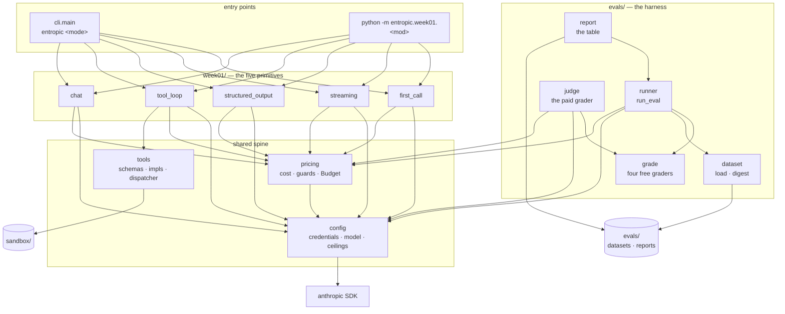

# Entropic knowledge graph

A map of what exists in this repo, what it does, and how the pieces point at each other. Written for
a future session that needs orientation before touching code.

**Verified against commit `aacd6af` (2026-09-10). 82 tests pass, 1 live test deselected.**
If the code has moved since, trust the code and update this file (see [Maintenance](#maintenance)).

- Package root: `src/entropic/` (uv build backend, `src` layout, Python 3.12+)
- Entry point: `entropic = "entropic.cli:main"` — `pyproject.toml:20`
- Everything paid goes through two modules: `config.py` builds the client, `pricing.py` prices the
  call and guards the spend. Nothing else does either.

---

## 1. Shape of the system



Reading order for a newcomer: `config.py` → `pricing.py` → `tools.py` → `week01/tool_loop.py`. The rest are
variations on the first call. For the harness, read `evals/grade.py` first — the vocabulary explains
the runner, not the other way round.

Note which way the arrows do *not* run: nothing in `week01/` imports `evals`, and `evals` imports no
capability module. The harness measures whatever it is handed.

---

## 2. Nodes

Stable IDs are `module.Symbol`. Cite them in future notes; they survive line drift.

### 2.1 Modules

| ID | Path | Role |
|----|------|------|
| `config` | `src/entropic/config.py` | **Every tunable constant except the tool pair's**: credentials, model selection, spending ceilings, output caps, loop caps. The only module that constructs a client. Holds no arithmetic. |
| `pricing` | `src/entropic/pricing.py` | Token prices, cost arithmetic, and the two budget guards that enforce `config`'s ceilings. The only module that knows a price. |
| `tools` | `src/entropic/tools.py` | Framework-free tool implementations + their JSON schemas + a name→function dispatcher. Imports nothing from this package except `tools_config`. |
| `tools_config` | `src/entropic/tools_config.py` | The constants `tools` needs, in a config module that travels with it. Imports nothing internal at all. |
| `cli` | `src/entropic/cli.py` | The `entropic` command: a mode table, a lookup, an interactive menu. |
| `week01.first_call` | `src/entropic/week01/first_call.py` | One non-streaming call; token count and cost. |
| `week01.streaming` | `src/entropic/week01/streaming.py` | Streamed call; thinking vs. text blocks. |
| `week01.structured_output` | `src/entropic/week01/structured_output.py` | `messages.parse` into a Pydantic model. |
| `week01.tool_loop` | `src/entropic/week01/tool_loop.py` | The agent loop, hand-written. The seed of the real agent. |
| `week01.chat` | `src/entropic/week01/chat.py` | Multi-turn REPL with a running cost meter. |
| `evals.dataset` | `src/entropic/evals/dataset.py` | `Case`, the strict JSONL loader, the dataset digest. |
| `evals.grade` | `src/entropic/evals/grade.py` | `Outcome`, `Score`, `Grader`, and the four graders that cost nothing. |
| `evals.judge` | `src/entropic/evals/judge.py` | `LlmJudge`: the fifth grader, the only one that spends. |
| `evals.runner` | `src/entropic/evals/runner.py` | `run_eval`: iterate, bill, grade, survive. |
| `evals.report` | `src/entropic/evals/report.py` | Three Markdown tables and the file they are written to. |

### 2.2 Settings (`config`)

Values, plus the one function that turns them into a client. No arithmetic lives here.

| ID | Kind | Anchor | Contract |
|----|------|--------|----------|
| `config.MODEL` | constant | `config.py:33` | What Entropic thinks with. `ENTROPIC_MODEL` env override, else `DEFAULT_MODEL` = `claude-opus-5`. Every module imports this; none hardcodes a model. |
| `config.JUDGE_MODEL` | constant | `config.py:34` | What grades an eval. `ENTROPIC_JUDGE_MODEL` env override, else `DEFAULT_JUDGE_MODEL` = `claude-sonnet-5`. **Deliberately not `MODEL`**: a model grading its own output favours it, and applying a rubric is easier than the task being graded. Raise it when the rubric is hard — a judge weaker than the task cannot see the failures that matter. |
| `config.MAX_USD_PER_REQUEST` | constant | `config.py:43` | Default `0.25`, env `ENTROPIC_MAX_USD_PER_REQUEST`. Enforced in `pricing`, not here. |
| `config.MAX_USD_PER_RUN` | constant | `config.py:44` | Default `1.00`, env `ENTROPIC_MAX_USD_PER_RUN`. |
| `config.MAX_USD_PER_EVAL` | constant | `config.py:45` | Default `2.00`, env `ENTROPIC_MAX_USD_PER_EVAL`. One eval over a whole dataset. |
| `config.MAX_TOKENS_*` | constants | `config.py:57-62` | One output cap per call site: `FIRST_CALL` 1024, `STREAMING` 4096, `EXTRACT` 2048, `TOOL_LOOP` 4096, `CHAT` 4096, `JUDGE` 1024. Each module imports its own under the local alias `MAX_TOKENS`. Side by side they show which calls are the expensive ones — invisible when each number sits alone in its module. |
| `config.MAX_AGENT_TURNS` | constant | `config.py:66` | `8`. The tool loop's iteration cap; imported by `tool_loop` as `MAX_TURNS`. |
| `config.MAX_FAILURES_SHOWN` | constant | `config.py:70` | `10`. Default truncation for an eval report's failure list. |
| `config.has_credentials` | function | `config.py:73` | `ANTHROPIC_API_KEY` or `ANTHROPIC_AUTH_TOKEN` env, or `~/.config/anthropic` (the `ant` CLI profile). Used to skip tests, not only to fail fast. |
| `config.get_client` | function | `config.py:80` | Raises `SystemExit` with both setup paths when unauthenticated. Adds `anthropic-workspace-id` header only when `ANTHROPIC_WORKSPACE_ID` is set — needed for org-level keys, harmless to omit for workspace-scoped ones. |

### 2.3 Cost and budget (`pricing`)

The only module that knows a price. Two guards at two scales: `check_request` refuses a call before
it is sent, `Budget` reacts after the call that crosses a ceiling — the only honest moment, since
what a call cost is not knowable until it is done.

| ID | Kind | Anchor | Contract |
|----|------|--------|----------|
| `pricing.Price` | frozen dataclass | `pricing.py:28` | USD per million tokens. `cache_write` = input × 1.25, `cache_read` = input × 0.10, as properties — not stored fields. |
| `pricing.PRICES` | dict | `pricing.py:43` | `claude-opus-5` 5/25, `claude-sonnet-5` 2/10, `claude-haiku-4-5` 1/5, `claude-fable-5-1` 10/50. Both of `config`'s default models must appear here. |
| `pricing.cost_usd` | function | `pricing.py:51` | Prices one request across four token classes. **An unknown model costs `0.0`, it does not raise** — a typo in `ENTROPIC_MODEL` silently reports free. |
| `pricing.usage_cost` | function | `pricing.py:71` | `cost_usd` applied to an SDK `Usage`; `None` cache fields coerce to 0. |
| `pricing.describe_usage` | function | `pricing.py:81` | One paste-into-`LOG.md` line. The house format for reporting a call. |
| `pricing.BudgetExceeded` | exception | `pricing.py:91` | `RuntimeError`. Message always names the amount and the env var to turn. |
| `pricing.worst_case_usd` | function | `pricing.py:95` | Input at input price + **the full `max_tokens`** at output price. Thinking counts against `max_tokens`, so this really is a ceiling. |
| `pricing.estimate_eval_usd` | function | `pricing.py:101` | Worst case for a whole run: cases × calls-per-case × `worst_case_usd`. `check_request` cannot see this coming — no single row of an eval is expensive. |
| `pricing.assert_request_within_budget` | function | `pricing.py:117` | Pure, no network. Returns worst case or raises. This is the unit-testable half of the pre-flight guard. |
| `pricing.check_request` | function | `pricing.py:132` | `messages.count_tokens` (free) → `assert_request_within_budget`. Returns the real input-token count. Callers must pass exactly what the real request will send. |
| `pricing.Budget` | mutable dataclass | `pricing.py:152` | Per-run accumulator, billed two ways. `charge()` returns the increment and **records** the overrun in `tripped`; `add()` is `charge()` plus a raise, which is what an interactive run wants. Both bill before they trip, so `spent_usd` always includes the crossing call. `scope` (`"run"` \| `"eval"`) only shapes the message, but it is what makes it name the right env var. |
| `pricing.Budget.tripped` | field | `pricing.py:169` | The overrun message, or `None`. An **attribute** rather than a flag in a caller's closure: a type checker cannot see a nested function reassign a captured name, so it narrows such a flag to `None` and marks the stop branch unreachable — and unreachable code is never type-checked, which is the real cost. |

### 2.4 Tools (`tools`)

| ID | Kind | Anchor | Contract |
|----|------|--------|----------|
| `tools.calculate` | function | `tools.py:30` | AST-walked arithmetic. No names, calls, attributes, or tuples. Raises `ValueError` on anything else. |
| `tools._eval_node` | function | `tools.py:39` | The whitelist: `+ - * / ** %`, unary ±, non-bool numeric constants. Guards `**` at `MAX_EXPONENT` = 1000 and `/`, `%` at zero. |
| `tools.current_time` | function | `tools.py:63` | ISO-8601 UTC, second precision. |
| `tools.read_file` | function | `tools.py:68` | Sandboxed read. `sandbox` is a parameter (default `tools_config.SANDBOX`) purely so tests can pass a `tmp_path`. |
| `tools_config.SANDBOX` | constant | `tools_config.py:17` | `<repo root>/sandbox` via `parents[2]`. **Depends on the file staying two levels under the repo root** — moving the module to another depth breaks the path silently. |
| `tools_config.MAX_FILE_READ_CHARS` | constant | `tools_config.py:21` | 20 000 characters. `read_file` reads one extra char to detect truncation; the cut marker is appended text, not an exception. The number is interpolated into the tool description, so the model is told the cap. |
| `tools_config.MAX_EXPONENT` | constant | `tools_config.py:25` | 1000. Stops `2 ** 10_000_000` hanging the process from a tool argument. |
| `tools.CALCULATOR_TOOL` / `TIME_TOOL` / `READ_FILE_TOOL` | `ToolParam` | `tools.py:87,107,119` | All three are `strict: True` with `additionalProperties: False`. Descriptions are written as prompts ("use this instead of computing in your head"). |
| `tools.ALL_TOOLS` | list | `tools.py:141` | The list handed to the API. Adding a tool = impl + schema + `ALL_TOOLS` entry + `execute_tool` branch. Four edits, no registry. |
| `tools.execute_tool` | function | `tools.py:144` | Dispatch by name → `(content, is_error)`. Type-checks each argument, catches every `Exception`, and returns unknown names as errors. **Never raises.** |

### 2.5 CLI (`cli`)

| ID | Kind | Anchor | Contract |
|----|------|--------|----------|
| `cli.Mode` | frozen dataclass | `cli.py:20` | `key`, `title`, `blurb`, `run: Callable[[list[str]], None]`. |
| `cli.MODES` | tuple | `cli.py:34` | Order is the menu numbering and is asserted by a test: `call, stream, extract, loop, chat`. |
| `cli._run_loop` | function | `cli.py:28` | The only mode taking arguments; prompts `task>` when a TTY and no args. |
| `cli.find_mode` | function | `cli.py:55` | Accepts a key or a 1-based number; case- and space-insensitive; `None` when unknown. |
| `cli.menu_text` | function | `cli.py:64` | Numbered listing; also the body of the "unknown mode" error. |
| `cli.main` | function | `cli.py:71` | `argv` injectable for tests. Non-TTY with no args → `SystemExit` rather than a hang on `input()`. |

### 2.6 The five primitives

| ID | Anchor | What it demonstrates | Notable call shape |
|----|--------|----------------------|--------------------|
| `week01.first_call.main` | `first_call.py:24` | Stateless API, free pre-flight count, `stop_reason` checked **before** reading content (`refusal`, `max_tokens`). | `messages.create`, `max_tokens=1024`. |
| `week01.streaming.main` | `streaming.py:26` | `content_block_start` / `content_block_delta` events; thinking and text as separate blocks; `get_final_message()` still carries usage. | `messages.stream(thinking={"type": "adaptive", "display": "summarized"})`, `max_tokens=4096`. |
| `week01.structured_output.PaperSummary` | `structured_output.py:34` | Field descriptions are visible to the model — written as prompts; `confidence` bounded `ge=0, le=1`. | — |
| `week01.structured_output.main` | `structured_output.py:50` | `messages.parse(output_format=…)` → `parsed_output`, which is `None` when parsing fails. | `max_tokens=2048`. |
| `week01.tool_loop.run` | `tool_loop.py:46` | The whole agent. `client` is injectable, which is what makes the loop testable for free. | `max_tokens=4096`, `MAX_TURNS=8`. |
| `week01.tool_loop.main` | `tool_loop.py:106` | Task from argv; empty task → usage `SystemExit`. | — |
| `week01.chat.main` | `chat.py:35` | Growing history (you pay for all of it every turn), `/effort`, `/reset`, `/quit`, per-turn and session cost. | `messages.stream(output_config={"effort": …})`. |
| `week01.chat.Effort` | `chat.py:26` | `Literal["low","medium","high","xhigh"]`; `EFFORTS` derived via `get_args`, so the command validates against the type. |

### 2.7 The eval harness (`evals`)

Built Week 1. The shape is the point: the harness never assumes the thing under test is a model
call, which is what lets Week 2 hand it a retrieval function that spends nothing.

| ID | Kind | Anchor | Contract |
|----|------|--------|----------|
| `evals.dataset.Case` | Pydantic model | `dataset.py:26` | `id`, `input`, `expected`, `tags`. **`extra="forbid"`** — a mistyped `expcted` is refused rather than silently labelling nothing. `input`/`expected` are objects, not strings, so the same row shape carries a per-field label now and a list of chunk ids in Week 2. |
| `evals.dataset.load_jsonl` | function | `dataset.py:40` | Validates the whole file before the run. Raises `DatasetError` naming the line for bad JSON, a bad row, or a duplicate id. Blank and `//` lines are skipped. An empty dataset is an error. |
| `evals.dataset.digest` | function | `dataset.py:81` | 12 hex chars of SHA-256, recorded in every report. Without it you cannot tell whether a score moved because the prompt changed or the labels did. |
| `evals.grade.Outcome` | frozen dataclass | `grade.py:27` | What a task produced: `output`, plus optional `usage`/`model`/`raw`/`error`. `usage=None` means the task never called the API — the runner bills what is there and nothing more. |
| `evals.grade.Score` | frozen dataclass | `grade.py:42` | A verdict: `passed`, `detail`, `parts` (field-level detail), and `usage`/`model` for a grader that spent. |
| `evals.grade.Grader` | type alias | `grade.py:57` | `Callable[[Case, Outcome], Score]`. Every grader is a factory returning one of these, so the runner treats all five identically. |
| `evals.grade.exact_match` / `contains` | factories | `grade.py:97,112` | Forgiving comparisons: both sides go through `_comparable`, which collapses whitespace and casefolds. `contains` is literal, not numeric — `535,628` does not match `535628`. |
| `evals.grade.regex` | factory | `grade.py:127` | Fixed pattern, or one per case from `expected[name]`. **Neither side is normalised** — it matches `_as_text`, not `_comparable`. Normalising the subject would make `^[A-Z]+$` unsatisfiable; normalising the pattern would casefold `\D` into `\d` and invert the check. Write `(?i)` to opt into case-insensitivity. |
| `evals.grade.pydantic_valid` | factory | `grade.py:159` | Checks shape only, which is a different question from correctness. |
| `evals.grade.field_match` | factory | `grade.py:181` | Per-field exact match, reported per field. `passed` is the strict whole-record number; the useful number is in `parts`. Whole-record accuracy on a five-field schema reads near zero and names no culprit. |
| `evals.judge.LlmJudge` | dataclass | `judge.py:45` | The paid grader. `model` defaults to `config.JUDGE_MODEL`, not `config.MODEL`. `check_request` before the call like any other paid path. Returns `passed=False` with no call at all when the task already failed. |
| `evals.judge.Verdict` | Pydantic model | `judge.py:35` | `reasoning` **before** `passed`: the field order is the model's scratch space. |
| `evals.runner.Task` | type alias | `runner.py:32` | `Callable[[Case], Outcome]`. The task owns its own API call, and therefore its own model, prompt and `check_request`. |
| `evals.runner.RowResult` | frozen dataclass | `runner.py:36` | One case under one variant. `passed` requires every grader to pass and no error. |
| `evals.runner.EvalRun` | dataclass | `runner.py:54` | The whole run, including what makes two runs comparable: model, dataset digest, date, ceiling, and `stopped_early`. |
| `evals.runner.run_eval` | function | `runner.py:80` | Cases outer, variants inner. Bills through `Budget.charge`, so a ceiling trip ends the run rather than killing it. `model` is **recorded, not applied** — pass the one the task really uses; it is also the fallback price when an `Outcome` or `Score` names no model. |
| `evals.report.to_markdown` | function | `report.py:32` | Summary, per-field, failures. Error rows are excluded from the denominator, so a rate limit reads as a rate limit and not as lost accuracy. |
| `evals.report._grading_models` | function | `report.py:70` | The models a grader actually spent on, read back from `Score.model` rather than from config — so the header records what the run did, not what was configured. |
| `evals.report.write_report` | function | `report.py:157` | `evals/reports/<dataset>-<date>.md`, created on demand. |

### 2.8 Tests

| ID | Path | Covers | Cost |
|----|------|--------|------|
| `tests.test_pricing` | `tests/test_pricing.py` | Pricing arithmetic, cache multipliers, unknown-model-is-free, worst case, both guards, `charge` vs `add`, and that both of `config`'s default models are priced. | free |
| `tests.test_tools` | `tests/test_tools.py` | Calculator whitelist and rejections; sandbox escape via `..`, absolute path, and **symlink**; directory and missing-file errors; truncation at and over the cap; dispatcher error paths. | free |
| `tests.test_cli` | `tests/test_cli.py` | Mode order, lookup by key/number, unknown-mode exit. | free |
| `tests.test_tool_loop` | `tests/test_tool_loop.py` | The loop's rules, via `_FakeClient`. | free |
| `tests.test_tool_loop._FakeClient` | `tests/test_tool_loop.py:68` | Scripts `Message` responses and records every `messages` payload sent. **The pattern to copy for any future loop test.** | free |
| `tests.test_tool_loop.test_demo_task_live` | `tests/test_tool_loop.py:132` | The real demo task end to end; asserts the compound-interest answer. | ~$0.02, `-m live` |
| `tests.test_api_smoke` | `tests/test_api_smoke.py` | `count_tokens` round-trip; skipped without credentials. | free |
| `tests.test_evals_dataset` | `tests/test_evals_dataset.py` | The loader failing before the run: typo'd key, duplicate id, bad JSON, empty file; digest moves with the labels. | free |
| `tests.test_evals_graders` | `tests/test_evals_graders.py` | All five graders, the judge included — its verdict is scripted through a fake client, so the paid grader is tested for nothing. | free |
| `tests.test_evals_runner` | `tests/test_evals_runner.py` | The runner's three promises: error rows, a tripped ceiling that keeps its rows, every dollar billed. Tasks here are plain functions — no fake client needed at all. | free |
| `tests.test_evals_report` | `tests/test_evals_report.py` | Table arithmetic: pass rates, per-field columns, error rows out of the denominator, the partial-run banner. | free |

`addopts = "-m 'not live'"` in `pyproject.toml:44` — paid tests never run by accident.

### 2.9 Non-code nodes

| ID | Path | Role |
|----|------|------|
| `sandbox/` | repo root | The only directory `read_file` can reach. Git-ignored except `README.md`; `holdings.txt` is a local demo fixture. |
| `evals/` | repo root | `datasets/*.jsonl` (hand-labelled, the actual asset) and `reports/*.md` (one per run, committed on purpose — a score means nothing alone). Outside `src/` so the wheel does not ship the data. `evals/README.md` documents the row format. |
| `LOG.md` | repo root | Weekly log: what shipped, what broke, real token counts and dollar figures. Append here after live runs. |
| `README.md` | repo root | The five modes, the budget table, the check commands. |
| `.env` / `.env.example` | repo root | `ANTHROPIC_API_KEY`, optional `ANTHROPIC_WORKSPACE_ID`, both budget overrides, `ENTROPIC_MODEL`. `.env` is git-ignored; `load_dotenv()` runs at `config` import. |
| `CLAUDE.md` | repo root | The four project rules for Claude sessions: read this graph first, move it with every commit, keep constants in one config module, and turn on branch protection before the repo gains a collaborator or goes public. Tracked, so it reaches every clone — a session's private memory does not. The constants rule is a **verbatim mirror** of a global preference in `~/.claude/CLAUDE.md`, which is machine-local and backed up by nothing; this copy is the durable one, so edit both or neither. |
| `.githooks/pre-commit` | repo root | Refuses a commit that stages `src/` or `pyproject.toml` without this file. Enabled per clone with `git config core.hooksPath .githooks`; git never installs hooks on clone. |
| `scripts/check-knowledge-graph.sh` | repo root | The rule itself, reading changed paths on stdin. The hook and CI both call it, so the two cannot drift. |
| `.github/workflows/knowledge-graph.yml` | repo root | The same check over the push or PR diff, for clones that never enabled the hook. |
| `.github/workflows/checks.yml` | repo root | ruff, ruff format, pyright and the free tests on every push and PR. No key is configured, so the smoke test skips and the `live` tests stay deselected — CI spends nothing. `uv sync --locked` also catches lockfile drift. |
| roadmap | `~/workspace/MLAI/ML/llm-engineer-roadmap.md` | Outside the repo. The eight-week plan this codebase is executing; the source of every "Week N" comment in the code. |

---

## 3. Edges

Format: `subject —relation→ object`. Greppable by relation name.

### Imports (all internal edges)

```
cli                      —imports→ week01.{first_call, streaming, structured_output, tool_loop, chat}
week01.first_call        —imports→ config.{MODEL, MAX_TOKENS_FIRST_CALL as MAX_TOKENS, get_client}
week01.streaming         —imports→ config.{MODEL, MAX_TOKENS_STREAMING as MAX_TOKENS, get_client}
week01.structured_output —imports→ config.{MODEL, MAX_TOKENS_EXTRACT as MAX_TOKENS, get_client}
week01.{first_call, streaming, structured_output} —imports→ pricing.{check_request, describe_usage}
week01.tool_loop         —imports→ config.{MODEL, MAX_USD_PER_RUN, MAX_TOKENS_TOOL_LOOP, MAX_AGENT_TURNS, get_client}
week01.tool_loop         —imports→ pricing.{Budget, check_request, describe_usage}
week01.tool_loop         —imports→ tools.{ALL_TOOLS, execute_tool}
week01.chat              —imports→ config.{MODEL, MAX_USD_PER_RUN, MAX_TOKENS_CHAT, get_client}
week01.chat              —imports→ pricing.{Budget, BudgetExceeded, check_request, usage_cost}
pricing                  —imports→ config.{MAX_USD_PER_REQUEST, MAX_USD_PER_RUN}   (one way; config never imports pricing)
config                   —imports→ anthropic, dotenv
tools                    —imports→ anthropic.types.ToolParam + tools_config   (no client, no network)
tools_config             —imports→ pathlib                    (nothing internal at all)

evals.dataset            —imports→ pydantic                    (no config, no client, no network)
evals.grade              —imports→ evals.dataset, anthropic.types.Usage, pydantic
evals.judge              —imports→ config.{JUDGE_MODEL, MAX_TOKENS_JUDGE, get_client} + pricing.check_request
evals.judge              —imports→ evals.{dataset, grade}
evals.runner             —imports→ config.{MODEL, MAX_USD_PER_EVAL} + pricing.Budget
evals.runner             —imports→ evals.{dataset, grade}
evals.report             —imports→ evals.runner, config.MAX_FAILURES_SHOWN
```

`tools` does not import `config`, and `config` does not import `tools`. Keep it that way — it is why
`tools` can be lifted into an SDK tool runner or a LangGraph node by copying two files. Those two
files are the exception to "every constant lives in `config`", and the shape of the exception is the
point: the constants did not stay scattered in `tools.py`, they moved into `tools_config.py`. A
config module that travels with the code it configures keeps both properties — one place per
concern, and no dependency on the rest of the package.

The same rule holds one level up: no module under `evals/` imports `week01/`, or anything else that
does work. The harness is handed a `Task` and knows nothing about what is inside it. `evals.grade`
holds `Outcome` and `Score` rather than the runner, so a grader never imports the runner either —
the dependency runs one way and stays acyclic.

### Enforcement and control flow

```
pricing.check_request              —calls→ client.messages.count_tokens   (free)
pricing.check_request              —calls→ pricing.assert_request_within_budget
pricing.assert_request_within_budget —calls→ pricing.worst_case_usd —calls→ pricing.cost_usd
pricing.Budget.charge              —calls→ pricing.usage_cost
pricing.Budget.charge              —records-into→ pricing.Budget.tripped  (bills, never raises)
pricing.Budget.add                 —calls→ pricing.Budget.charge, then raises if tripped
pricing.{assert_request_within_budget, Budget.add} —raises→ pricing.BudgetExceeded
config.get_client                  —raises→ SystemExit   (missing credentials)

week01.tool_loop.run   —guards-each-call-with→ pricing.check_request      (per request, pre-flight)
week01.tool_loop.run   —accumulates-into→      pricing.Budget             (per run, post-call)
week01.tool_loop.run   —calls→                 tools.execute_tool
week01.tool_loop.run   —sends→                 tools.ALL_TOOLS
week01.tool_loop.run   —raises→                RuntimeError               (turn cap, MAX_TURNS=8)
week01.chat.main       —catches→               pricing.BudgetExceeded     (pre-flight: drop turn, keep session)
week01.chat.main       —catches→               pricing.BudgetExceeded     (per-run: end session)
tools.execute_tool     —calls→                 tools.{calculate, current_time, read_file}
tools.read_file        —reads-within→          tools.SANDBOX

evals.dataset.load_jsonl   —raises→        evals.dataset.DatasetError   (before any paid call)
evals.runner.run_eval      —accumulates-into→ pricing.Budget(scope="eval"), via Budget.charge
evals.runner.run_eval      —bills→          Outcome.usage and Score.usage into that one budget
evals.runner.run_eval      —reads→          pricing.Budget.tripped       (partial run; rows kept)
evals.runner._run_one      —catches→        Exception from the task      (error row)
evals.runner._run_one      —catches→        Exception from a grader      (failed score, run goes on)
evals.judge.LlmJudge       —guards-call-with→ pricing.check_request      (pre-flight, as everywhere)
evals.judge.LlmJudge       —reports-usage-in→ evals.grade.Score          (so the runner can bill it)
evals.report.write_report  —writes→        evals/reports/<dataset>-<date>.md
```

`tool_loop` lets `BudgetExceeded` propagate; `chat` catches it in both places. That difference is
deliberate: a batch run should die loudly, an interactive session should degrade.

### Tested-by

```
pricing.{cost_usd, worst_case_usd, assert_request_within_budget, Budget} —tested-by→ tests.test_pricing
tools.{calculate, read_file, execute_tool}                             —tested-by→ tests.test_tools
cli.{MODES, find_mode, menu_text, main}                                —tested-by→ tests.test_cli
week01.tool_loop.run                                                   —tested-by→ tests.test_tool_loop
config.get_client                                                      —smoke-tested-by→ tests.test_api_smoke
pricing.{estimate_eval_usd, Budget.charge, Budget.scope}               —tested-by→ tests.test_pricing
evals.dataset.{load_jsonl, digest}                                     —tested-by→ tests.test_evals_dataset
evals.grade.* and evals.judge.LlmJudge                                 —tested-by→ tests.test_evals_graders
evals.runner.run_eval                                                  —tested-by→ tests.test_evals_runner
evals.report.{to_markdown, write_report}                               —tested-by→ tests.test_evals_report
```

Untested by design: the four demo `main()` functions in `week01/` (they are the demos), and
`config.get_client`'s header logic beyond the smoke test.

Note what the eval tests do *not* need: `tests.test_evals_runner` uses plain functions as tasks, not
a fake client. That is the `Task` seam paying for itself — the harness is testable without
pretending to be an API.

### Environment

```
ENTROPIC_MODEL                 —configures→ config.MODEL        (the agent)
ENTROPIC_JUDGE_MODEL           —configures→ config.JUDGE_MODEL  (the grader; defaults apart on purpose)
ENTROPIC_MAX_USD_PER_REQUEST   —configures→ config.MAX_USD_PER_REQUEST
ENTROPIC_MAX_USD_PER_RUN       —configures→ config.MAX_USD_PER_RUN
ENTROPIC_MAX_USD_PER_EVAL      —configures→ config.MAX_USD_PER_EVAL
ANTHROPIC_API_KEY | ANTHROPIC_AUTH_TOKEN | ~/.config/anthropic —authenticates→ config.get_client
ANTHROPIC_WORKSPACE_ID         —adds-header→ config.get_client   (org-level keys only)
```

Every `ENTROPIC_*` value is read **at import time** into module-level constants. Setting them
with `monkeypatch` after import will not take effect; pass `limit_usd=` explicitly instead, which is
what `tests.test_pricing` does.

---

## 4. Invariants

The rules the code encodes. Breaking one of these is a regression even when tests stay green.

1. **Every paid call is preceded by `pricing.check_request`.** The free token count is the guard's input;
   pass the exact `messages`, `system`, and `tools` the real call will send or the count lies.
2. **Cost is reported, always.** Every path prints `describe_usage` or an equivalent cost line. This
   is the repo's stated purpose, not decoration.
3. **The assistant turn is echoed back verbatim**, `tool_use` blocks included (`tool_loop.py:85`).
4. **All tool results for one turn go back in ONE user message** (`tool_loop.py:107`). Splitting them
   trains the model out of parallel tool calls. `tests.test_tool_loop` asserts this explicitly.
5. **Tool errors are `tool_result` with `is_error: True`, never exceptions.** `execute_tool` catches
   everything. The model can recover from a message; it cannot recover from a traceback.
6. **The loop is capped** (`config.MAX_AGENT_TURNS` = 8) and backed by two dollar ceilings. An
   uncapped loop is a cost bug waiting to happen.
7. **`read_file` resolves before it compares.** `.resolve()` then `is_relative_to` defeats `..`,
   absolute paths, and symlinks alike — all three are tested. Any new filesystem tool must repeat
   this check; do not add a tool that takes a path without it.
8. **`config` holds every tunable constant and is the only module that builds a client; `pricing` is
   the only module that knows a price.** New modules import `MODEL` (or `JUDGE_MODEL`, if they grade), they do not name a model,
   and they never do cost arithmetic of their own. Both defaults must appear in `pricing.PRICES`: an
   unknown model costs `0.0` rather than raising, so a typo in a default would report every run as
   free. `tests.test_pricing` pins this. `pricing` imports `config`, never the reverse. The one
   exception to the constants half is the `tools` / `tools_config` pair, which is isolated on purpose
   and carries its own config — see §3.
9. **Paid tests carry `@pytest.mark.live`** and are deselected by default.
10. **Types are complete.** `pyright` runs in standard mode; `cast` is used where SDK stubs are loose
    (`tests/test_tool_loop.py:43`, `chat.py:66`), never `# type: ignore`.
11. **An eval survives its own bad rows.** A task that raises, a task that reports an error, a grader
    that raises — each becomes one row in the report, and the run continues. The dataset is validated
    in full *before* the first paid call, so the failures that do happen are the system's, not the
    labels'.
12. **Every dollar an eval spends lands in one budget.** The task reports usage in `Outcome`, a paid
    grader in `Score`, and `run_eval` bills both to one `Budget` via `charge`. Pricing stays in
    `pricing`: nothing under `evals/` calls `usage_cost` itself. A grader that spends silently would
    make the printed total a lie.
13. **The harness imports no capability module.** `evals/` depends on `config` and on itself. It is
    handed a `Task` and knows nothing about what is inside it — which is the only reason Week 2 can
    point it at a retrieval function that never calls the API.

---

## 5. Where the next work attaches

Anchors the code already names, so a future session can find the intended seam rather than inventing one.

| Planned | Seam | Named at |
|---------|------|----------|
| Week 1 — Project 1a | A `Task` wrapping `structured_output`'s `messages.parse`, graded with `field_match` over a hand-labelled dataset. Nothing new in the harness. | `evals/README.md` |
| Week 1 — prompt caching | System prompts are already byte-identical per call, which is the precondition. `Price.cache_write` / `cache_read` and the cache columns in `describe_usage` are already wired. Measure it as two variants of one eval — `baseline` and `cached` — rather than a toy script. | `chat.py:11`, `pricing.py:28-41` |
| Week 2 — retrieval metrics | recall@k and MRR are graders over a `Task` that returns `Outcome(usage=None)`. The harness already treats a free task as a first-class one. | `runner.py:38`, `grade.py:57` |
| Week 2 — RAG milestone `v0.1-rag` | New capability module; reuse `tools` for retrieval tools. | roadmap |
| Week 3 — `chat` becomes the default mode | `cli.MODES` order and `cli.main`'s no-arg branch. | `cli.py:7-8` |
| Week 5 — SDK tool runner | `tools.ALL_TOOLS` + `execute_tool` are framework-free precisely for this. | `tools.py:1-3` |
| Week 5 — async and batch evals | `run_eval` is serial on purpose: concurrent rows race the budget ceiling, and a wrong total is worse than a slow run. `Budget` is where that would have to become thread-safe. | `pricing.py:152`, `runner.py:80` |
| Week 6 — LangGraph agent | Same two symbols; `tool_loop.run` is the reference semantics to preserve. | `tools.py:1-3` |

Adding a tool, concretely: implement it in `tools.py`, add a `ToolParam` with `strict: True` and
`additionalProperties: False`, append to `ALL_TOOLS`, add a branch to `execute_tool` that type-checks
its arguments, and add tests for the happy path plus at least one abuse path.

Adding a grader, concretely: write a factory in `grade.py` returning `Callable[[Case, Outcome], Score]`,
return `Score(False, …)` rather than raising when the case or the output is unusable, fill `parts` if
the verdict decomposes by field, and set `usage`/`model` if it spent anything. Test it with a literal
`Case` and `Outcome` — no client, no network.

---

## Maintenance

Two things enforce this file rather than trusting memory: `.githooks/pre-commit` refuses a commit
that changes `src/` or `pyproject.toml` without staging it, and `.github/workflows/knowledge-graph.yml`
runs the same rule in CI. Both call `scripts/check-knowledge-graph.sh`. Neither can tell whether the
edit was any good — that part is still on you.

This file is hand-written, not generated. It goes stale in three places first: the anchors in §2
(line numbers), the pricing table, and §5 as weeks land. When you touch the repo in a way that moves
a node or an edge, update the affected row and the "verified against" commit at the top. Keeping §4
accurate matters more than keeping the line numbers exact.
