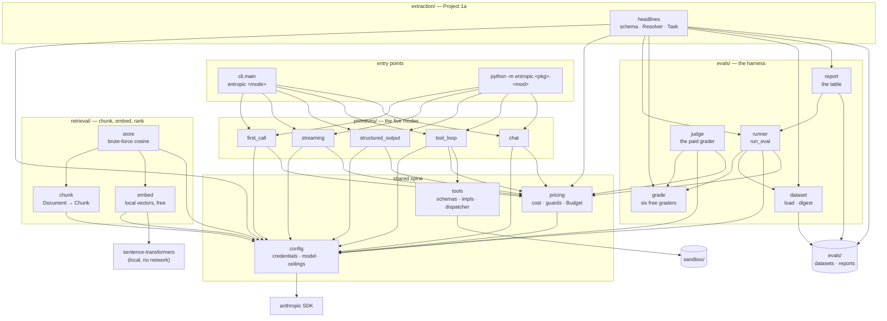

# Entropic knowledge graph

A map of what exists in this repo, what it does, and how the pieces point at each other. Written for
a future session that needs orientation before touching code.

**Verified against commit `7e483c1` plus the package restructure landing in this commit
(2026-09-16). 474 tests pass, 21 fail on purpose, 1 live test deselected.**

> **The package is organised by capability, not by week.** `week01/` split into `primitives/`
> (the five CLI modes plus the failure catalogue) and `extraction/` (Project 1a, which is a
> capability rather than a demo); `week02/` became `retrieval/`. The test tree mirrors it.
> Roadmap weeks still appear in §5, where they are dates rather than module names.

> **`retrieval/` is written; the eval harness half of Week 2 is not.** `chunk`, `embed` and `store`
> are implemented and green. The two retrieval graders and `report._metrics_table` are still
> signatures and `NotImplementedError`, with their tests complete and red, so `uv run pytest -q`
> is the to-do list. Same arrangement as the `underhood` repo (Track B).
If the code has moved since, trust the code and update this file (see [Maintenance](#maintenance)).

- Package root: `src/entropic/` (uv build backend, `src` layout, Python 3.12+)
- Entry point: `entropic = "entropic.cli:main"` — `pyproject.toml:20`
- Everything paid goes through two modules: `config.py` builds the client, `pricing.py` prices the
  call and guards the spend. Nothing else does either.

---

## 1. Shape of the system



Reading order for a newcomer: `config.py` → `pricing.py` → `tools.py` → `primitives/tool_loop.py`. The rest are
variations on the first call. For the harness, read `evals/grade.py` first — the vocabulary explains
the runner, not the other way round.

Note which way the arrows do *not* run: nothing in `primitives/` imports `evals`, and `evals` imports no
capability module. The harness measures whatever it is handed.

---

## 2. Nodes

Stable IDs are `module.Symbol`. Cite them in future notes; they survive line drift.

### 2.1 Modules

| ID | Path | Role |
|----|------|------|
| `config` | `src/entropic/config.py` | **Every tunable constant except the tool pair's**: credentials, model selection, spending ceilings, output caps, loop caps. The only module that constructs a client. Holds no arithmetic. |
| `pricing` | `src/entropic/pricing.py` | Token prices, cost arithmetic, and the two budget guards that enforce `config`'s ceilings. The only module that knows a price. |
| `tools` | `src/entropic/tools.py` | Framework-free tool implementations + their JSON schemas + a name→function dispatcher. Imports nothing from this package except `tools_config`. |
| `tools_config` | `src/entropic/tools_config.py` | The constants `tools` needs, in a config module that travels with it. Imports nothing internal at all. |
| `cli` | `src/entropic/cli.py` | The `entropic` command: a mode table, a lookup, an interactive menu. |
| `primitives.first_call` | `src/entropic/primitives/first_call.py` | One non-streaming call; token count and cost. |
| `primitives.streaming` | `src/entropic/primitives/streaming.py` | Streamed call; thinking vs. text blocks. |
| `primitives.structured_output` | `src/entropic/primitives/structured_output.py` | `messages.parse` into a Pydantic model. |
| `primitives.tool_loop` | `src/entropic/primitives/tool_loop.py` | The agent loop, hand-written. The seed of the real agent. |
| `primitives.chat` | `src/entropic/primitives/chat.py` | Multi-turn REPL with a running cost meter. |
| `primitives.failures` | `src/entropic/primitives/failures.py` | **Break things on purpose.** Nine failure modes provoked for real and tabulated into `docs/failure-modes.md`. Free by construction, which is the design constraint rather than a happy accident: a request rejected with a 4xx never reaches the model, so there is nothing to bill, and the last two rows never leave the machine. Nothing here calls `messages.parse` — a *successful* call is the only way this module could cost anything, and a test asserts the string is absent from the source. |
| `extraction.headlines` | `src/entropic/extraction/headlines.py` | **Project 1a**: the extraction schema, two system-prompt variants, the `Task` that wraps `messages.parse`, the `Resolver` that turns a company mention into a ticker, and the `main` that runs the eval. The harness's first paying customer. |
| `evals.dataset` | `src/entropic/evals/dataset.py` | `Case`, the strict JSONL loader, the dataset digest. |
| `evals.grade` | `src/entropic/evals/grade.py` | `Outcome`, `Score`, `Grader`, and the six graders that cost nothing — four over text, two over a ranked list of chunk ids. |
| `evals.judge` | `src/entropic/evals/judge.py` | `LlmJudge`: the fifth grader, the only one that spends. |
| `evals.runner` | `src/entropic/evals/runner.py` | `run_eval`: iterate, bill, grade, survive. |
| `evals.report` | `src/entropic/evals/report.py` | Four Markdown tables and the file they are written to. |
| `retrieval.chunk` | `src/entropic/retrieval/chunk.py` | `Document`, `Chunk`, `Inventory`, and the four splitters — fixed, fixed-with-overlap, by sentence, by heading. Also `Inventory.containing`, which resolves a labelled quote to the ids that hold it. Imports `config` and nothing else internal. |
| `retrieval.embed` | `src/entropic/retrieval/embed.py` | The `Embedder` protocol and `LocalEmbedder`, `sentence-transformers` on MPS. The one part of Entropic that thinks with someone else's weights, and the only capability module that spends nothing at all. |
| `retrieval.store` | `src/entropic/retrieval/store.py` | `VectorStore`: ids, a normalised matrix, and brute-force cosine search. No index, no database, exact answers. |

### 2.2 Settings (`config`)

Values, plus the one function that turns them into a client. No arithmetic lives here.

| ID | Kind | Anchor | Contract |
|----|------|--------|----------|
| `config.MODEL` | constant | `config.py:20` | What Entropic thinks with. `ENTROPIC_MODEL` env override, else `DEFAULT_MODEL` = `claude-opus-5`. Every module imports this; none hardcodes a model. |
| `config.JUDGE_MODEL` | constant | `config.py:21` | What grades an eval. `ENTROPIC_JUDGE_MODEL` env override, else `DEFAULT_JUDGE_MODEL` = `claude-sonnet-5`. **Deliberately not `MODEL`**: a model grading its own output favours it, and applying a rubric is easier than the task being graded. Raise it when the rubric is hard — a judge weaker than the task cannot see the failures that matter. |
| `config.MAX_USD_PER_REQUEST` | constant | `config.py:27` | Default `0.25`, env `ENTROPIC_MAX_USD_PER_REQUEST`. Enforced in `pricing`, not here. |
| `config.MAX_USD_PER_RUN` | constant | `config.py:28` | Default `1.00`, env `ENTROPIC_MAX_USD_PER_RUN`. |
| `config.MAX_USD_PER_EVAL` | constant | `config.py:29` | Default `2.00`, env `ENTROPIC_MAX_USD_PER_EVAL`. One eval over a whole dataset. |
| `config.MAX_TOKENS_*` | constants | `config.py:36-42` | One output cap per call site: `FIRST_CALL` 1024, `STREAMING` 4096, `EXTRACT` 2048, **`HEADLINE` 128**, `TOOL_LOOP` 4096, `CHAT` 4096, `JUDGE` 1024. Each module imports its own under the local alias `MAX_TOKENS`. Side by side they show which calls are the expensive ones — invisible when each number sits alone in its module. `HEADLINE` is the worked example of why the cap is sized per call site rather than set generously: `estimate_eval_usd` prices the full cap, so Project 1a's worst case is $3.19 at `EXTRACT`'s 2048 and $0.64 at 384. Same run, same real spend; only the guard's verdict changes. It started at 256, clipped one row in 60 on the first live run (2026-09-11), went to 384, and still clipped two rows in 50 — the other edge of the same knife. The cause was not the record: it was **extended thinking**, billed as output and charged against the cap, spending 200-280 tokens before the answer began. With `THINKING_EVAL` off the record is ~45 tokens and 128 is three times what it needs. The old comment claimed 384 sized "a five-field record"; it never did. Tuned against actual runs rather than guessed — three of them. |
| `config.MAX_AGENT_TURNS` | constant | `config.py:48` | `8`. The tool loop's iteration cap; imported by `tool_loop` as `MAX_TURNS`. |
| `config.MAX_FAILURES_SHOWN` | constant | `config.py:51` | `10`. Default truncation for an eval report's failure list. |
| `config.EMBED_MODEL` | constant | `config.py:58` | `BAAI/bge-small-en-v1.5` — 384 dimensions, 512 tokens, ~130MB, runs on MPS. Free to run, which is what makes a retrieval eval free to repeat. |
| `config.EMBED_QUERY_PREFIX` | constant | `config.py:63` | The instruction BGE v1.5 is trained to see **on the query side only**. Embedding a passage with it, or a query without it, still returns plausible rankings — just measurably worse ones, with nothing in the output to say so. |
| `config.CHUNK_*` | constants | `config.py:67-71` | `CHARS` 1200, `OVERLAP_CHARS` 200, `OVERLAP_SENTENCES` 1, `MAX_CHARS` 2000, `MIN_CHARS` 80. **In characters, not tokens**: the tokenizer belongs to the embedding model, and a chunker that imports one cannot be pointed at another. `MIN_CHARS` is the floor below which a fragment is dropped rather than embedded. |
| `config.HEADING_*` | constants | `config.py:74-76` | What `by_heading` accepts as a heading in text whose markup extraction destroyed: `MAX_CHARS` 80, `MAX_WORDS` 12, `MIN_CAPITAL_RATIO` 0.6. |
| `config.TOP_K` | constant | `config.py:79` | `5`. How many chunks a retriever returns, and therefore how many an answer can cite. |
| `config.has_credentials` | function | `config.py:82` | `ANTHROPIC_API_KEY` or `ANTHROPIC_AUTH_TOKEN` env, or `~/.config/anthropic` (the `ant` CLI profile). Used to skip tests, not only to fail fast. |
| `config.get_client` | function | `config.py:89` | Raises `SystemExit` with both setup paths when unauthenticated. Adds `anthropic-workspace-id` header only when `ANTHROPIC_WORKSPACE_ID` is set — needed for org-level keys, harmless to omit for workspace-scoped ones. |

### 2.3 Cost and budget (`pricing`)

The only module that knows a price. Two guards at two scales: `check_request` refuses a call before
it is sent, `Budget` reacts after the call that crosses a ceiling — the only honest moment, since
what a call cost is not knowable until it is done.

| ID | Kind | Anchor | Contract |
|----|------|--------|----------|
| `pricing.Price` | frozen dataclass | `pricing.py:20` | USD per million tokens. `cache_write` = input × 1.25, `cache_read` = input × 0.10, as properties — not stored fields. |
| `pricing.PRICES` | dict | `pricing.py:36` | `claude-opus-5` 5/25, `claude-sonnet-5` 2/10, `claude-haiku-4-5` 1/5, `claude-fable-5-1` 10/50. Both of `config`'s default models must appear here. |
| `pricing.cost_usd` | function | `pricing.py:44` | Prices one request across four token classes. **An unknown model costs `0.0`, it does not raise** — a typo in `ENTROPIC_MODEL` silently reports free. |
| `pricing.usage_cost` | function | `pricing.py:64` | `cost_usd` applied to an SDK `Usage`; `None` cache fields coerce to 0. |
| `pricing.describe_usage` | function | `pricing.py:74` | One paste-into-`LOG.md` line. The house format for reporting a call. |
| `pricing.BudgetExceeded` | exception | `pricing.py:84` | `RuntimeError`. Message always names the amount and the env var to turn. |
| `pricing.worst_case_usd` | function | `pricing.py:88` | Input at input price + **the full `max_tokens`** at output price. Thinking counts against `max_tokens`, so this really is a ceiling. |
| `pricing.estimate_eval_usd` | function | `pricing.py:94` | Worst case for a whole run: cases × calls-per-case × `worst_case_usd`. `check_request` cannot see this coming — no single row of an eval is expensive. Takes `cached_tokens`: a prefix behind a breakpoint is written once at a 25% premium and read thereafter at a tenth of input price, so a cached run is priced as one write plus n-1 reads. Without that the estimator would refuse a cached run for costing what the uncached one costs — blocking the experiment on the arithmetic it exists to check. Note the sign flips at n=1: caching a single row costs *more* than not caching it, because you pay the write premium and never read it back, which makes `--sample 1` the one place the wiring cannot be smoke-tested. |
| `pricing.assert_request_within_budget` | function | `pricing.py:116` | Pure, no network. Returns worst case or raises. This is the unit-testable half of the pre-flight guard. |
| `pricing.check_request` | function | `pricing.py:131` | `messages.count_tokens` (free) → `assert_request_within_budget`. Returns the real input-token count. Callers must pass exactly what the real request will send — `system` takes the block form as well as a bare string, which is how a cache breakpoint travels. |
| `pricing.Budget` | mutable dataclass | `pricing.py:149` | Per-run accumulator, billed two ways. `charge()` returns the increment and **records** the overrun in `tripped`; `add()` is `charge()` plus a raise, which is what an interactive run wants. Both bill before they trip, so `spent_usd` always includes the crossing call. `scope` (`"run"` \| `"eval"`) only shapes the message, but it is what makes it name the right env var. |
| `pricing.Budget.tripped` | field | `pricing.py:160` | The overrun message, or `None`. An **attribute** rather than a flag in a caller's closure: a type checker cannot see a nested function reassign a captured name, so it narrows such a flag to `None` and marks the stop branch unreachable — and unreachable code is never type-checked, which is the real cost. |

### 2.4 Tools (`tools`)

| ID | Kind | Anchor | Contract |
|----|------|--------|----------|
| `tools.calculate` | function | `tools.py:29` | AST-walked arithmetic. No names, calls, attributes, or tuples. Raises `ValueError` on anything else. |
| `tools._eval_node` | function | `tools.py:38` | The whitelist: `+ - * / ** %`, unary ±, non-bool numeric constants. Guards `**` at `MAX_EXPONENT` = 1000 and `/`, `%` at zero. |
| `tools.current_time` | function | `tools.py:62` | ISO-8601 UTC, second precision. |
| `tools.read_file` | function | `tools.py:67` | Sandboxed read. `sandbox` is a parameter (default `tools_config.SANDBOX`) purely so tests can pass a `tmp_path`. |
| `tools_config.SANDBOX` | constant | `tools_config.py:13` | `<repo root>/sandbox` via `parents[2]`. **Depends on the file staying two levels under the repo root** — moving the module to another depth breaks the path silently. |
| `tools_config.MAX_FILE_READ_CHARS` | constant | `tools_config.py:17` | 20 000 characters. `read_file` reads one extra char to detect truncation; the cut marker is appended text, not an exception. The number is interpolated into the tool description, so the model is told the cap. |
| `tools_config.MAX_EXPONENT` | constant | `tools_config.py:21` | 1000. Stops `2 ** 10_000_000` hanging the process from a tool argument. |
| `tools.CALCULATOR_TOOL` / `TIME_TOOL` / `READ_FILE_TOOL` | `ToolParam` | `tools.py:86,106,118` | All three are `strict: True` with `additionalProperties: False`. Descriptions are written as prompts ("use this instead of computing in your head"). |
| `tools.ALL_TOOLS` | list | `tools.py:140` | The list handed to the API. Adding a tool = impl + schema + `ALL_TOOLS` entry + `execute_tool` branch. Four edits, no registry. |
| `tools.execute_tool` | function | `tools.py:143` | Dispatch by name → `(content, is_error)`. Type-checks each argument, catches every `Exception`, and returns unknown names as errors. **Never raises.** |

### 2.5 CLI (`cli`)

| ID | Kind | Anchor | Contract |
|----|------|--------|----------|
| `cli.Mode` | frozen dataclass | `cli.py:15` | `key`, `title`, `blurb`, `run: Callable[[list[str]], None]`. |
| `cli.MODES` | tuple | `cli.py:29` | Order is the menu numbering and is asserted by a test: `call, stream, extract, loop, chat`. |
| `cli._run_loop` | function | `cli.py:23` | The only mode taking arguments; prompts `task>` when a TTY and no args. |
| `cli.find_mode` | function | `cli.py:50` | Accepts a key or a 1-based number; case- and space-insensitive; `None` when unknown. |
| `cli.menu_text` | function | `cli.py:59` | Numbered listing; also the body of the "unknown mode" error. |
| `cli.main` | function | `cli.py:66` | `argv` injectable for tests. Non-TTY with no args → `SystemExit` rather than a hang on `input()`. |

### 2.6 The primitives (`primitives`) and Project 1a (`extraction`)

| ID | Anchor | What it demonstrates | Notable call shape |
|----|--------|----------------------|--------------------|
| `primitives.first_call.main` | `first_call.py:15` | Stateless API, free pre-flight count, `stop_reason` checked **before** reading content (`refusal`, `max_tokens`). | `messages.create`, `max_tokens=1024`. |
| `primitives.streaming.main` | `streaming.py:20` | `content_block_start` / `content_block_delta` events; thinking and text as separate blocks; `get_final_message()` still carries usage. | `messages.stream(thinking={"type": "adaptive", "display": "summarized"})`, `max_tokens=4096`. |
| `primitives.structured_output.PaperSummary` | `structured_output.py:29` | Field descriptions are visible to the model — written as prompts; `confidence` bounded `ge=0, le=1`. | — |
| `primitives.structured_output.main` | `structured_output.py:45` | `messages.parse(output_format=…)` → `parsed_output`, which is `None` when parsing fails. | `max_tokens=2048`. |
| `primitives.tool_loop.run` | `tool_loop.py:28` | The whole agent. `client` is injectable, which is what makes the loop testable for free. | `max_tokens=4096`, `MAX_TURNS=8`. |
| `primitives.tool_loop.main` | `tool_loop.py:88` | Task from argv; empty task → usage `SystemExit`. | — |
| `primitives.chat.main` | `chat.py:26` | Growing history (you pay for all of it every turn), `/effort`, `/reset`, `/quit`, per-turn and session cost. | `messages.stream(output_config={"effort": …})`. |
| `primitives.chat.Effort` | `chat.py:17` | `Literal["low","medium","high","xhigh"]`; `EFFORTS` derived via `get_args`, so the command validates against the type. |
| `extraction.headlines.Extraction` | `headlines.py:45` | What the **model** returns: `company` — the mention **copied verbatim** from the headline, not canonicalised — plus `metric`, `quarter`, `direction`, `change_pct`. What gets **graded** is `FIELDS` (`headlines.py:69`): `ticker` and the last four, because the task resolves the ticker in code before handing back the outcome. The labelling conventions live in the **field descriptions**, which the model sees, and a convention stated only in the few-shot examples would punish `zero_shot` for failing to guess it — a test asserts each one appears in both arms. They are: copy the mention; the Indian fiscal calendar, where a bare month is a month and not a quarter; a level or a basis-point move leaves `change_pct` null, but a growth **rate** is itself a change, and its direction is the sign of the growth rather than whether the rate rose or fell; a share price move is the market's number and never the metric. The descriptions are **prompt, not documentation**, so they are written short: 1,773 characters for five fields, against 2,530 when every rule was first written out longhand. Rationale that a reader would want and the model would not belongs here in the graph. `company` is **nullable** — a headline naming a sector or an index has no company to extract, and `null` is an answer rather than a miss; `extraction_task` skips the lookup entirely for it, so nothing lands in `unresolved`. |
| `extraction.headlines.METRICS` | `headlines.py:42` | A **total order** over the metric vocabulary, most preferred first. A headline routinely names two ("narrows Q1 loss; revenue up 63%"); without a tie-break the label is a coin flip the model has no way to call, and the miss reads as a model failure when it is a spec failure. The rule, stated in the `metric` description: the earliest-ranked metric **among those whose percentage change the headline states**, else the earliest among those the headline mentions at all, else — for two that still tie — the one mentioned first. The last two members close the vocabulary: `other` is a company metric the six named ones do not cover (a narrower or domain-specific line — GMV, provisions, volumes, new business premium), and `none` is a headline that reports no metric at all. Both rank last, so they can never outrank a named metric. One clarification is load-bearing — a forward-looking statement about a metric is `guidance`, not that metric, or the mechanical rule reads "cuts revenue guidance" as cueing `revenue` and flips `hl-003` and `hl-023` to a label no reader would write. **Placeholder**: the order is asserted, not researched. |
| `extraction.headlines.Resolver` | `headlines.py:114` | Company mention → NSE ticker, through the directory. Indexes the ticker, the registered name and every alias under `_key` (`headlines.py:142` — casefold, strip punctuation and a `Ltd`/`Limited` suffix), then looks up **exactly**: never fuzzily, because a lookup that matches approximately is wrong in the same quiet way a guess is. A miss returns `None` and is counted in `unresolved`. **The one silent failure:** a company whose name contains another company's — `Tech Mahindra` holds `Mahindra`, which is `M&M`; `SBI Cards` holds `SBI`, which is `SBIN`; `Kotak Mahindra Bank` holds `Mahindra` too — where a truncated mention resolves to a real but wrong company and the resolver reports success. Those rows carry the `name-contains-name` tag, and a test derives the set rather than trusting it, so the tag stays accurate as the directory grows. `dict.get` is free and cannot hallucinate `HEROMOTOCORP` for `HEROMOTOCO`, and 22 of the 48 rows that name a company spell it as something other than its symbol — so 46% of that field's difficulty leaves the model's job entirely. A parametrized test proves the composed property over every such row: copy the spelling the headline writes, resolve it, land on the label. `ticker` is therefore right **by construction** whenever `company` is, and the eval measures identification rather than symbol recall. |
| `extraction.headlines.report_unresolved` | `headlines.py:344` | The actionable half of a failed lookup: the mentions to add to the directory, with counts. **The failure mode of a lookup is a to-do list; the failure mode of a guess is a plausible wrong symbol.** |
| `extraction.headlines.load_directory` | `headlines.py:102` | Reads `evals/reference/nse-tickers.json` into `{ticker: {name, aliases}}`. Reference data, not settings. |
| `extraction.headlines.Variant` | `headlines.py:176` | One arm of an eval: the system prompt, plus whether it travels behind a cache breakpoint. The two axes are deliberately independent — prompt *content* changes what the model answers, a breakpoint changes only what the answer costs — so each table is readable only while the other axis is held fixed. `as_sent` returns a bare string uncached and the block form with `cache_control` when cached; a test asserts the breakpoint actually reaches the wire, because a `Variant` that built the block and dropped it would look identical to every test that only checks prompt text. |
| `extraction.headlines.CACHE_VARIANTS` | `headlines.py:195` | The caching ablation: one prompt, breakpoint off then on. Scores must come out identical — the cache is a serving detail, not a different request — so a gap between these two arms is a bug in the wiring rather than a finding. Verified before the first paid run that the arms are independent: a request with no `cache_control` reported `cache_read=0` against a cache written seconds earlier, so the baseline is not silently subsidised. **Measured 2026-09-12** (`headlines-20260912-0346.md`): $0.00991/row uncached against $0.00238 cached, **76% cheaper**, with both arms failing the same two rows with the same two answers — the agreement is the result, not the saving. 1,715 of 1,754 tokens sit behind the breakpoint, and the prefix stayed warm across the whole interleaved run. The saving is mostly the **`output_format` schema**, 1,148 tokens against `FEW_SHOT`'s 567: neither system prompt reaches the 1,024-token minimum cacheable prefix on its own, so this works only because the schema carries it over the line. |
| `extraction.headlines.THINKING` | `headlines.py:171` | Extended thinking, **off** for eval runs (`config.THINKING_EVAL`). Not a micro-optimisation: thinking is billed as output *and* counts against `max_tokens`, and it was the single cause of three separate symptoms — one row of a 50-row eval answering correctly on one run and wrongly on the next, two rows clipped mid-record because thinking spent the budget before the answer, and a cost outlier at 3× the median row. Three identical calls returned 192, 88 and 203 output tokens with thinking on, and 42, 42, 42 with it off. **Claude 5 deprecated `temperature` and `top_p`** (both 400 on Opus 5 and Sonnet 5; only Haiku 4.5 still accepts them), so this is the only determinism control the API still offers. Turning it back on means raising `MAX_TOKENS_HEADLINE`, which is now sized for the record alone. **It is not a free win.** Thinking on scored 50/50 and off scores 48/50, for 56% more per cached row: `hl-031` loses the subsidiary rule (the model returns `Reliance Jio` verbatim and the resolver files a to-do, exactly as invariant 13 promises) and `hl-043` returns `other`. **The subsidiary rule in `Extraction.company` is therefore thinking-dependent** — it asks for a fact rather than a copy, and that is the step thinking was doing. Off is the default anyway: a stable instrument is worth more than 4% here, and the 50/50 it replaced was unrepeatable. |
| `extraction.headlines.measure` | `headlines.py:251` | The real input-token count for one row, from the free counting endpoint, and how much of it a breakpoint would cover. Replaced `_rough_input_tokens`, which was `len(system) // 4 + 40` and never saw `output_format` — and the schema is the largest fixed part of every request here, 1,148 tokens against `ZERO_SHOT`'s 54. Every pre-flight estimate Project 1a printed ran ~37% low. Counting is not billed, so there was never a reason to guess. |
| `extraction.headlines.VARIANTS` | `headlines.py:191` | `zero_shot`, then `few_shot` = `ZERO_SHOT` + six worked examples and two lines on the two that read backwards. It was six examples plus a 680-character paragraph restating the field descriptions in prose, which made the arm a *third* thing — the same instructions, said twice, plus examples — and left the ablation unable to say which half paid. **The answer, once the arms differed only by the examples: they paid nothing.** Identical scores and identical failures on all 50 rows, for 26% more per row. Worth knowing before reaching for few-shot as a default — the rules were already in the field descriptions, and repeating them as records added no signal. Each arm differs from the one before it by exactly one thing, which is what makes the per-field table read as an ablation rather than a scatter; a test pins the prefix relationship so the ladder cannot quietly break. |
| `extraction.headlines.extraction_task` | `headlines.py:198` | Returns a `Task`. Builds its client lazily so importing the module costs nothing, pre-flights through `check_request`, resolves the ticker, and turns `parsed_output is None` into `Outcome(error=…)` **with** its usage — the call still happened, so the row still bills. Resolution lives here rather than in the harness, so `run_eval` needs no concept of post-processing. | `messages.parse`, `max_tokens=384`. |
| `extraction.headlines.main` | `headlines.py:298` | Prints the worst case (priced per arm, not averaged), the labelled/skipped split and the directory size, then **stops unless `--yes`**. `--sample N` (`headlines.py:317`) runs N cases taken *evenly across* the dataset rather than the first N — the rows are roughly in the order they were written, so the front is the easy end and a smoke run off it cannot fail. Not in `cli.MODES`: a menu number that spends forty cents on a stray keystroke is a different kind of thing from a demo. | — |

### 2.7 Retrieval (`retrieval`)

Written by hand in Week 2, and green: 38 tests across `test_chunk` and `test_store`. Nothing here
calls the Anthropic API, which is why every number it produces can be re-measured as often as the
question is worth asking.

| ID | Kind | Anchor | Contract |
|----|------|--------|----------|
| `retrieval.chunk.Document` | frozen dataclass | `chunk.py:32` | `doc_id`, `text`, `source`, `page_starts`. `page_of(offset)` turns a character offset back into a 1-indexed page by bisect, which is what lets a retrieved passage be cited rather than only quoted. |
| `retrieval.chunk.Chunk` | frozen dataclass | `chunk.py:46` | `id`, `text`, `doc_id`, `ordinal`, `start`, `page`, `heading`. `citation` renders `doc · p.N · heading`. |
| `retrieval.chunk.Inventory` | frozen dataclass | `chunk.py:69` | Every chunk of every document under **one** strategy, plus `by_id`. All three splitters must drop fragments under `CHUNK_MIN_CHARS` (a marooned heading, a surviving page number) and number the survivors contiguously — so a heading has to travel with its span rather than its ordinal, or one dropped fragment shifts every heading after it by one. `name` is load-bearing: ids are positional, so two inventories built by different splitters use the same ids for different text. `build` refuses two documents sharing a `doc_id` — their chunk ids would collide, `by_id` would keep whichever came last, and every label naming one would resolve to the wrong text with nothing raised. Same shape as the `setdefault` near-miss in the ticker directory a week earlier. |
| `retrieval.chunk.Inventory.containing` | method | `chunk.py:106` | A labelled quote → the ids that hold it, whitespace- and case-insensitively. **This is how a label survives a re-chunk** and the Week 2 instance of invariant 13: the dataset names the sentence that answers the question, code resolves it to ids in *this* inventory, and the model is never asked where the answer lives. An empty list is a finding, not a bug — the quote straddles a boundary, so no single chunk can answer, and the strategy has capped its own recall before the embedder runs. |
| `retrieval.chunk.fixed` | factory | `chunk.py:123` | A sliding window, stepping `size - overlap`. **Does not snap to word boundaries, on purpose**: it is the baseline the other three are measured against, and a baseline quietly improved flatters everything compared to it. `overlap=0` is the plain split; the roadmap's "fixed with overlap" is the same function with a second number. |
| `retrieval.chunk.sentences` | function | `chunk.py:196` | Sentence spans by regex with an abbreviation guard. `_ABBREVIATIONS` is annual-report specific — `Rs.` and `Cr.` open every other line of one, and breaking on them shears a figure off its unit. Single initials (`J. K. Sharma`) are guarded too. Not a parser and does not pretend to be; that is an argument for measuring it against the others, not for importing one. |
| `retrieval.chunk.by_sentence` | factory | `chunk.py:215` | Packs whole sentences to `max_chars`, stepping back `overlap_sentences`. No chunk ends mid-clause, which is what makes a passage quotable. A sentence longer than the budget becomes its own chunk rather than being cut — cutting it would void the comparison with `fixed` on exactly the documents where it matters. |
| `retrieval.chunk.headings` | function | `chunk.py:312` | Heading detection over text whose markup extraction destroyed. Three signals: short, does not end like a sentence, and either numbered or mostly capitalised. |
| `retrieval.chunk.by_heading` | factory | `chunk.py:328` | One chunk per section, sub-split by sentence when a section runs long; every piece keeps its heading. **Degrades to `by_sentence` when no headings are found**, which is the honest behaviour — a structural splitter cannot find structure that ingestion destroyed, and a plausible chunk count would hide a broken ingest. |
| `retrieval.embed.Embedder` | Protocol | `embed.py:21` | `name`, `dimensions`, `embed_documents`, `embed_query`. A protocol so a test can hand the store a deterministic fake without importing torch, and so a hosted provider drops in later as a second column in the same table. |
| `retrieval.embed.LocalEmbedder` | class | `embed.py:35` | `sentence-transformers` on MPS when available, else CPU. Heavy imports are **deferred into `__init__`** — importing torch costs seconds, and no test of the chunker or the harness should pay that. Returns L2-normalised float32. |
| `retrieval.embed.LocalEmbedder.embed_query` | method | `embed.py:69` | Prefixes `EMBED_QUERY_PREFIX`; `embed_documents` does not. The asymmetry is the model's training, not a preference. |
| `retrieval.embed.LocalEmbedder.count_truncated` | method | `embed.py:75` | How many chunks the 512-token limit actually cut. Text past the limit is not down-weighted or summarised — it is **not read**, while the chunk goes on claiming to contain it. Run it once over a new inventory; a chunking strategy whose recall looks bad should be checked here before it is blamed. |
| `retrieval.store.Hit` | frozen dataclass | `store.py:20` | `chunk_id`, `score`. |
| `retrieval.store.VectorStore` | frozen dataclass | `store.py:28` | Ids and a normalised matrix, aligned row for row. Holds no chunks — `Inventory` does — so the two rebuild independently. |
| `retrieval.store.VectorStore.build` | classmethod | `store.py:39` | Refuses two shapes rather than trusting them: a vector count that does not match the inventory (a misalignment returns real ids attached to another chunk's vector — every score plausible, every citation wrong, nothing raised), and un-normalised rows, which would make cosine wrong by a different factor per chunk. |
| `retrieval.store.VectorStore.search` | method | `store.py:62` | `matrix @ query`, then a **stable** sort. Ties break by position in the inventory: arbitrary, but not free to wobble between two identical runs — the same rule that turned thinking off for evals, applied to the one place NumPy would otherwise decide it. |
| `retrieval.store.rank_ids` | function | `store.py:76` | Hits → the ranked list of ids the retrieval graders read. |

### 2.8 The eval harness (`evals`)

Built Week 1. The shape is the point: the harness never assumes the thing under test is a model
call, which is what lets Week 2 hand it a retrieval function that spends nothing.

| ID | Kind | Anchor | Contract |
|----|------|--------|----------|
| `evals.dataset.Case` | Pydantic model | `dataset.py:22` | `id`, `input`, `expected`, `tags`. **`extra="forbid"`** — a mistyped `expcted` is refused rather than silently labelling nothing. `input`/`expected` are objects, not strings, so the same row shape carries a per-field label now and a list of chunk ids in Week 2. |
| `evals.dataset.load_jsonl` | function | `dataset.py:36` | Validates the whole file before the run. Raises `DatasetError` naming the line for bad JSON, a bad row, or a duplicate id. Blank and `//` lines are skipped. An empty dataset is an error. |
| `evals.dataset.digest` | function | `dataset.py:76` | 12 hex chars of SHA-256, recorded in every report. Without it you cannot tell whether a score moved because the prompt changed or the labels did. |
| `evals.grade.Outcome` | frozen dataclass | `grade.py:20` | What a task produced: `output`, plus optional `usage`/`model`/`raw`/`error`. `usage=None` means the task never called the API — the runner bills what is there and nothing more. |
| `evals.grade.Score` | frozen dataclass | `grade.py:34` | A verdict: `passed`, `detail`, `parts` (field-level detail), **`value`** (a number, for a grader whose verdict is one), and `usage`/`model` for a grader that spent. `value` exists because a reciprocal rank of 0.5 is not a failure, and averaging booleans instead would throw away the difference between rank 2 and rank 40. `passed` stays the strict reading of the same measurement. |
| `evals.grade.Grader` | type alias | `grade.py:50` | `Callable[[Case, Outcome], Score]`. Every grader is a factory returning one of these, so the runner treats all seven identically. |
| `evals.grade.exact_match` / `contains` | factories | `grade.py:88,103` | Forgiving comparisons: both sides go through `_comparable`, which collapses whitespace and casefolds. `contains` is literal, not numeric — `535,628` does not match `535628`. |
| `evals.grade.regex` | factory | `grade.py:118` | Fixed pattern, or one per case from `expected[name]`. **Neither side is normalised** — it matches `_as_text`, not `_comparable`. Normalising the subject would make `^[A-Z]+$` unsatisfiable; normalising the pattern would casefold `\D` into `\d` and invert the check. Write `(?i)` to opt into case-insensitivity. |
| `evals.grade.pydantic_valid` | factory | `grade.py:146` | Checks shape only, which is a different question from correctness. |
| `evals.grade.field_match` | factory | `grade.py:164` | Per-field exact match, reported per field. `passed` is the strict whole-record number; the useful number is in `parts`. Whole-record accuracy on a five-field schema reads near zero and names no culprit. |
| `evals.grade.recall_at_k` | factory | `grade.py:195` | What fraction of a case's relevant chunks came back in the top k. Both graders must first de-duplicate the ranked list, order kept: a retriever returning one chunk twice has found one thing, and without the collapse it would spend two of its k slots on it and be scored as having found two. `passed` is the strict reading (all of them), `value` is the fraction the report means. Grade the retriever before the answer: a generator cannot cite what retrieval never handed it. |
| `evals.grade.reciprocal_rank` | factory | `grade.py:204` | One over the rank of the first relevant chunk, zero if none came back. **Named for the row, because only the report has an M** — MRR is this column averaged. Optional `k` truncates first, for an MRR@k matching the k the generator will actually see. Answers a different question from recall@k: not whether the chunk was found, but how far down it sat, which is what decides whether it survives the context window. |
| `evals.judge.LlmJudge` | dataclass | `judge.py:39` | The paid grader. `model` defaults to `config.JUDGE_MODEL`, not `config.MODEL`. `check_request` before the call like any other paid path. Returns `passed=False` with no call at all when the task already failed. |
| `evals.judge.Verdict` | Pydantic model | `judge.py:30` | `reasoning` **before** `passed`: the field order is the model's scratch space. |
| `evals.runner.Task` | type alias | `runner.py:21` | `Callable[[Case], Outcome]`. The task owns its own API call, and therefore its own model, prompt and `check_request`. |
| `evals.runner.RowResult` | frozen dataclass | `runner.py:24` | One case under one variant. `passed` requires every grader to pass and no error. |
| `evals.runner.EvalRun` | dataclass | `runner.py:42` | The whole run, including what makes two runs comparable: model, dataset digest, date, ceiling, and `stopped_early`. |
| `evals.runner.run_eval` | function | `runner.py:68` | Cases outer, variants inner. Bills through `Budget.charge`, so a ceiling trip ends the run rather than killing it. `model` is **recorded, not applied** — pass the one the task really uses; it is also the fallback price when an `Outcome` or `Score` names no model. |
| `evals.report.to_markdown` | function | `report.py:27` | Summary, metrics, per-field, failures. The middle two are omitted when no grader fed them, so an extraction run still prints three tables and a retrieval run prints means instead of a per-field pivot over nothing. Error rows are excluded from the denominator, so a rate limit reads as a rate limit and not as lost accuracy. |
| `evals.report._metrics_table` | function | `report.py:97` | One row per grader that reported a `value`, meaned per case, one column per variant. Kept apart from the summary because it answers a different question: the summary counts rows that passed outright, so a retriever reliably finding two of three relevant chunks reads as 0% there while being plainly useful. The mean is the metric; the pass rate is the strict cut of it. |
| `evals.report._grading_models` | function | `report.py:68` | The models a grader actually spent on, read back from `Score.model` rather than from config — so the header records what the run did, not what was configured. |
| `evals.report.write_report` | function | `report.py:160` | `evals/reports/<dataset>-<date>.md`, created on demand. |

### 2.9 Tests

| ID | Path | Covers | Cost |
|----|------|--------|------|
| `tests.test_pricing` | `tests/test_pricing.py` | `test_the_price_list` is a table: opus arithmetic, both cache multipliers, unknown-model-is-free, the worst case. Then both guards, `charge` vs `add`, and that both of `config`'s default models are priced. | free |
| `tests.test_tools` | `tests/test_tools.py` | Tables throughout: calculator whitelist and rejections; the three sandbox escapes (`..`, absolute path, **symlink**); truncation at and over the cap; the dispatcher's six rows of (tool, input, `is_error`, expected text). Directory errors stay their own test — they assert two anchored messages. | free |
| `tests.test_cli` | `tests/test_cli.py` | Mode order, lookup by key/number, unknown-mode exit. | free |
| `tests.primitives.test_tool_loop` | `tests/primitives/test_tool_loop.py` | The loop's rules, via `_FakeClient`. | free |
| `tests.primitives.test_tool_loop._FakeClient` | `tests/primitives/test_tool_loop.py:69` | Scripts `Message` responses and records every `messages` payload sent. **The pattern to copy for any future loop test.** | free |
| `tests.primitives.test_tool_loop.test_demo_task_live` | `tests/primitives/test_tool_loop.py:133` | The real demo task end to end; asserts the compound-interest answer. | ~$0.02, `-m live` |
| `tests.conftest.make_judge` | `tests/conftest.py:63` | The one scripted `LlmJudge` fixture: a verdict decided in the test, a fixed `JUDGE_USAGE`, and a log of prompts and pre-flight counts. Shared so the grader tests and the runner tests cannot drift apart about what a judge costs. | free |
| `tests.test_api_smoke` | `tests/test_api_smoke.py` | `count_tokens` round-trip; skipped without credentials. | free |
| `tests.evals.test_dataset` | `tests/evals/test_dataset.py` | `test_the_loader_refuses` tables the four ways a dataset is rejected before the run — typo'd key, duplicate id, bad JSON, empty file — each row naming the message it must produce. Plus the happy path, comment skipping, and that the digest moves with the labels. | free |
| `tests.evals.test_graders` | `tests/evals/test_graders.py` | One table per free grader, since each is a pure function of (case, outcome): `regex` alone is eight rows of (pattern, value, passed). Then the judge, whose verdict is scripted through `conftest.make_judge`, so the paid grader is tested for nothing. The retrieval pair adds three tables — rank-by-rank recall, rank-by-rank reciprocal rank, and the five ways one side or the other is unusable, run against **both** graders from one table since both read the same two fields. The repeats-collapse row is the one that would silently pass without `_id_list`. | free |
| `tests.conftest.BagOfWordsEmbedder` | `tests/conftest.py:82` | The shared fake embedder: words hashed into 32 buckets by **CRC32, not `hash`**, which Python randomises per process — a fake that embeds differently on Tuesday is worse than no fake. Similarity is real if crude, so a test can say "this query should find that chunk" without importing torch. `normalise=False` breaks the contract on purpose, for the test that the store notices. | free |
| `tests.retrieval.test_chunk` | `tests/retrieval/test_chunk.py` | The four splitters as tables over the text they must survive. The abbreviation table is the load-bearing one — `Rs.` opens every other sentence in an annual report, and a splitter that breaks on it shears the figure off its unit, which surfaces as a retrieval failure three layers later. Then: the fixed window's mid-word cut asserted rather than apologised for, headings recognised in text that lost its markup, ordinals staying contiguous across a dropped fragment, a page number derived from an offset, and the two ends of quote resolution — a quote found in the chunk that holds it, and a quote **split across a boundary resolving to nothing**, which is the finding that a chunking strategy has capped its own recall. | free |
| `tests.retrieval.test_store` | `tests/retrieval/test_store.py` | The store's arithmetic and its two guards, against the fake. Ranking, k larger and smaller than the inventory, an empty store, ties breaking identically across five runs, and the two builds it refuses: un-normalised vectors, and a matrix one row short the way a batching bug drops the last batch. Whether a *real* model ranks the right chunk first is a question for an eval over labelled data — confusing the two produces a suite that passes while retrieval is broken. | free |
| `tests.evals.test_runner` | `tests/evals/test_runner.py` | The runner's three promises: error rows, a tripped ceiling that keeps its rows, every dollar billed — including a grader that names no model, which is billed at the run's. Most tasks here are plain functions, no fake client needed. The last two put a real `LlmJudge` **inside** `run_eval`: one asserts a verdict per row, priced at the judge's model rather than the task's; one that a judge failing on the network costs that row and not the run. The judge's own tests call it directly, so this is the only cover on the junction. | free |
| `tests.primitives.test_failures` | `tests/primitives/test_failures.py` | The catalogue checked for the two things a catalogue gets wrong: lying about what it costs, and quietly ceasing to provoke anything. `_raises` reports a success as **no error** rather than passing silently, so a reversed deprecation or a raised limit reads as news. The free-to-run property is asserted against the source text, not the behaviour, because behaviour would need the network to check. | free |
| `tests.extraction.test_headlines` | `tests/extraction/test_headlines.py` | Project 1a both ways. The task against a scripted client: a parsed record becomes a gradeable `Outcome`, a `None` parse becomes an error row that still bills, a case with no headline never calls. Then the **dataset as an asset** — 50 parametrized rows assert every label validates against `Extraction`, sits in the field's vocabulary, and (for `ticker`) matches the shape `[A-Z0-9&-]+` or is `null`; that `change_pct` labels are floats (`str(12) != str(12.0)` and `field_match` compares text); and that no field is so lopsided a constant answer would score well. The company-shaped checks run over `NAMED`, the 48 rows that name one: each headline spells its company in a form the directory lists, the composed property holds — copy the spelling the headline writes, resolve it, land on the label — and every labelled ticker is in the directory at all. A 12-row table pins the resolver's normalisation (case, punctuation, `Ltd`, and the misses), a row per directory entry checks it resolves to itself, and a row per case checks the `name-contains-name` tag against the containment actually computed from the directory — in both directions, so a missing tag and a stale one each fail. One test guards the prompt rather than the code: no four-word run of any dataset headline may appear in `FEW_SHOT` or in a field description, because an illustration that is also a test case stops that row measuring anything. | free |
| `tests.test_reference_data` | `tests/test_reference_data.py` | The registry of hand-edited reference files and the two properties the rule asks of all of them: sorted by the key they are looked up by, and no key repeated. `ORDERED_FILES` is the opt-in list — one row today, and the shape is the point, since the second and third cost nothing. `json_keys` parses through `object_pairs_hook=list` so duplicates survive to be seen; a plain `json.loads` keeps the last of a repeated key and drops the rest, which would make the duplicate check vacuous. A sequence whose order carries meaning (`extraction.METRICS`) is deliberately *not* in the registry. | free |
| `tests.evals.test_report` | `tests/evals/test_report.py` | Report arithmetic: pass rates, per-field columns, error rows out of the denominator, the partial-run banner, and the `graded by` line appearing only when a grader spent. Then the metrics table over a retrieval run, including the case that justifies having both numbers: a `weak` variant that finds the right chunk **every** time and never at rank 1 reads 0/4 in the summary and 0.500 in the metrics, and a report with only the first number would say it found nothing. Deliberately not tabled — each test reads a different section of the same run. | free |

`addopts = "-m 'not live'"` in `pyproject.toml:44` — paid tests never run by accident.

### 2.10 Non-code nodes

| ID | Path | Role |
|----|------|------|
| `sandbox/` | repo root | The only directory `read_file` can reach. Git-ignored except `README.md`; `holdings.txt` is a local demo fixture. |
| `evals/` | repo root | `datasets/*.jsonl` (hand-labelled, the actual asset) and `reports/*.md` (one per run, committed on purpose — a score means nothing alone). Outside `src/` so the wheel does not ship the data. `evals/README.md` documents the row format. |
| `evals/reference/nse-tickers.json` | repo root | The ticker directory: 45 companies, registered name plus the 54 alias forms a headline actually uses. Two jobs at once — it is the ground truth the `ticker` labels are checked against (a label outside it is unfalsifiable), and it is what `Resolver` looks up at runtime. **22 of the 48 rows that name a company spell it as something other than its symbol** (`HUL`→`HINDUNILVR`, `Hero MotoCorp`→`HEROMOTOCO`, `Vedanta`→`VEDL`, `SBI`→`SBIN`, `Tech Mahindra`→`TECHM`, `Zomato`→`ETERNAL`, …) — 46% of that field, removed from the model's job rather than prompted around. Growing it is the maintenance task, and `report_unresolved` names the mentions to add. **Sorted by ticker**, one canonical order, so adding a company is a one-line diff instead of a reshuffle (`CLAUDE.md`, "Reference data stays in one canonical order"; `tests.test_reference_data` asserts it). Spellings are stored once: matching is case-, punctuation- and `Ltd`-insensitive, so `PVR INOX` and `PVR Inox` were one entry written twice, and an alias restating the ticker or the name was a third copy of something already indexed — 61 aliases came down to 44 with no change in what resolves. Hand-transcribed: verify before trusting it in production. |
| `evals/datasets/headlines.jsonl` | repo root | Project 1a's dataset: 50 Indian market results headlines, **all 50 labelled** as of 2026-09-11. The company field is called `ticker` and holds the NSE symbol, or `null` for the one headline that names a sector rather than a company. `main` still filters on `expected`, so an unlabelled row added later is skipped rather than scored — `field_match` counts a missing label as wrong, which would drag the per-field table down. The last 12 rows were the backlog, and each needed a schema decision before it could be labelled at all; the decisions are recorded in the field descriptions, which is where the model can act on them: `other` and `none` close the metric vocabulary, `H1`/`H2` close the quarter one, a subsidiary resolves to its listed parent, two companies with equal claim go to the one named first, and a share price move is not a metric. **Measured 2026-09-12** (`evals/reports/headlines-20260911-1537.md`, $1.00809): 49/50 whole-record on **both** arms, and the same single row fails in each. The 12 hard rows moved the score off 50/50, which the earlier 30-row set could not, but they did not separate the two prompts — `few_shot` costs 26% more for an identical result. That report predates two label fixes and reads 48/50; the responses were the same, `hl-032`'s `ticker` and `hl-043`'s `metric` were the labels that moved. Rows carry tags (`off-vocab-metric`, `growth-rate`, `subsidiary`, `name-contains-name`, `share-price`, …) so the report can be sliced by the difficulty being tested rather than by row id. **One label to distrust:** `hl-043` was moved from `other` to `revenue` on 2026-09-12 because both arms said `revenue` — measured before we knew the instrument was nondeterministic, and with thinking off the model now says `other`, the original label. The label stands by decision, but "both arms agreed" is no longer a reason for it. A label settled by model vote is only as good as the run that voted. |
| `LOG.md` | repo root | Weekly log: what shipped, what broke, real token counts and dollar figures. Append here after live runs. |
| `README.md` | repo root | The five modes, the budget table, the check commands. |
| `pyproject.toml` deps | repo root | `anthropic`, `pydantic`, `python-dotenv`, and from Week 2 `sentence-transformers` (which brings torch, transformers and numpy) and `pypdf`. The first dependencies that are not about talking to Anthropic: Anthropic ships no embedding model, so retrieval runs on local weights. They are heavy — torch dominates the install — which is why `retrieval.embed` defers importing them until an embedder is actually built. |
| `.env` / `.env.example` | repo root | `ANTHROPIC_API_KEY`, optional `ANTHROPIC_WORKSPACE_ID`, both budget overrides, `ENTROPIC_MODEL`. `.env` is git-ignored; `load_dotenv()` runs at `config` import. |
| `CLAUDE.md` | repo root | The eight project rules for Claude sessions: read this graph first, move it with every commit, keep constants in one config module, club same-shaped tests into parametrized tables, keep hand-edited reference data in one canonical order, keep comments and docstrings short, **never send a paid API call without per-action confirmation**, and turn on branch protection before the repo gains a collaborator or goes public. Tracked, so it reaches every clone — a session's private memory does not. The constants, testing, reference-data, comment and paid-call rules are **verbatim mirrors** of global preferences in `~/.claude/CLAUDE.md`, which is machine-local and backed up by nothing; these copies are the durable ones, so edit both or neither. The paid-call rule was added on 2026-09-12 after a session launched a $0.73 eval run and reported it as already running: the repo's `--yes` flag, three ceilings and free pre-flight count are guards against mistakes, not a substitute for asking. |
| `.githooks/pre-commit` | repo root | Refuses a commit that stages `src/` or `pyproject.toml` without this file. Enabled per clone with `git config core.hooksPath .githooks`; git never installs hooks on clone. |
| `scripts/check-knowledge-graph.sh` | repo root | The rule itself, reading changed paths on stdin. The hook and CI both call it, so the two cannot drift. |
| `.github/workflows/knowledge-graph.yml` | repo root | The same check over the push or PR diff, for clones that never enabled the hook. |
| `.github/workflows/checks.yml` | repo root | ruff, ruff format, pyright and the free tests on every push and PR. No key is configured, so the smoke test skips and the `live` tests stay deselected — CI spends nothing. `uv sync --locked` also catches lockfile drift. `astral-sh/setup-uv` is pinned to a **full version** (`@v10.1.0`), not a floating major: the action stopped publishing major and minor tags at v8, so `@v10` does not resolve. |
| roadmap | `~/workspace/MLAI/ML/llm-engineer-roadmap.md` | Outside the repo. The eight-week plan this codebase is executing; the source of every "Week N" comment in the code. |

---

## 3. Edges

Format: `subject —relation→ object`. Greppable by relation name.

### Imports (all internal edges)

```
cli                      —imports→ primitives.{first_call, streaming, structured_output, tool_loop, chat}
primitives.first_call        —imports→ config.{MODEL, MAX_TOKENS_FIRST_CALL as MAX_TOKENS, get_client}
primitives.streaming         —imports→ config.{MODEL, MAX_TOKENS_STREAMING as MAX_TOKENS, get_client}
primitives.structured_output —imports→ config.{MODEL, MAX_TOKENS_EXTRACT as MAX_TOKENS, get_client}
primitives.{first_call, streaming, structured_output} —imports→ pricing.{check_request, describe_usage}
primitives.tool_loop         —imports→ config.{MODEL, MAX_USD_PER_RUN, MAX_TOKENS_TOOL_LOOP, MAX_AGENT_TURNS, get_client}
primitives.tool_loop         —imports→ pricing.{Budget, check_request, describe_usage}
primitives.tool_loop         —imports→ tools.{ALL_TOOLS, execute_tool}
primitives.chat              —imports→ config.{MODEL, MAX_USD_PER_RUN, MAX_TOKENS_CHAT, get_client}
primitives.chat              —imports→ pricing.{Budget, BudgetExceeded, check_request, usage_cost}
pricing                  —imports→ config.{MAX_USD_PER_REQUEST, MAX_USD_PER_RUN}   (one way; config never imports pricing)
config                   —imports→ anthropic, dotenv
tools                    —imports→ anthropic.types.ToolParam + tools_config   (no client, no network)
tools_config             —imports→ pathlib                    (nothing internal at all)

evals.dataset            —imports→ pydantic                    (no config, no client, no network)
evals.grade              —imports→ evals.dataset, anthropic.types.Usage, pydantic
evals.judge              —imports→ config.{JUDGE_MODEL, MAX_TOKENS_JUDGE, get_client} + pricing.check_request
evals.judge              —imports→ evals.{dataset, grade}
evals.runner             —imports→ config.{MODEL, MAX_USD_PER_EVAL} + pricing.Budget
evals.runner             —imports→ evals.{dataset, grade}
evals.report             —imports→ evals.runner, config.MAX_FAILURES_SHOWN

primitives.failures          —imports→ config.{MODEL, get_client}, pricing.{Budget, check_request, assert_request_within_budget}
extraction.headlines        —imports→ config.{MODEL, MAX_TOKENS_HEADLINE as MAX_TOKENS, MAX_USD_PER_EVAL, get_client}
extraction.headlines        —imports→ pricing.{check_request, estimate_eval_usd}
extraction.headlines        —imports→ evals.{dataset, grade, report, runner}   (the one edge that points INTO evals)
extraction.headlines        —reads→ evals/datasets/headlines.jsonl, evals/reference/nse-tickers.json   (paths from __file__, not settings)

retrieval.chunk             —imports→ config.{CHUNK_*, HEADING_*}          (nothing else internal)
retrieval.embed             —imports→ config.{EMBED_MODEL, EMBED_BATCH, EMBED_QUERY_PREFIX}
retrieval.embed             —imports→ numpy, and (deferred to __init__) torch + sentence_transformers
retrieval.store             —imports→ config.TOP_K, retrieval.{chunk.Inventory, embed.Embedder}
```

`retrieval` imports no client and calls no API. The arrow that will eventually point from a retrieval
task into `evals` is the same shape as `extraction.headlines`'s — a capability importing the harness to
be measured by it, never the reverse.

`tools` does not import `config`, and `config` does not import `tools`. Keep it that way — it is why
`tools` can be lifted into an SDK tool runner or a LangGraph node by copying two files. Those two
files are the exception to "every constant lives in `config`", and the shape of the exception is the
point: the constants did not stay scattered in `tools.py`, they moved into `tools_config.py`. A
config module that travels with the code it configures keeps both properties — one place per
concern, and no dependency on the rest of the package.

The same rule holds one level up: no module under `evals/` imports `primitives/`, or anything else that
does work. `extraction.headlines` is the arrow in the permitted direction — a capability importing the
harness to be measured by it, never the harness reaching for a capability. The harness is handed a
`Task` and knows nothing about what is inside it. `evals.grade`
holds `Outcome` and `Score` rather than the runner, so a grader never imports the runner either —
the dependency runs one way and stays acyclic.

### Enforcement and control flow

```
pricing.check_request              —calls→ client.messages.count_tokens   (free)
pricing.check_request              —calls→ pricing.assert_request_within_budget
pricing.assert_request_within_budget —calls→ pricing.worst_case_usd —calls→ pricing.cost_usd
pricing.Budget.charge              —calls→ pricing.usage_cost
pricing.Budget.charge              —records-into→ pricing.Budget.tripped  (bills, never raises)
pricing.Budget.add                 —calls→ pricing.Budget.charge, then raises if tripped
pricing.{assert_request_within_budget, Budget.add} —raises→ pricing.BudgetExceeded
config.get_client                  —raises→ SystemExit   (missing credentials)

primitives.tool_loop.run   —guards-each-call-with→ pricing.check_request      (per request, pre-flight)
primitives.tool_loop.run   —accumulates-into→      pricing.Budget             (per run, post-call)
primitives.tool_loop.run   —calls→                 tools.execute_tool
primitives.tool_loop.run   —sends→                 tools.ALL_TOOLS
primitives.tool_loop.run   —raises→                RuntimeError               (turn cap, MAX_TURNS=8)
primitives.chat.main       —catches→               pricing.BudgetExceeded     (pre-flight: drop turn, keep session)
primitives.chat.main       —catches→               pricing.BudgetExceeded     (per-run: end session)
tools.execute_tool     —calls→                 tools.{calculate, current_time, read_file}
tools.read_file        —reads-within→          tools.SANDBOX

evals.dataset.load_jsonl   —raises→        evals.dataset.DatasetError   (before any paid call)
evals.runner.run_eval      —accumulates-into→ pricing.Budget(scope="eval"), via Budget.charge
evals.runner.run_eval      —bills→          Outcome.usage and Score.usage into that one budget
evals.runner.run_eval      —reads→          pricing.Budget.tripped       (partial run; rows kept)
evals.runner._run_one      —catches→        Exception from the task      (error row)
evals.runner._run_one      —catches→        Exception from a grader      (failed score, run goes on)
evals.judge.LlmJudge       —guards-call-with→ pricing.check_request      (pre-flight, as everywhere)
evals.judge.LlmJudge       —reports-usage-in→ evals.grade.Score          (so the runner can bill it)
evals.report.write_report  —writes→        evals/reports/<dataset>-<date>.md
```

`tool_loop` lets `BudgetExceeded` propagate; `chat` catches it in both places. That difference is
deliberate: a batch run should die loudly, an interactive session should degrade.

### Tested-by

```
pricing.{cost_usd, worst_case_usd, assert_request_within_budget, Budget} —tested-by→ tests.test_pricing
tools.{calculate, read_file, execute_tool}                             —tested-by→ tests.test_tools
cli.{MODES, find_mode, menu_text, main}                                —tested-by→ tests.test_cli
primitives.tool_loop.run                                                   —tested-by→ tests.primitives.test_tool_loop
config.get_client                                                      —smoke-tested-by→ tests.test_api_smoke
pricing.{estimate_eval_usd, Budget.charge, Budget.scope}               —tested-by→ tests.test_pricing
evals.dataset.{load_jsonl, digest}                                     —tested-by→ tests.evals.test_dataset
evals.grade.* and evals.judge.LlmJudge                                 —tested-by→ tests.evals.test_graders
evals.runner.run_eval                                                  —tested-by→ tests.evals.test_runner
evals.report.{to_markdown, write_report}                               —tested-by→ tests.evals.test_report
extraction.headlines.{Extraction, extraction_task, VARIANTS}              —tested-by→ tests.extraction.test_headlines
evals/datasets/headlines.jsonl                                         —validated-by→ tests.extraction.test_headlines
evals/reference/nse-tickers.json                                       —grounds→ evals/datasets/headlines.jsonl (`ticker` labels)
```

Untested by design: the four demo `main()` functions in `primitives/` (they are the demos), and
`config.get_client`'s header logic beyond the smoke test.

Note what the eval tests do *not* need: `tests.evals.test_runner` uses plain functions as tasks, not
a fake client. That is the `Task` seam paying for itself — the harness is testable without
pretending to be an API.

The suite is 58 test functions and 100 collected cases, because same-shaped tests are parametrized
tables rather than one function per input (`CLAUDE.md` § Tests). A row that needs its own assertions
stays its own test — see the report and tool-loop modules, which are deliberately not tabled.

### Environment

```
ENTROPIC_MODEL                 —configures→ config.MODEL        (the agent)
ENTROPIC_JUDGE_MODEL           —configures→ config.JUDGE_MODEL  (the grader; defaults apart on purpose)
ENTROPIC_MAX_USD_PER_REQUEST   —configures→ config.MAX_USD_PER_REQUEST
ENTROPIC_MAX_USD_PER_RUN       —configures→ config.MAX_USD_PER_RUN
ENTROPIC_MAX_USD_PER_EVAL      —configures→ config.MAX_USD_PER_EVAL
ANTHROPIC_API_KEY | ANTHROPIC_AUTH_TOKEN | ~/.config/anthropic —authenticates→ config.get_client
ANTHROPIC_WORKSPACE_ID         —adds-header→ config.get_client   (org-level keys only)
```

Every `ENTROPIC_*` value is read **at import time** into module-level constants. Setting them
with `monkeypatch` after import will not take effect; pass `limit_usd=` explicitly instead, which is
what `tests.test_pricing` does.

---

## 4. Invariants

The rules the code encodes. Breaking one of these is a regression even when tests stay green.

1. **Every paid call is preceded by `pricing.check_request`.** The free token count is the guard's input;
   pass the exact `messages`, `system`, and `tools` the real call will send or the count lies.
2. **Cost is reported, always.** Every path prints `describe_usage` or an equivalent cost line. This
   is the repo's stated purpose, not decoration.
3. **The assistant turn is echoed back verbatim**, `tool_use` blocks included (`tool_loop.py:85`).
4. **All tool results for one turn go back in ONE user message** (`tool_loop.py:107`). Splitting them
   trains the model out of parallel tool calls. `tests.primitives.test_tool_loop` asserts this explicitly.
5. **Tool errors are `tool_result` with `is_error: True`, never exceptions.** `execute_tool` catches
   everything. The model can recover from a message; it cannot recover from a traceback.
6. **The loop is capped** (`config.MAX_AGENT_TURNS` = 8) and backed by two dollar ceilings. An
   uncapped loop is a cost bug waiting to happen.
7. **`read_file` resolves before it compares.** `.resolve()` then `is_relative_to` defeats `..`,
   absolute paths, and symlinks alike — all three are tested. Any new filesystem tool must repeat
   this check; do not add a tool that takes a path without it.
8. **`config` holds every tunable constant and is the only module that builds a client; `pricing` is
   the only module that knows a price.** New modules import `MODEL` (or `JUDGE_MODEL`, if they grade), they do not name a model,
   and they never do cost arithmetic of their own. Both defaults must appear in `pricing.PRICES`: an
   unknown model costs `0.0` rather than raising, so a typo in a default would report every run as
   free. `tests.test_pricing` pins this. `pricing` imports `config`, never the reverse. The one
   exception to the constants half is the `tools` / `tools_config` pair, which is isolated on purpose
   and carries its own config — see §3.
9. **Paid tests carry `@pytest.mark.live`** and are deselected by default.
10. **Types are complete.** `pyright` runs in standard mode; `cast` is used where SDK stubs are loose
    (`tests/primitives/test_tool_loop.py:43`, `chat.py:66`), never `# type: ignore`.
11. **An eval survives its own bad rows.** A task that raises, a task that reports an error, a grader
    that raises — each becomes one row in the report, and the run continues. The dataset is validated
    in full *before* the first paid call, so the failures that do happen are the system's, not the
    labels'.
12. **Every dollar an eval spends lands in one budget.** The task reports usage in `Outcome`, a paid
    grader in `Score`, and `run_eval` bills both to one `Budget` via `charge`. Pricing stays in
    `pricing`: nothing under `evals/` calls `usage_cost` itself. A grader that spends silently would
    make the printed total a lie.
13. **A model is asked to read, never to join.** `extraction` has the model copy the company as the
    headline writes it, and resolves the NSE ticker in code from `evals/reference/nse-tickers.json`
    (`headlines.py:132`). A dictionary lookup is exact, free and cannot invent a plausible-looking
    wrong symbol; a miss is `None` plus a line in `report_unresolved`'s to-do list, which is a gap in
    the reference data rather than a silently wrong row. Reach for this wherever a deterministic
    mapping exists — ticker lookup in Week 1, and in Week 2 `Inventory.containing`, which resolves a
    labelled quote to the chunk ids that hold it instead of labelling ids by hand. **The one exception, and it is a
    knowledge question rather than a join:** an unlisted subsidiary has no directory entry and no
    enumerable set, so the `company` description asks the model to name the listed parent instead
    (`Reliance Jio` → `Reliance Industries`). The model supplies the fact; code still does the
    lookup.

14. **The harness imports no capability module.** `evals/` depends on `config` and on itself. It is
    handed a `Task` and knows nothing about what is inside it — which is the only reason Week 2 can
    point it at a retrieval function that never calls the API.

15. **An eval is a measurement, so nothing about it may wobble.** Extended thinking is off for eval
    runs (`config.THINKING_EVAL`), because an instrument that answers differently on consecutive
    identical runs cannot rank two prompts — and it did: one row of `headlines.jsonl` was right on
    one run and wrong on the next with nothing changed but the day, which was reported as a
    standing disagreement with the model before the cause was found. `temperature` and `top_p` are
    **deprecated across Claude 5**, so thinking is the only control left; check this first when a
    future model removes it too. The same rule is why the judge is a different model from the one
    under test, and why graders are pure functions wherever the grading admits one.

16. **A prompt never quotes its own test set.** An illustration in a field description or a worked
    example that is also a dataset row hands the model that row's answer, and the row stops
    measuring anything while still counting as a pass. `tests.extraction.test_headlines` enforces it on
    four-word runs; writing the spec is exactly when this happens, because the clearest example of
    a rule is usually the case that forced you to write it. Pick a company and a metric the dataset
    does not use.

17. **A chunk id belongs to one inventory, and the inventory names its strategy.** Ids are
    positional (`RELIANCE-FY25#0042`), so they survive a re-embed and deliberately do *not* survive
    a re-chunk: the 43rd chunk of a differently-split document is different text, and pretending
    otherwise would silently rewrite every label that named it. This is why a retrieval label is a
    **quote** rather than an id — `Inventory.containing` resolves it against *this* inventory, so
    one labelled dataset can score four chunking strategies. Quote a number with the strategy that
    produced it or do not quote it.

18. **Retrieval is graded before generation, and it is free.** `retrieval` calls no API, so a recall or
    MRR number can be re-measured as often as the question is worth asking. Keep it that way: a
    generator cannot cite what retrieval never handed it, so a wrong answer on a case that scored
    zero on recall is not the generator's bug, and a pipeline measured only end to end cannot say
    which half to fix.

---

## 5. Where the next work attaches

Anchors the code already names, so a future session can find the intended seam rather than inventing one.

| Planned | Seam | Named at |
|---------|------|----------|
| ~~Week 1 — Project 1a~~ | **Consumed.** `extraction.headlines`: `messages.parse` behind a `Task`, `field_match` + `pydantic_valid` over 50 labelled headlines, two prompt variants. Nothing new in the harness, as predicted — the only code change outside the new module was one right-sized output cap. | `extraction.py` |
| ~~Week 1 — prompt caching~~ | **Consumed 2026-09-12.** 76% off per row; `Variant` carries the breakpoint, `estimate_eval_usd` prices it, `measure` counts it. The seam note below was wrong about where the tokens were — see `CACHE_VARIANTS`. | `headlines.py:240` |
| ~~superseded~~ | System prompts are already byte-identical per call, which is the precondition. `Price.cache_write` / `cache_read` and the cache columns in `describe_usage` are already wired. Measure it as two variants of one eval — `baseline` and `cached` — rather than a toy script. **`extraction.headlines.VARIANTS` is the seam**: `FEW_SHOT` is ~1,400 characters of byte-identical system prompt resent on all 50 rows of its arm, which is the shape caching pays for — smaller than it was, since the prompts were cut by a third, so the measured saving will be smaller too. `extraction.main` already prices each arm by its own prompt length, so the saving will show up in the estimate as well as the bill. | `headlines.py:195`, `pricing.py:21-34` |
| ~~Week 1 — measure the un-saturated eval~~ | **Consumed.** Run 2026-09-12, $1.00809. 49/50 both arms after two label fixes; `few_shot` bought nothing. The remaining miss is `hl-032`, where both arms read a dimming sector outlook as `guidance` and the label says `none` — kept as a label, so the row stays a real disagreement rather than being tuned away. | `evals/reports/headlines-20260911-1537.md` |
| ~~Week 1 — label the backlog~~ | **Consumed.** All 50 rows carry an `expected`. The 12 hard ones each needed a schema decision first, and those landed in the field descriptions: `other`/`none` close the metric vocabulary, `H1`/`H2` the quarter one, `company` became nullable, and a subsidiary resolves to its listed parent. | `evals/datasets/headlines.jsonl` |
| ~~Week 1 — break things on purpose~~ | **Consumed 2026-09-12.** `primitives.failures` provokes nine failure modes and writes `docs/failure-modes.md`. Two findings worth keeping: the SDK refuses `max_tokens=10_000_000` client-side with a `ValueError` rather than letting the API reject it, and `context-too-long` never becomes a 400 because `check_request` prices it first. The one failure deliberately *not* in the table is a `cache_control` breakpoint below the model's minimum prefix — silently ignored, correct answer, full price — because provoking it needs a successful call and the catalogue is free. | `failures.py` |
| Week 2 — retrieval metrics | **Specified 2026-09-14, not yet written.** `recall_at_k` and `reciprocal_rank` are stubs in `grade.py` with their tables green-when-done. The seam note predicted no harness change and was **half right**: the free-task path needs nothing, but `Score` has gained `value` and the report needs a means table, because a reciprocal rank is a number and a boolean column would average rank 2 and rank 40 into the same nothing. `Score.value` is the one piece already in place — it is shape, not logic. | `grade.py:195,204`, `report.py:111` |
| ~~Week 2 — the four modules~~ | **`retrieval/` consumed 2026-09-16**, written by hand against the tests. Still open in the same shape: `grade.recall_at_k`, `grade.reciprocal_rank` and `report._metrics_table` are signatures raising `NotImplementedError`, with 21 tests red as the to-do list. | `tests/evals/test_graders.py`, `tests/evals/test_report.py` |
| Week 2 — the corpus | Nothing ingests a PDF yet. `Document` is the target shape — `pypdf` per page, joined with `page_starts` so citations survive — and `Inventory.build` takes it from there. The corpus is Indian annual reports, chosen so Project 1a's ticker directory and this week's documents describe the same companies. | `chunk.py:48` |
| Week 2 — the retrieval dataset | Questions labelled with a **quote**, not a chunk id (invariant 17). `Inventory.containing` turns one labelled file into `expected["relevant"]` for whichever strategy is being scored, which is what lets fixed / overlap / sentence / heading appear as four columns of one table rather than four incomparable runs. A quote that resolves to nothing is a finding about the chunker, and should be printed the way `report_unresolved` prints a missing ticker. | `chunk.py:117` |
| Week 2 — hybrid and rerank | BM25 and reciprocal-rank fusion rank the same `Inventory`, so they are variants over one set of ids and the metrics table compares them directly. A cross-encoder reranker is a second local model behind the same `Embedder`-shaped seam. | `store.py:67` |
| Week 2 — answer-level eval | `LlmJudge` on faithfulness and correctness, over the chunks retrieval returned. The first part of this week that spends, and the reason `retrieval` staying free matters: the two numbers stay separable. | `judge.py:45` |
| Week 2 — RAG milestone `v0.1-rag` | New capability module; reuse `tools` for retrieval tools. | roadmap |
| Week 3 — `chat` becomes the default mode | `cli.MODES` order and `cli.main`'s no-arg branch. | `cli.py:29` |
| Week 5 — SDK tool runner | `tools.ALL_TOOLS` + `execute_tool` are framework-free precisely for this. | `tools.py:1-3` |
| Week 5 — async and batch evals | `run_eval` is serial on purpose: concurrent rows race the budget ceiling, and a wrong total is worse than a slow run. `Budget` is where that would have to become thread-safe. | `pricing.py:152`, `runner.py:80` |
| Week 6 — LangGraph agent | Same two symbols; `tool_loop.run` is the reference semantics to preserve. | `tools.py:1-3` |

Adding a tool, concretely: implement it in `tools.py`, add a `ToolParam` with `strict: True` and
`additionalProperties: False`, append to `ALL_TOOLS`, add a branch to `execute_tool` that type-checks
its arguments, and add tests for the happy path plus at least one abuse path.

Adding a grader, concretely: write a factory in `grade.py` returning `Callable[[Case, Outcome], Score]`,
return `Score(False, …)` rather than raising when the case or the output is unusable, fill `parts` if
the verdict decomposes by field, and set `usage`/`model` if it spent anything. Test it with a literal
`Case` and `Outcome` — no client, no network.

---

## Maintenance

Two things enforce this file rather than trusting memory: `.githooks/pre-commit` refuses a commit
that changes `src/` or `pyproject.toml` without staging it, and `.github/workflows/knowledge-graph.yml`
runs the same rule in CI. Both call `scripts/check-knowledge-graph.sh`. Neither can tell whether the
edit was any good — that part is still on you.

This file is hand-written, not generated. It goes stale in three places first: the anchors in §2
(line numbers), the pricing table, and §5 as weeks land. When you touch the repo in a way that moves
a node or an edge, update the affected row and the "verified against" commit at the top. Keeping §4
accurate matters more than keeping the line numbers exact.
