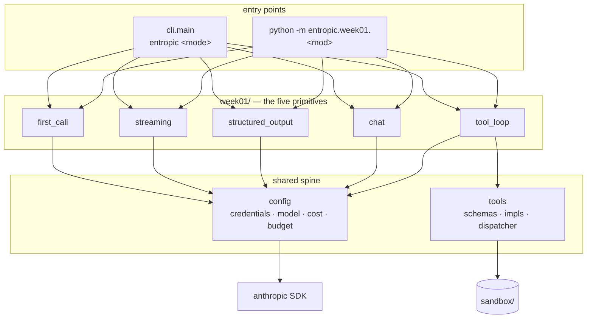

# Entropic knowledge graph

A map of what exists in this repo, what it does, and how the pieces point at each other. Written for
a future session that needs orientation before touching code.

**Verified against commit `589187b` (2026-09-10). 45 tests pass, 1 live test deselected.**
If the code has moved since, trust the code and update this file (see [Maintenance](#maintenance)).

- Package root: `src/entropic/` (uv build backend, `src` layout, Python 3.12+)
- Entry point: `entropic = "entropic.cli:main"` — `pyproject.toml:20`
- Everything paid goes through one module: `config.py`. Nothing else builds a client or prices a call.

---

## 1. Shape of the system



Reading order for a newcomer: `config.py` → `tools.py` → `week01/tool_loop.py`. The rest are
variations on the first call.

---

## 2. Nodes

Stable IDs are `module.Symbol`. Cite them in future notes; they survive line drift.

### 2.1 Modules

| ID | Path | Role |
|----|------|------|
| `config` | `src/entropic/config.py` | Credentials, model selection, token pricing, the two budget guards. The only module that constructs a client. |
| `tools` | `src/entropic/tools.py` | Framework-free tool implementations + their JSON schemas + a name→function dispatcher. Deliberately importable by any future framework. |
| `cli` | `src/entropic/cli.py` | The `entropic` command: a mode table, a lookup, an interactive menu. |
| `week01.first_call` | `src/entropic/week01/first_call.py` | One non-streaming call; token count and cost. |
| `week01.streaming` | `src/entropic/week01/streaming.py` | Streamed call; thinking vs. text blocks. |
| `week01.structured_output` | `src/entropic/week01/structured_output.py` | `messages.parse` into a Pydantic model. |
| `week01.tool_loop` | `src/entropic/week01/tool_loop.py` | The agent loop, hand-written. The seed of the real agent. |
| `week01.chat` | `src/entropic/week01/chat.py` | Multi-turn REPL with a running cost meter. |

### 2.2 Cost and budget (`config`)

| ID | Kind | Anchor | Contract |
|----|------|--------|----------|
| `config.MODEL` | constant | `config.py:22` | `ENTROPIC_MODEL` env override, else `DEFAULT_MODEL` = `claude-opus-5`. Every module imports this; none hardcodes a model. |
| `config.Price` | frozen dataclass | `config.py:25` | USD per million tokens. `cache_write` = input × 1.25, `cache_read` = input × 0.10, as properties — not stored fields. |
| `config.PRICES` | dict | `config.py:41` | `claude-opus-5` 5/25, `claude-sonnet-5` 2/10, `claude-haiku-4-5` 1/5, `claude-fable-5-1` 10/50. |
| `config.cost_usd` | function | `config.py:49` | Prices one request across four token classes. **An unknown model costs `0.0`, it does not raise** — a typo in `ENTROPIC_MODEL` silently reports free. |
| `config.usage_cost` | function | `config.py:69` | `cost_usd` applied to an SDK `Usage`; `None` cache fields coerce to 0. |
| `config.describe_usage` | function | `config.py:79` | One paste-into-`LOG.md` line. The house format for reporting a call. |
| `config.MAX_USD_PER_REQUEST` | constant | `config.py:94` | Default `0.25`, env `ENTROPIC_MAX_USD_PER_REQUEST`. |
| `config.MAX_USD_PER_RUN` | constant | `config.py:95` | Default `1.00`, env `ENTROPIC_MAX_USD_PER_RUN`. |
| `config.BudgetExceeded` | exception | `config.py:98` | `RuntimeError`. Message always names the amount and the env var to turn. |
| `config.worst_case_usd` | function | `config.py:102` | Input at input price + **the full `max_tokens`** at output price. Thinking counts against `max_tokens`, so this really is a ceiling. |
| `config.assert_request_within_budget` | function | `config.py:108` | Pure, no network. Returns worst case or raises. This is the unit-testable half of the pre-flight guard. |
| `config.check_request` | function | `config.py:123` | `messages.count_tokens` (free) → `assert_request_within_budget`. Returns the real input-token count. Callers must pass exactly what the real request will send. |
| `config.Budget` | mutable dataclass | `config.py:142` | Per-run accumulator. `add()` bills first, then trips — so `spent_usd` always reflects what was actually charged, including the crossing call. |
| `config.has_credentials` | function | `config.py:161` | `ANTHROPIC_API_KEY` or `ANTHROPIC_AUTH_TOKEN` env, or `~/.config/anthropic` (the `ant` CLI profile). Used to skip tests, not only to fail fast. |
| `config.get_client` | function | `config.py:168` | Raises `SystemExit` with both setup paths when unauthenticated. Adds `anthropic-workspace-id` header only when `ANTHROPIC_WORKSPACE_ID` is set — needed for org-level keys, harmless to omit for workspace-scoped ones. |

### 2.3 Tools (`tools`)

| ID | Kind | Anchor | Contract |
|----|------|--------|----------|
| `tools.calculate` | function | `tools.py:33` | AST-walked arithmetic. No names, calls, attributes, or tuples. Raises `ValueError` on anything else. |
| `tools._eval_node` | function | `tools.py:42` | The whitelist: `+ - * / ** %`, unary ±, non-bool numeric constants. Guards `**` at `_MAX_EXPONENT` = 1000 and `/`, `%` at zero. |
| `tools.current_time` | function | `tools.py:66` | ISO-8601 UTC, second precision. |
| `tools.read_file` | function | `tools.py:71` | Sandboxed read. `sandbox` is a parameter (default `tools.SANDBOX`) purely so tests can pass a `tmp_path`. |
| `tools.SANDBOX` | constant | `tools.py:29` | `<repo root>/sandbox` via `parents[2]`. **Depends on the file staying at `src/entropic/tools.py`** — moving the module breaks the path silently. |
| `tools._MAX_FILE_READ` | constant | `tools.py:30` | 20 000 characters. Reads one extra char to detect truncation; the cut marker is appended text, not an exception. The number is interpolated into the tool description, so the model is told the cap. |
| `tools.CALCULATOR_TOOL` / `TIME_TOOL` / `READ_FILE_TOOL` | `ToolParam` | `tools.py:90,110,122` | All three are `strict: True` with `additionalProperties: False`. Descriptions are written as prompts ("use this instead of computing in your head"). |
| `tools.ALL_TOOLS` | list | `tools.py:144` | The list handed to the API. Adding a tool = impl + schema + `ALL_TOOLS` entry + `execute_tool` branch. Four edits, no registry. |
| `tools.execute_tool` | function | `tools.py:147` | Dispatch by name → `(content, is_error)`. Type-checks each argument, catches every `Exception`, and returns unknown names as errors. **Never raises.** |

### 2.4 CLI (`cli`)

| ID | Kind | Anchor | Contract |
|----|------|--------|----------|
| `cli.Mode` | frozen dataclass | `cli.py:20` | `key`, `title`, `blurb`, `run: Callable[[list[str]], None]`. |
| `cli.MODES` | tuple | `cli.py:34` | Order is the menu numbering and is asserted by a test: `call, stream, extract, loop, chat`. |
| `cli._run_loop` | function | `cli.py:28` | The only mode taking arguments; prompts `task>` when a TTY and no args. |
| `cli.find_mode` | function | `cli.py:55` | Accepts a key or a 1-based number; case- and space-insensitive; `None` when unknown. |
| `cli.menu_text` | function | `cli.py:64` | Numbered listing; also the body of the "unknown mode" error. |
| `cli.main` | function | `cli.py:71` | `argv` injectable for tests. Non-TTY with no args → `SystemExit` rather than a hang on `input()`. |

### 2.5 The five primitives

| ID | Anchor | What it demonstrates | Notable call shape |
|----|--------|----------------------|--------------------|
| `week01.first_call.main` | `first_call.py:23` | Stateless API, free pre-flight count, `stop_reason` checked **before** reading content (`refusal`, `max_tokens`). | `messages.create`, `max_tokens=1024`. |
| `week01.streaming.main` | `streaming.py:25` | `content_block_start` / `content_block_delta` events; thinking and text as separate blocks; `get_final_message()` still carries usage. | `messages.stream(thinking={"type": "adaptive", "display": "summarized"})`, `max_tokens=4096`. |
| `week01.structured_output.PaperSummary` | `structured_output.py:33` | Field descriptions are visible to the model — written as prompts; `confidence` bounded `ge=0, le=1`. | — |
| `week01.structured_output.main` | `structured_output.py:49` | `messages.parse(output_format=…)` → `parsed_output`, which is `None` when parsing fails. | `max_tokens=2048`. |
| `week01.tool_loop.run` | `tool_loop.py:52` | The whole agent. `client` is injectable, which is what makes the loop testable for free. | `max_tokens=4096`, `MAX_TURNS=8`. |
| `week01.tool_loop.main` | `tool_loop.py:112` | Task from argv; empty task → usage `SystemExit`. | — |
| `week01.chat.main` | `chat.py:42` | Growing history (you pay for all of it every turn), `/effort`, `/reset`, `/quit`, per-turn and session cost. | `messages.stream(output_config={"effort": …})`. |
| `week01.chat.Effort` | `chat.py:32` | `Literal["low","medium","high","xhigh"]`; `EFFORTS` derived via `get_args`, so the command validates against the type. |

### 2.6 Tests

| ID | Path | Covers | Cost |
|----|------|--------|------|
| `tests.test_config` | `tests/test_config.py` | Pricing arithmetic, cache multipliers, unknown-model-is-free, worst case, both guards. | free |
| `tests.test_tools` | `tests/test_tools.py` | Calculator whitelist and rejections; sandbox escape via `..`, absolute path, and **symlink**; directory and missing-file errors; truncation at and over the cap; dispatcher error paths. | free |
| `tests.test_cli` | `tests/test_cli.py` | Mode order, lookup by key/number, unknown-mode exit. | free |
| `tests.test_tool_loop` | `tests/test_tool_loop.py` | The loop's rules, via `_FakeClient`. | free |
| `tests.test_tool_loop._FakeClient` | `tests/test_tool_loop.py:68` | Scripts `Message` responses and records every `messages` payload sent. **The pattern to copy for any future loop test.** | free |
| `tests.test_tool_loop.test_demo_task_live` | `tests/test_tool_loop.py:132` | The real demo task end to end; asserts the compound-interest answer. | ~$0.02, `-m live` |
| `tests.test_api_smoke` | `tests/test_api_smoke.py` | `count_tokens` round-trip; skipped without credentials. | free |

`addopts = "-m 'not live'"` in `pyproject.toml:44` — paid tests never run by accident.

### 2.7 Non-code nodes

| ID | Path | Role |
|----|------|------|
| `sandbox/` | repo root | The only directory `read_file` can reach. Git-ignored except `README.md`; `holdings.txt` is a local demo fixture. |
| `LOG.md` | repo root | Weekly log: what shipped, what broke, real token counts and dollar figures. Append here after live runs. |
| `README.md` | repo root | The five modes, the budget table, the check commands. |
| `.env` / `.env.example` | repo root | `ANTHROPIC_API_KEY`, optional `ANTHROPIC_WORKSPACE_ID`, both budget overrides, `ENTROPIC_MODEL`. `.env` is git-ignored; `load_dotenv()` runs at `config` import. |
| `CLAUDE.md` | repo root | The two project rules for Claude sessions: read this graph first, and move it with every commit. Tracked, so it reaches every clone — a session's private memory does not. |
| `.githooks/pre-commit` | repo root | Refuses a commit that stages `src/` or `pyproject.toml` without this file. Enabled per clone with `git config core.hooksPath .githooks`; git never installs hooks on clone. |
| `scripts/check-knowledge-graph.sh` | repo root | The rule itself, reading changed paths on stdin. The hook and CI both call it, so the two cannot drift. |
| `.github/workflows/knowledge-graph.yml` | repo root | The same check over the push or PR diff, for clones that never enabled the hook. |
| `.github/workflows/checks.yml` | repo root | ruff, ruff format, pyright and the free tests on every push and PR. No key is configured, so the smoke test skips and the `live` tests stay deselected — CI spends nothing. `uv sync --locked` also catches lockfile drift. |
| roadmap | `~/workspace/MLAI/ML/llm-engineer-roadmap.md` | Outside the repo. The eight-week plan this codebase is executing; the source of every "Week N" comment in the code. |

---

## 3. Edges

Format: `subject —relation→ object`. Greppable by relation name.

### Imports (all internal edges)

```
cli                      —imports→ week01.{first_call, streaming, structured_output, tool_loop, chat}
week01.first_call        —imports→ config.{MODEL, check_request, describe_usage, get_client}
week01.streaming         —imports→ config.{MODEL, check_request, describe_usage, get_client}
week01.structured_output —imports→ config.{MODEL, check_request, describe_usage, get_client}
week01.tool_loop         —imports→ config.{MODEL, MAX_USD_PER_RUN, Budget, check_request, describe_usage, get_client}
week01.tool_loop         —imports→ tools.{ALL_TOOLS, execute_tool}
week01.chat              —imports→ config.{MODEL, MAX_USD_PER_RUN, Budget, BudgetExceeded, check_request, get_client, usage_cost}
config                   —imports→ anthropic, dotenv
tools                    —imports→ anthropic.types.ToolParam   (types only; no client, no network)
```

`tools` does not import `config`, and `config` does not import `tools`. Keep it that way — it is why
`tools` can be lifted into an SDK tool runner or a LangGraph node unchanged.

### Enforcement and control flow

```
config.check_request              —calls→ client.messages.count_tokens   (free)
config.check_request              —calls→ config.assert_request_within_budget
config.assert_request_within_budget —calls→ config.worst_case_usd —calls→ config.cost_usd
config.Budget.add                 —calls→ config.usage_cost
config.{assert_request_within_budget, Budget.add} —raises→ config.BudgetExceeded
config.get_client                 —raises→ SystemExit   (missing credentials)

week01.tool_loop.run   —guards-each-call-with→ config.check_request       (per request, pre-flight)
week01.tool_loop.run   —accumulates-into→      config.Budget              (per run, post-call)
week01.tool_loop.run   —calls→                 tools.execute_tool
week01.tool_loop.run   —sends→                 tools.ALL_TOOLS
week01.tool_loop.run   —raises→                RuntimeError               (turn cap, MAX_TURNS=8)
week01.chat.main       —catches→               config.BudgetExceeded      (pre-flight: drop turn, keep session)
week01.chat.main       —catches→               config.BudgetExceeded      (per-run: end session)
tools.execute_tool     —calls→                 tools.{calculate, current_time, read_file}
tools.read_file        —reads-within→          tools.SANDBOX
```

`tool_loop` lets `BudgetExceeded` propagate; `chat` catches it in both places. That difference is
deliberate: a batch run should die loudly, an interactive session should degrade.

### Tested-by

```
config.{cost_usd, worst_case_usd, assert_request_within_budget, Budget} —tested-by→ tests.test_config
tools.{calculate, read_file, execute_tool}                             —tested-by→ tests.test_tools
cli.{MODES, find_mode, menu_text, main}                                —tested-by→ tests.test_cli
week01.tool_loop.run                                                   —tested-by→ tests.test_tool_loop
config.get_client                                                      —smoke-tested-by→ tests.test_api_smoke
```

Untested by design: the four demo `main()` functions in `week01/` (they are the demos), and
`config.get_client`'s header logic beyond the smoke test.

### Environment

```
ENTROPIC_MODEL                 —configures→ config.MODEL
ENTROPIC_MAX_USD_PER_REQUEST   —configures→ config.MAX_USD_PER_REQUEST
ENTROPIC_MAX_USD_PER_RUN       —configures→ config.MAX_USD_PER_RUN
ANTHROPIC_API_KEY | ANTHROPIC_AUTH_TOKEN | ~/.config/anthropic —authenticates→ config.get_client
ANTHROPIC_WORKSPACE_ID         —adds-header→ config.get_client   (org-level keys only)
```

All four `ENTROPIC_*` values are read **at import time** into module-level constants. Setting them
with `monkeypatch` after import will not take effect; pass `limit_usd=` explicitly instead, which is
what `tests.test_config` does.

---

## 4. Invariants

The rules the code encodes. Breaking one of these is a regression even when tests stay green.

1. **Every paid call is preceded by `check_request`.** The free token count is the guard's input;
   pass the exact `messages`, `system`, and `tools` the real call will send or the count lies.
2. **Cost is reported, always.** Every path prints `describe_usage` or an equivalent cost line. This
   is the repo's stated purpose, not decoration.
3. **The assistant turn is echoed back verbatim**, `tool_use` blocks included (`tool_loop.py:85`).
4. **All tool results for one turn go back in ONE user message** (`tool_loop.py:107`). Splitting them
   trains the model out of parallel tool calls. `tests.test_tool_loop` asserts this explicitly.
5. **Tool errors are `tool_result` with `is_error: True`, never exceptions.** `execute_tool` catches
   everything. The model can recover from a message; it cannot recover from a traceback.
6. **The loop is capped** (`MAX_TURNS = 8`) and backed by two dollar ceilings. An uncapped loop is a
   cost bug waiting to happen.
7. **`read_file` resolves before it compares.** `.resolve()` then `is_relative_to` defeats `..`,
   absolute paths, and symlinks alike — all three are tested. Any new filesystem tool must repeat
   this check; do not add a tool that takes a path without it.
8. **`config` is the only module that builds a client or knows a price.** New modules import `MODEL`,
   they do not name a model.
9. **Paid tests carry `@pytest.mark.live`** and are deselected by default.
10. **Types are complete.** `pyright` runs in standard mode; `cast` is used where SDK stubs are loose
    (`tests/test_tool_loop.py:43`, `chat.py:66`), never `# type: ignore`.

---

## 5. Where the next work attaches

Anchors the code already names, so a future session can find the intended seam rather than inventing one.

| Planned | Seam | Named at |
|---------|------|----------|
| Week 2 — eval harness | A per-eval budget ceiling alongside the other two; `Budget` already takes an explicit `limit_usd`. | `config.py:90-92`, README budget table |
| Week 2 — prompt caching | System prompts are already byte-identical per call, which is the precondition. `Price.cache_write` / `cache_read` and the cache columns in `describe_usage` are already wired. | `chat.py:11`, `config.py:33-38` |
| Week 2 — RAG milestone `v0.1-rag` | New capability module; reuse `tools` for retrieval tools. | roadmap |
| Week 3 — `chat` becomes the default mode | `cli.MODES` order and `cli.main`'s no-arg branch. | `cli.py:7-8` |
| Week 5 — SDK tool runner | `tools.ALL_TOOLS` + `execute_tool` are framework-free precisely for this. | `tools.py:1-3` |
| Week 6 — LangGraph agent | Same two symbols; `tool_loop.run` is the reference semantics to preserve. | `tools.py:1-3` |

Adding a tool, concretely: implement it in `tools.py`, add a `ToolParam` with `strict: True` and
`additionalProperties: False`, append to `ALL_TOOLS`, add a branch to `execute_tool` that type-checks
its arguments, and add tests for the happy path plus at least one abuse path.

---

## Maintenance

Two things enforce this file rather than trusting memory: `.githooks/pre-commit` refuses a commit
that changes `src/` or `pyproject.toml` without staging it, and `.github/workflows/knowledge-graph.yml`
runs the same rule in CI. Both call `scripts/check-knowledge-graph.sh`. Neither can tell whether the
edit was any good — that part is still on you.

This file is hand-written, not generated. It goes stale in three places first: the anchors in §2
(line numbers), the pricing table, and §5 as weeks land. When you touch the repo in a way that moves
a node or an edge, update the affected row and the "verified against" commit at the top. Keeping §4
accurate matters more than keeping the line numbers exact.
